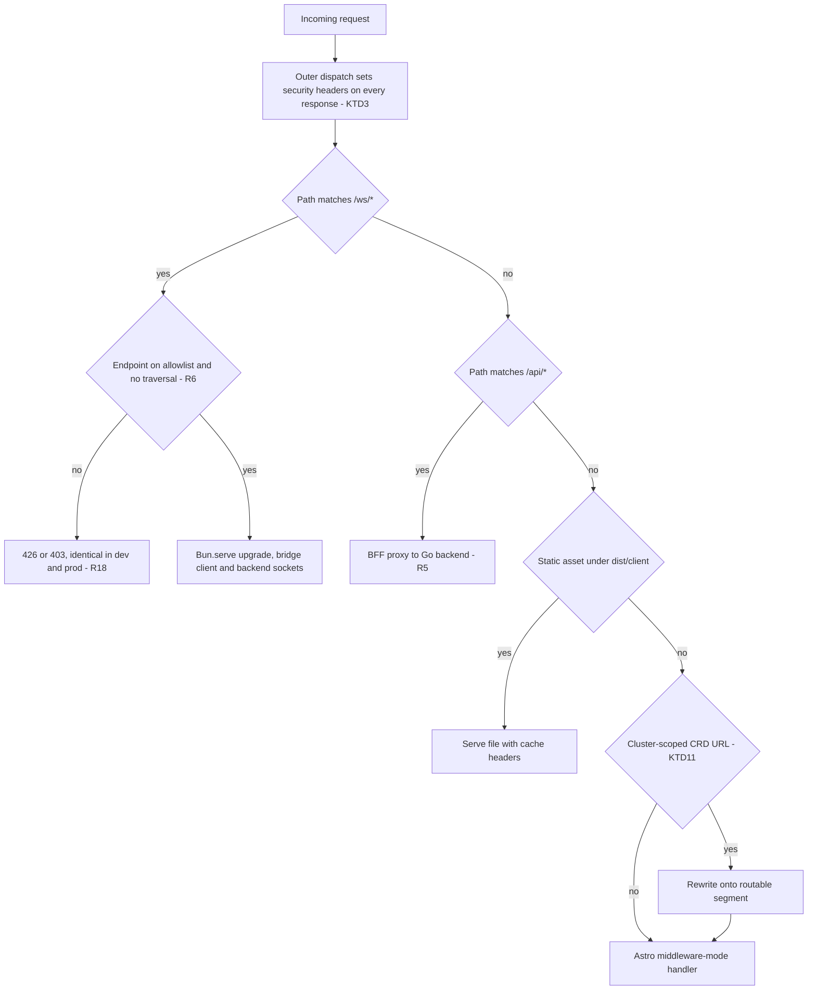
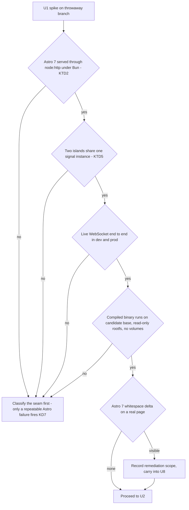
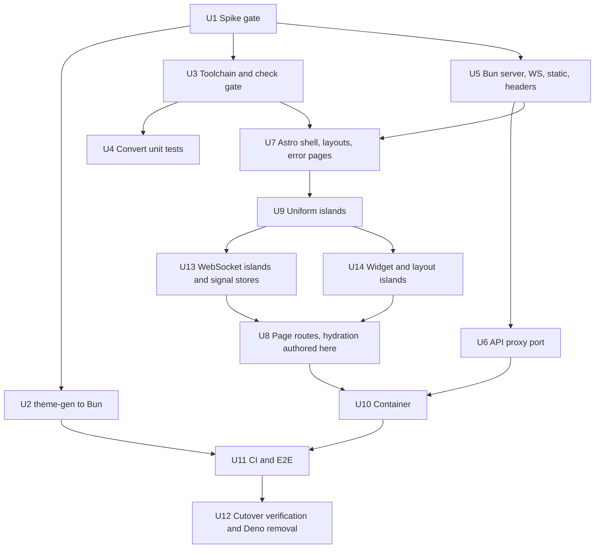

# Bun + Astro Frontend Migration - Plan

## Goal Capsule

**Objective.** An operator running k8sCenter sees the product behave exactly as it does today, and keeps getting it from a frontend the project can still build on years from now.

**Means.** Replace Deno 2.9.6 + Fresh 2.x with Bun 1.4.2 + Astro 7.3.2 (KD1, KD2), at visual and functional parity (KD4).

**Authority.** The Product Contract owns what an operator may observe. The Planning Contract owns how it is built. Where a Key Decision and a Key Technical Decision disagree, the Key Decision wins on behavior and the KTD wins on mechanism within it.

**Stop conditions.** U1 is a gate, not a warm-up. If U1 cannot prove its seams, stop and apply KD7 rather than starting U2. Stop and escalate if any unit would change a URL an operator can reach, weaken an E2E spec to make it pass, or drop a security header that `frontend/main.ts` sets today.

**Execution profile.** Bulk-mechanical in U8 and U9; design-led in U13 and U14, where the least bulk-portable islands live; design-led everywhere else. U8, U9 and U14 are exempt from the repo's five-files-per-PR convention (see Assumptions).

**Beyond parity.** Three things ship here that parity does not require, each closing a gap this migration exposed: the frontend pod stops auto-injecting Service environment variables (R20), every pinned GitHub Action must be commit-pinned and past the cooldown (U11), and the cutover carries a soak and rollback protocol (Operational Notes). They are deliberate scope, named here so approving the Objective is not approving them unseen.

**Tail ownership.** This plan ends when U12 verifies parity and the last Deno reference is gone. Release G resumes after that, on Astro.

---

## Product Contract

**Product Contract preservation:** restructured, with additions — no scope reversed. Corrections: the migration-surface counts were wrong (192 route files not "100+", 54 dynamic not "at least 34", four CI workflows not two, six redirect handlers not five) and KD3's rationale understated its own case (Release G is 26 PRs). Additions: R17, R18, R19, R20 (each traceable to a research finding), and KD7, KD8 (both session-settled). R1 now names Astro 7.3.2 specifically. R11 gained one clarifying clause: additions to the E2E suite are expected, reductions are not — this makes explicit what "unchanged at its current size" always meant. R12's cooldown clause was widened from "OS patches" to OS patches and package installs, matching what KTD6 and KTD7 both already claimed to govern; the rule itself is unchanged. No original R-ID changed meaning.

### Summary

Move the k8sCenter web frontend off Deno and Fresh onto Bun and Astro, preserving what operators see. Fresh is Deno-only by design, so leaving Deno necessarily means leaving Fresh; Astro supplies the replacement islands architecture. The app's own code is only shallowly coupled to Deno, so the weight of the work is the shell around it: routing conventions, the build and test contract, the container, and CI.

The plan sequences as a gating spike, then shared tooling, then the new server shell, then the route and island port, then container and CI. Research widened three things the brainstorm recorded: the CI surface is four workflows rather than two, the spike must prove cross-island state sharing rather than single-island hydration, and choosing a Bun container base is its own unit because no distroless Bun image exists.

### Problem Frame

The current stack works. Deno 2.9.6 is green across `deno task check`, the unit suite, the build, and the E2E suite. The motivation is not a defect — it is runtime performance and stability, and working on current technology in a project maintained for its own sake rather than to a schedule. Timeline is explicitly unconstrained.

What makes the move non-trivial is that Fresh cannot be separated from Deno. Fresh's own documentation states it can be "hosted anywhere Deno runs"; every task is `deno serve`, its reference container is `denoland/deno`, and its plugin ships over `jsr:`. Vite is only the build tool. So the decision to leave Deno is simultaneously a decision to replace the routing, SSR, and island-hydration layer for 192 route files and 152 islands.

The compensating fact is that the coupling runs shallow in application code. Across `frontend/`, exactly two non-test `Deno.*` call sites exist, and one of them is already feature-detected. 134 files import from `fresh/runtime`, and all 134 import only `IS_BROWSER` — verified exhaustively, not sampled.

### Requirements

**Runtime and framework**

R1. The web frontend runs on Bun 1.4.2 with Astro 7.3.2, Astro providing the islands architecture.

R2. No Deno remains anywhere in the repository. This includes `tools/theme-gen`, which is a standalone Deno CLI independent of the frontend app.

R3. An operator sees no functional or visual change. Every page, wizard, table and detail surface behaves as it does today.

R19. Every URL an operator can reach today resolves to the same page afterwards. This includes `/extensions/:group/:resource/_/:name`, whose literal `_` segment Astro's router reserves for private files. Governed by KTD11.

**Interactive surfaces**

R4. The WebSocket-backed features keep working: resource events, log tail, exec terminal, alerts, Hubble flows, and logs-search. These are served by the application's own server rather than by a framework route, because no islands framework owns WebSocket upgrades.

R5. The API proxy retains its security properties: forward-header allowlist, hop-by-hop header stripping, SSRF path validation, the 30-second timeout, and manual handling of OIDC redirects.

R6. The WebSocket proxy retains its path allowlist and traversal guard.

R18. The development server and the production server dispatch `/ws/*` through the same code path, so R6's guards apply in both. Today they do not: `frontend/vite.config.ts` proxies `/ws` straight to the backend in dev because HTTP upgrades bypass connect middleware, which means the allowlist and traversal guard never run locally.

**Islands and shared state**

R7. All 152 islands keep working, and module-level signals remain the mechanism for sharing state between them. Astro documents this as a supported pattern, and it is already how `frontend/lib/cluster.ts`, `namespace.ts`, `pin-store.ts` and `resource-counts.ts` work.

R8. Every island declares its hydration explicitly. Fresh hydrates islands automatically; Astro requires a `client:*` directive per island, so each of the 152 needs a hydration decision rather than a default. Governed by KTD4.

**Build, test and deployment**

R9. A single repo-wide gate replaces `deno fmt --check && deno lint && deno check`, and `make lint` plus CI continue to invoke one command.

R10. The 117 unit tests currently written against `Deno.test` are converted with no loss of coverage, and the migrated suite passes.

R11. The E2E suite passes, never shrunk or weakened. Playwright's `webServer` block and its CI-versus-local port split are updated, not weakened. Additions are expected: today's suite proves less than the plan needs, so U11 grows it (KTD14).

R12. The container keeps its security posture: non-root, read-only root filesystem, a distroless-equivalent runtime, all capabilities dropped, Trivy-clean, and the existing 7-day supply-chain cooldown gate — which applies to both the OS patches in the image and the packages the frontend installs. Governed by KTD6 for the image and KTD7 for the packages.

R17. The loss of Deno's runtime permission sandbox is accepted, and the control that actually compensates for it is named and verified. Deno runs today under `--allow-net`, `--allow-read=.` and `--allow-env=BACKEND_URL,LOG,PORT,HOSTNAME`; Bun has no equivalent. The operative compensating control is the frontend egress restriction in `helm/kubecenter/templates/networkpolicy.yaml`, not the pod `securityContext` fields in R12 — non-root, read-only rootfs and dropped capabilities stop privilege escalation and persistence, which is a different threat from a compromised dependency reading and exfiltrating data. Governed by KTD10.

R20. The frontend pod stops auto-injecting Service environment variables, and the security checklist records that no runtime sandbox will catch a future pod-spec mistake. The env allowlist is not idle today: `helm/kubecenter/templates/deployment-frontend.yaml` never sets `enableServiceLinks: false`, so Kubernetes injects a `_SERVICE_HOST` and `_SERVICE_PORT` variable for every Service in the namespace — Postgres, Prometheus, Grafana, the backend — and `--allow-env=BACKEND_URL,LOG,PORT,HOSTNAME` is what stops a compromised dependency reading them. Bun removes that. Set `enableServiceLinks: false`, which costs nothing because `BACKEND_URL` is already set explicitly. Beyond that, any future PR adding an environment variable, volume, or secret to the frontend Deployment requires explicit security review, because nothing in the runtime will refuse it. Governed by KTD10.

R13. The Helm contract is unchanged: the same image name, port 8000, `BACKEND_URL` environment variable, and readiness probe on `/`.

R14. The theme pipeline keeps generating both `frontend/assets/themes.generated.css` and `mobile/lib/theme/themes.g.dart` from `shared/themes/*.json`, and `make check-themes` still enforces parity. The Flutter app must not be broken by this migration.

**Sequencing**

R15. Release G does not start until the migration has landed, so the dashboard builder is built natively on Astro.

R16. The risky seams are proven on a throwaway spike before any bulk migration begins. The spike covers, at minimum: Bun serving Astro, two islands sharing one module-scope signal instance, one live WebSocket end to end, the container base running the Bun binary, and Astro 7's whitespace handling against a representative page.

### Key Decisions

KD1. **Bun replaces Deno as the frontend runtime.** (session-settled: user-directed — chosen over remaining on Deno and Fresh: runtime performance and stability, and the value of working on current technology in an unconstrained-timeline project.) Governs R1.

KD2. **Astro provides the islands architecture.** (session-settled: user-directed — chosen over other islands frameworks: wide adoption and continuous active development.) Governs R1, R7, R8. Conflict call-out: Astro's own Bun recipe still warns verbatim that Bun support "may reveal rough edges" and that "some integrations may not work as expected." This does not invalidate the choice, but it is why R16 exists.

KD3. **The migration precedes Release G.** (session-settled: user-directed — chosen over shipping Release G on Fresh first, and over running both stacks concurrently.) Governs R15. The cost avoided is larger than first estimated: `docs/plans/2026-09-10-EXECUTION-ORDER.md` scopes Release G at 26 PRs, and the five releases queued behind it carry roughly fourteen further frontend-touching units that would otherwise be written on Fresh and then ported.

KD4. **The migration holds visual and functional parity; the redesign is excluded.** (session-settled: user-directed — chosen over combining the re-platform with the SaaS-themed redesign: parity preserves the ability to diff the new app against the old one, which is the cheapest correctness check available across roughly 89,500 lines.) Governs R3, R19.

KD5. **WebSocket handling moves out of the framework and into the application's own Bun server.** No islands framework owns WebSocket upgrades; each delegates to the underlying server. The current `frontend/routes/ws/[...path].ts` is a Fresh route only because Fresh owns the server process. Governs R4, R6, R18.

KD6. **Astro runs through its Node adapter in `middleware` mode rather than `standalone`.** Middleware mode exports a handler that can be mounted inside another server, which is what makes KD5 possible. It serves no files, so serving `dist/client/` and setting security headers become the application's responsibility. Governs R4, R5, R12.

KD7. **If the spike fails, keep Bun and re-open the framework choice.** (session-settled: user-directed — chosen over abandoning back to Deno and Fresh, over falling back to Node with Astro, and over pushing through the rough edges in-flight: the runtime motivation in KD1 is independent of the framework choice in KD2, so a framework-level failure should not cost the runtime decision.) Governs R16. Not every U1 failure is a framework failure, and routing the wrong one here sends the migration down a dead end while the real cause stays unfixed. Classify first: an environment or harness failure is retried, a Bun binary or base-image failure routes to KTD6, an outer-server or credential failure routes to KTD2 or U5, a cross-island signal-sharing failure is retried once after correcting the bundler dedupe KTD5 names and only then counts as repeatable, and only a repeatable Astro incompatibility fires KD7. When it does fire, record the failing seam, discard the spike, and spike the next islands framework rather than starting U2. Budget honestly for that: re-opening the framework choice also re-derives every Astro-specific decision — KTD1 through KTD5, KTD9, KTD11, KTD12 and KTD14, since the adapter choice and the security-header strategy are both premised on `@astrojs/node` and on Astro's own CSP behaviour — and rewrites U7 through U14. It is not one more spike cycle.

KD8. **`tools/theme-gen` ports to Bun rather than remaining the last Deno artifact.** (session-settled: user-directed — chosen over deferring it behind the frontend migration and over narrowing R2 to the frontend app only: leaving one Deno CLI would keep a whole toolchain installed for a 245-line script.) Governs R2, R14.

### Non-Goals

- Any visual redesign, including the "beautiful, SaaS-themed" direction. Parity is the bar.
- Any change to the Flutter mobile app beyond not breaking its generated theme.
- Release G work of any kind.
- Any change to the Go backend.
- Light and dark mode work. Both already exist: `shared/themes/liquid-glass-light.json` sits alongside the dark tokens, `frontend/lib/theme.ts` owns `applyTheme`/`toggleTheme`, and a working toggle is already in the top bar.

### Deferred to Follow-Up Work

- Lazier hydration. KTD4 puts all 152 islands on `client:load` for parity; `client:visible` for below-the-fold islands is a performance change and belongs after the port.
- Visual-regression screenshot coverage beyond the highest-traffic pages.
- Recovering the JSX-precompile optimisation Deno provided, if the U1 benchmark shows it matters.
- An import-boundary lint rule enforcing that the signal stores stay client-only. U13 adds the check; promoting it to a standing rule is separate.
- Consolidating the two code editors. Monaco and CodeMirror both ship for the same job behind two different boundary conventions; porting both verbatim is correct under parity, but it doubles the widget-integration risk surface in U14.
- Dropping `d3-force` from the dependency list. It is declared in the import map with zero import sites anywhere in `frontend/`. U3 should not carry dead weight into `package.json`, but confirming and removing it is a separate call.
- Retiring `'unsafe-inline'` from the CSP. The current policy already carries it for scripts and styles, so Astro's inline hydration bootstrap rides on an existing allowance rather than forcing a new loosening — no regression. Once the bootstrap scripts are enumerable after the port, hash-based directives become possible.
- Collapsing the six identical redirect handlers into a data-driven table.
- Paying down the accessibility debt the new linter exposed. Biome's recommended preset enforces a11y rules `deno lint` never did, and turning them on surfaced **232 findings across 77 files** — 119 `noLabelWithoutControl`, 75 `noSvgWithoutTitle`, and the remainder scattered. Every one is inherited verbatim from the Fresh originals, so none is a regression, and fixing them means editing markup KD4 requires the port to carry across untouched. The group is disabled for the migration and the count is recorded here so it is a decision rather than an omission. Re-enable it once parity is banked.
- Re-enabling Biome's linter on `.astro` files, if its parser ever learns to read templates. Today it sees only frontmatter, so every import used in markup reads as unused — and `--write --unsafe` acts on that, deleting live imports. `astro check` covers those files properly in the meantime.

### Acceptance Examples

- AE1. **Covers R3, R11.** With the migration landed, an operator walks the pod list, opens a pod detail, runs a wizard, and applies YAML. Every surface behaves as before, and the E2E suite passes at its current size without specs being weakened to accommodate the new stack.
- AE2. **Covers R4, R6, R18.** An operator opens a log tail on a running pod and an exec terminal in another tab. Both stream. Closing the tab tears the connection down. A request to a path outside the allowlist is refused identically under `bun run dev` and under the built server.
- AE3. **Covers R2, R14.** A repo-wide search for `deno`, `jsr:` and `Deno.` returns no live references outside historical documents, and `make check-themes` still passes — proving the Flutter theme is still generated by whatever replaced the Deno CLI.
- AE4. **Covers R12.** The built frontend image runs as non-root with a read-only root filesystem and all capabilities dropped, passes Trivy, and its OS-patch stage still refuses packages published inside the 7-day cooldown window.
- AE5. **Covers R7.** An operator switches cluster in the top bar. Every resource table and detail panel on the page re-reads the new cluster. No surface keeps rendering the previous cluster's data.
- AE6. **Covers R19.** An operator opens a cluster-scoped CRD detail page — a `ClusterSecretStore`, say — from the extensions browser. The page renders at the same URL it uses today.

### Known Migration Surface

Counts verified against the tree at plan time; the brainstorm's estimates were low.

- **Deno API call sites (live).** `frontend/lib/constants.ts` (`Deno.env.get`, already feature-detected), `frontend/routes/ws/[...path].ts` (`Deno.upgradeWebSocket`), and `tools/theme-gen/main.ts` (`readDir`, `readTextFile`, `writeTextFile`, `mkdir`, `args`, `exit`, plus `jsr:@std/path`).
- **Fresh framework surface.** Four non-runtime importers: `frontend/main.ts` (`App`, `staticFiles`, and a hand-written CSP and security-header middleware), `frontend/utils.ts` (`createDefine`), `frontend/routes/_error.tsx` (`HttpError`), `frontend/vite.config.ts` (`@fresh/plugin-vite`). Plus `frontend/routes/_app.tsx` and `frontend/routes/_layout.tsx`. No `_middleware.ts` exists anywhere.
- **Routing.** 192 route files, 54 carrying dynamic segments, 2 catch-all, 3 underscore-prefixed special files. Deepest nesting is 7 segments. One route uses a literal `_` as a real URL segment.
- **Server-side handlers.** 9 route files export a `handler`: six identical 302 redirects, the API proxy, the WebSocket proxy, and `frontend/routes/api/auth/oidc-token-exchange.ts` — a 68-line CSRF-checked, single-use-cookie auth handler with no page body, which belongs with the server code in U6 rather than the page port in U8.
- **Build contract.** `frontend/deno.json` is both task runner and import map — there is no real `frontend/package.json`. `jsx: "precompile"` with `jsxPrecompileSkipElements` has no Astro equivalent. `frontend/vite.config.ts` carries a Windows-specific `resolve.alias` workaround and a dev-only `/ws` proxy.
- **Deployment.** `frontend/Dockerfile` is 174 lines across three stages, ending on `denoland/deno:distroless-2.9.6`, with a Debian security-patch overlay implementing the 7-day cooldown gate. The builder deletes `/app/node_modules` and `/deno-dir/npm` to keep build tooling out of the Trivy surface.
- **CI — four workflows, not two.** `.github/workflows/ci.yml` (frontend lint/check/build), `e2e.yml` (frontend build), `mobile-ci.yml` (runs `tools/theme-gen` for the theme parity check), and `ci-release.yml` (builds and Trivy-scans the frontend image).
- **E2E.** `e2e/playwright.config.ts` runs a two-entry `webServer` array — Go backend first, then frontend — and four projects with a `dependencies` chain. `e2e/tests/api-routes.spec.ts` scans the frontend source tree by directory name.
- **Helm.** `helm/kubecenter/templates/deployment-frontend.yaml` declares no volumes while setting `readOnlyRootFilesystem: true`.

### Outstanding Questions

All deferred; none blocks implementation. The four U1 answered are resolved at their owning decisions rather than restated here.

- Whether the pinned Trivy action parses `bun.lock` for package findings. U10 verifies it against the pinned version rather than assuming support.
- Whether the SSR latency cost is acceptable. U1 measured the same chrome-heavy page on both stacks: Deno with `preact-render-to-string` averaged 0.81ms, Astro on Bun 1.09ms over 200 warmed requests each. Astro is roughly a third slower per render, though both sit under 2ms, and the gap looks like Astro's rendering pipeline rather than Bun against Deno. Recorded as an accepted cost against KD1's performance motivation, not a blocker — the Definition of Done's post-cutover comparison is where it gets a verdict. Neither reference included full routing or hydration-script injection, so the real number moves once U8 lands.
- Whether U14 should split into per-widget sub-units. Its five-file exemption borrows a bulk-mechanical rationale written for U8 and U9, but U14 is the opposite: nine bespoke files verified by manual comparison, where KTD14's diff and screenshot instruments are weakest. Splitting by widget family — the two editors, the two topology graphs, the schema forms — would bring it back under the convention.
- Whether NetworkPolicy enforcement should be a hard deployment precondition. KTD10 makes it the compensating control for the lost sandbox, but it stays operator-toggleable and CNI-dependent; making a release refuse to deploy when it is off, and proving egress denial live, would close the gap. It also makes the chart stricter for every operator, which is the trade.
- Whether the port needs an access-control matrix. A migrated route can resolve, diff clean, and still have lost an authorization check, because nothing compares enforcement before and after per actor. The cost is enumerating unauthenticated, non-admin and admin outcomes for every protected surface; the benefit is that authorization parity stops being assumed.
- Whether a stop-and-reassess checkpoint belongs before U14. U1 never exercises a third-party widget under Astro hydration, which is where KD2's own rough-edges warning is most likely to land — and by then the migration is deep enough that KD7 is expensive.

### Pre-existing defect found by U1

The exec terminal's outbound upgrade carries no credentials today, and this is not a migration risk — it is a defect the port must fix on arrival.

`frontend/routes/ws/[...path].ts` opens its backend connection with a bare `new WebSocket(backendWsUrl)` and passes no headers on any route; its own comment shows the design assumes in-band auth, where the first queued message carries the token. That holds for four of the five WebSocket routes. It does not hold for exec: `backend/internal/server/routes.go` gates `/api/v1/ws/exec/…` with `middleware.Auth` plus `middleware.CSRF` at upgrade time, and `middleware.Auth` accepts only an `Authorization: Bearer` header — no query parameter, no subprotocol fallback. So either exec is already broken through this path or it reaches the backend another way; the plan does not assume which.

U1 proved the fix is available on both runtimes: Bun's and Deno's `WebSocket` constructors each accept a non-standard `{ headers }` option, and with a Bearer token attached the exec upgrade returned 101 and streamed a real response from the live cluster, against a no-header control that correctly returned 401. U5 adds the header when it ports the bridge, and its exec scenario verifies it rather than assuming parity with today.

<!-- ce-section: work-relationships -->
### How This Work Fits Together

Three outcomes surfaced in the brainstorm and only the first is active scope.

The re-platform is this plan. The web visual redesign and the Flutter app's matching redesign are both deferred, and they are more coupled to each other than either is to this migration: both platforms render from `shared/themes/*.json` through `tools/theme-gen`, with `make check-themes` enforcing parity, so a token-level restyle is naturally one workstream spanning web and mobile. That relationship is tentative and a later brainstorm may revise it.

Release G, the dashboard builder, is paused by KD3 and resumes on Astro once this lands. Behind it sit Releases B, C-remainder, F, E and D. Their backend units are unaffected and may proceed alongside this migration; their frontend units should wait, or they will be written twice.

---

## Planning Contract

### Key Technical Decisions

KTD1. **Target Astro 7.3.2, not the 6.x line.** (session-settled: user-directed — chosen over waiting for the pin to clear the 7-day cooldown, and over the frozen 6.x line: the user accepted the supply-chain risk to baseline on current.) Astro 7 is current and 6.x is a frozen major; KD2's rationale is currency, and starting a migration one major behind would book an immediate follow-up upgrade. The cost is real: Astro 7's Rust compiler strips inter-element whitespace by default and no longer repairs unclosed HTML, both of which can move rendered output on a verbatim port. U1 measured it on a chrome-heavy page: 8 raw bytes differ in 3851, all self-closing-slash and trailing-semicolon changes invisible in a rendered browser, and the output is byte-identical once canonicalised. That was a representative page rather than the literal production one, so U8's route-scale run remains the real test — but the risk is now sized rather than feared. This version was pinned under an explicit, user-directed override of the repo's mandatory 7-day supply-chain cooldown: `astro@7.3.2` was published 2026-09-08, six days before this plan, and the user authorised the override after the rule and the exact publish date were surfaced. The override covers this one pin and nothing else; every other dependency in U3 clears the window normally. Its consequence is mechanical — see Assumptions.

KTD2. **The outer server defaults to `node:http.createServer()` under Bun; `Bun.serve` plus a bridge must earn its place in U1.** KD5 fixes that the application owns the server, not which server primitive it uses. Two shapes satisfy it. `@astrojs/node` middleware mode exports a Node-style `(req, res)` handler, so `node:http` — which Bun implements natively — mounts it with no translation layer and handles upgrades through its own `upgrade` event. `Bun.serve`'s `fetch` handler speaks Web `Request`/`Response` instead, which does not compose with that handler for free and needs a normalizing server adapter sitting between them permanently. A bridge is a defensible boundary, but it is code to keep in sync as either side evolves, and it buys only Bun's faster native WebSocket path. U1 settled this without needing the benchmark: `node:http` handled SSR, static assets, and WebSocket proxying — including the exec upgrade — correctly in both dev and built modes, with no functional gap putting `Bun.serve` in contention. `node:http` is authoritative in the dispatch design and in U5. One cost this decision did not name surfaced when U5 built it: `node:http` has no server-side WebSocket handshake, so the server takes a dependency on `ws` that `Bun.serve`'s built-in WebSocket support would have avoided. That is a real point for the alternative, not just speed — but one vetted dependency is a smaller ongoing cost than a permanent Request/Response translation layer, so the default stands. Revisit only if a later unit finds a concrete WebSocket limitation, and fix the promotion threshold before any benchmark rather than after.

KTD3. **The outer server sets every security header, on every response, and Astro's own CSP feature stays off.** `frontend/main.ts` today wraps `ctx.next()` so its five headers land on page responses and static assets alike; the replacement wraps the outermost dispatch so the same is true, including responses produced before Astro's handler runs. Astro's `security.csp` is not a substitute: it emits only a `<meta>` tag for on-demand pages, real headers only for prerendered ones, nothing at all in dev, and meta-CSP cannot carry `frame-ancestors`. Running both would also risk divergent hash lists. The repo already rejected Fresh's built-in `csp()` helper for forcing `upgrade-insecure-requests` and breaking HTTP-only homelab and dev use; the same reasoning applies here. Governs R12, R5.

KTD4. **All 152 islands hydrate with `client:load`.** Governs R8. Fresh has no lazy-hydration concept — every island on a page hydrates immediately — and `client:load` is the only directive that both server-renders and hydrates on load with no deferral. Any lazier directive is a behaviour change and therefore a parity defect under KD4. The `IS_BROWSER` guard is a render-branch, not a hydration control, and does not influence this.

KTD5. **Shared state stays module-scope signals, with bundler dedupe and an explicit sharing test.** Astro documents cross-island sharing via a shared module, and Rollup dedupes a common import into one chunk, so the existing pattern should survive. The failure mode is not Astro but duplicate copies of `preact` or `@preact/signals-core` resolving twice, after which a `computed()` built from one copy cannot see a `signal()` from the other. Pin `resolve.dedupe` for both, and prove sharing in U1 rather than at the end of U9. Governs R7.

KTD6. **Ship a compiled Bun launcher plus a pre-bundled SSR entry on `gcr.io/distroless/cc`.** The goal is the property today's Dockerfile works hard for — no build toolchain in the runtime layer, and therefore no Trivy findings from unreachable tooling. The obvious shape does not work: U1 measured that compiling the whole server with `bun build --compile` fails, because `@astrojs/node` locates its own static-asset directory by walking `import.meta.url` for a literal `server` path segment, and a compiled binary's virtual path has none. Dynamically importing the on-disk entry instead fails too, on an unresolvable external `preact` import. What works, and what U1 ran end to end: pre-bundle `dist/server/entry.mjs` in place with `bun build --target=bun` so its externals are inlined, then compile a thin launcher that dynamically imports that file. Base selection has two criteria, not one. The Bun Linux binary links libstdc++ as well as glibc, so `gcr.io/distroless/base` will not start it at all; `ldd` settles that much. But the second criterion decides the choice: the security-patch stage in `frontend/Dockerfile` is built entirely on Debian tooling — it reads `/var/lib/dpkg/status.d/`, compares with `dpkg --compare-versions`, and reads upload dates from `changelog.Debian.gz` to enforce the cooldown gate. `distroless/cc` is Debian-derived and keeps all of that working. Chainguard's `glibc-dynamic` is Wolfi-based, with apk and no dpkg — adopting it would require rebuilding that stage, and with it the cooldown gate, from scratch under a different package manager. That stage has already broken and been repaired twice; rewriting it is not a cost this migration should absorb. U1 confirms `distroless/cc` runs the binary; only a failure there reopens the choice. Governs R12.

KTD7. **Cooldown enforcement moves into `bunfig.toml`, with the existing audit retained.** Bun 1.3+ supports `install.minimumReleaseAge`, so the repo's 7-day rule becomes machine-enforced at install time rather than review-enforced. It is not sufficient alone: Bun issue #30525 reports the gate being bypassed for versions already present in `bun.lock`, so a periodic full-lockfile age audit stays. Governs R12.

KTD8. **One test runner: `bun test`.** The 117 converted tests are plain unit tests over pure functions; `bun test` runs them with a Jest-shaped `expect` and no extra toolchain. Astro recommends Vitest for `.astro` component tests via its Container API, but this port creates no `.astro` component tests — adding a second runner and config surface to serve a case that does not exist is cost without benefit. Revisit only if `.astro` components acquire their own tests. Governs R10.

KTD9. **R9's "one command" is one script wrapping two tools.** `deno check` type-checked everything in one binary; nothing in the Bun ecosystem does that across both `.ts` and `.astro`. `astro check` owns `.astro` type-checking and Biome owns lint and format for `.ts` and `.tsx`, behind a single `bun run check`. Biome is one binary doing both jobs, which is the closest thing to what `deno lint` plus `deno fmt` was; oxlint is faster still but brings no formatter, and ESLint plus Prettier is two toolchains and a plugin graph to maintain. Nothing in the Bun ecosystem type-checks `.astro`, which is why the wrapper has two tools in it at all. `make lint` and CI still invoke one command, which is what R9 actually requires. Governs R9.

KTD10. **The Deno permission sandbox is not replaced; the frontend NetworkPolicy is verified instead.** Bun has no equivalent to `--allow-net`, `--allow-read` or `--allow-env`, and no third-party shim is worth trusting for a security boundary. The practical delta today is small — the current Dockerfile already runs with unrestricted `--allow-net`, and the frontend pod has no volumes and no secret-bearing environment variables for the read and env allowlists to protect. What actually stops a compromised dependency exfiltrating whatever it reads is the frontend egress rule in `helm/kubecenter/templates/networkpolicy.yaml`, which permits only kube-dns and the backend pod. That control is operator-toggleable (`networkPolicy.enabled`) and CNI-dependent, so U10 asserts it rather than assuming it. The residual and genuinely unmitigated loss is the forward-looking backstop, which R20 converts into a review rule. Governs R17, R20.

KTD11. **The cluster-scoped CRD URL is preserved by rewriting it in the outer server.** Astro's router treats `_`-prefixed files and directories under `src/pages/` as private and non-routable, so `/extensions/:group/:resource/_/:name` cannot be expressed as a page path. The page moves to a routable segment and the outer server rewrites the operator-facing URL onto it. Rewriting rather than redirecting keeps the address bar unchanged, which is what R19 requires. Only two files reference this shape today, so the blast radius is small. Governs R19.

KTD12. **One cutover on a long-lived branch, not a strangler migration.** No tooling or documented pattern exists for running Fresh and Astro behind one origin, and doing so would mean solving asset serving and WebSocket ownership twice at once — directly against KD5 and KD6. The compensating safety is the old tree staying runnable for diffing throughout, plus the parity instruments in KTD14. The E2E suite alone is not that instrument: it is functional-assertion-only and visits a fraction of the 192 routes.

KTD13. **Browser state written by the frontend is byte-identical across the two builds.** `kc.theme`, `k8scenter-animations`, the nav-collapsed key, and the cluster and namespace selections are written by ordinary application code, not by anything Fresh or Astro owns — and so is the OIDC token-exchange handler's single-use cookie, whose name, encoding and lifetime carry the same requirement. The refresh-token cookie is exempt because the backend issues it and the backend is untouched; that reasoning does not extend to a cookie the frontend sets itself. Keeping them identical is what makes rollback a single Helm command instead of a migration: a rolled-back Fresh build reads exactly what the Astro build wrote. This is load-bearing enough to verify, not to leave implied by "port verbatim". Governs R3.

KTD14. **Parity is proven by structural HTML diffing at route scale, plus a one-time visual spot-check — not by the E2E suite alone.** The suite asserts behaviour, never appearance: it contains no screenshot or snapshot assertion anywhere, so KD4's visual bar currently has no machine check at all. Two cheap instruments close that. The Fresh-versus-Astro HTML diff built for one page in U1 runs across every page route during U8. It compares semantic structure, text and attributes after canonicalising what neither framework promises to keep stable: insignificant whitespace, framework-owned hydration markers, and hashed asset URLs. Without that contract the diff is unusable at route scale — KTD1 predicts Astro 7 strips inter-element whitespace on a verbatim port, so a raw diff would report hundreds of near-identical differences and bury the real ones. Every addition to the ignore list is called out in the U8 pull request with a one-line justification and approved by that PR's reviewer. Naming the gate is the point: "reviewed" with no reviewer is what lets an implementer under bulk-port pressure silence a stubborn diff by widening the normalisation, which is exactly the failure this instrument exists to prevent. A screenshot comparison across the 49 nav-reachable pages runs once before the Fresh tree is deleted. Neither becomes standing CI; both exist to be run while both trees are alive, which is the only window in which they can run at all. Governs R3, R11.

### High-Level Technical Design

**Request dispatch under the new server.** The application owns the socket; Astro is a mounted handler.

**U1 as a gate.** The spike answers five questions and has one failure behaviour.

**Unit dependencies.** U2 and U3 are independent of the server work and of each other once U1 passes; U4 follows U3, which stands up the toolchain it runs on.

### Assumptions

- **U8, U9 and U14 are exempt from the five-files-per-PR convention.** `CLAUDE.md` Agent Directive 2 caps a phase at five files, and `docs/plans/2026-09-10-EXECUTION-ORDER.md` G2 caps a unit at five. A 192-route and 152-island port cannot honour either. The safeguard the cap provides is supplied instead by KTD14's parity instruments and by the preserved old tree. U13 and U12 are also exempt: U13 lists eight source files plus the import-boundary check, and U12 deletes across the whole tree. Only their size exempts them — both are reviewable as single changes, unlike U14, whose exemption is questioned in Open Questions.
- **`astro` needs a `minimumReleaseAgeExcludes` entry, or the pin ages out first.** KTD7 sets `install.minimumReleaseAge = 604800`, which would itself refuse the KTD1 pin while 7.3.2 is inside the window. U1 runs before any install, so the pin will most likely clear seven days naturally and no exclusion is needed. If it has not, the exclusion is a second instance of the same user-authorised override recorded in KTD1 — add it for `astro` alone, never lower the global gate.
- **Backend units of the queued releases may proceed alongside this migration.** Only their frontend units need to wait. This plan does not schedule them.
- **Every unit through U11 lives in a two-toolchain window, and each one trips over it differently.** Deno and Bun both own `frontend/` until U12 deletes the Fresh tree, and the collisions are not where they look. U3 hit one: `astro check` generates `frontend/.astro/content.d.ts`, and `deno check` reads `deno.json`'s `exclude` rather than `.gitignore`, so the repo's canonical gate went red on a generated Astro artifact. U4 hit another: `cluster.ts` imports `fresh/runtime` and `api.ts` imports `cluster.ts`, so 25 tests sat two hops from a specifier Bun cannot resolve — closed with a test-only shim at `frontend/lib/__shims__/fresh-runtime.ts`, mapped through `tsconfig.json` paths and deleted when `cluster.ts` is ported. Expect a third. Before declaring any unit done, run both sides: `deno task check` and `deno task build` as well as the Bun gates. A unit that only proves its own toolchain has proven half of what it needs to.

- **The E2E suite's current size is the parity bar.** No spec is weakened, skipped, or retargeted to make the new stack pass. A spec that legitimately cannot express the new shape is rewritten to assert the same operator-visible outcome.

### Sequencing

Five phases. The phase boundary is a checkpoint, not a merge gate — U2 and U3 may land in either order once U1 passes, with U4 following U3.

| Phase | Units | Purpose |
|---|---|---|
| A — Prove | U1 | Gate the whole migration on measured evidence |
| B — Detach | U2, U3, U4 | Remove Deno from shared tooling and stand up the Bun toolchain |
| C — Shell | U5, U6, U7 | Build the new server and application shell before any page moves |
| D — Port | U9, U13, U14, U8 | Move the islands in three risk tiers, then the routes that mount them |
| E — Ship | U10, U11, U12 | Container, CI, and parity verification |

### System-Wide Impact

The frontend is one component, but three contracts cross its edge and this migration touches all of them.

**Mobile.** `tools/theme-gen/main.ts` emits `mobile/lib/theme/themes.g.dart` as well as the web CSS, and `mobile-ci.yml`'s parity job triggers on `tools/theme-gen/**` — so U2's port is inside the guard and drift is caught before merge. One coupling is not guarded: the generator hardcodes its CSS output path at `frontend/assets/themes.generated.css`. If Astro's asset conventions move that directory during U7 or U8, the generator must be updated in the same PR or the theme check fails on an unrelated change.

**Backend.** The HTTP contract is genuinely unchanged — the proxy forwards the same headers to the same paths. The WebSocket contract is not uniform, and the plan must not treat it as such. `backend/internal/server/routes.go` groups four WS routes under in-band first-message auth, but registers `/api/v1/ws/exec/...` separately under `middleware.Auth` plus `middleware.CSRF`, requiring credentials on the upgrade request itself. The frontend bridges to the backend with a bare outbound `new WebSocket()`, and Deno and Bun differ in how they permit headers on that call. Exec is therefore the one WS route where a verbatim port can silently fail authentication, and it is tested by name in U1 and U5.

**Helm and the pod.** The image-to-chart contract is image name, port 8000, `BACKEND_URL`, and the readiness probe on `/`. Two properties are easy to violate silently. The Deployment sets `readOnlyRootFilesystem: true` and declares no volumes, so the runtime must write nothing — including Bun's SQLite-backed `localStorage`, if any module touches it during server render. And `dist/client/` ships as ordinary files beside the compiled binary; `bun build --compile` embeds statically-imported assets but not files served dynamically by path, so this is a copy, not an embed, and the binary's path resolution must match the runtime `WORKDIR`.

**Performance.** Deno's `jsx: "precompile"` turned static JSX into literal HTML fragments at build time, avoiding vnode construction on every server render. Astro has no equivalent, so every component reverts to the standard JSX runtime cost. The plan defers recovering this, which is reasonable — but KD1's stated motivation is performance, so shipping an unmeasured SSR regression would undercut the migration's own premise. U1 measures it on a chrome-heavy page and records the number whether or not anything is done about it.

**Client-only modules.** `frontend/lib/api.ts` carries an explicit comment that module-level variables are process-global singletons and importing it server-side would leak auth state across SSR requests. That is the concrete precedent for the import-boundary check, and the boundary is two hops deep — `api.ts` and `auth.ts` themselves import `cluster.ts` — so a check keyed on direct imports would miss it.

---

### Risks & Dependencies

| Risk | Likelihood | Impact | Mitigation |
|---|---|---|---|
| Astro-on-Bun rough edges block the bridge (KTD2) | Medium | Blocks everything | U1 is the gate; KD7 defines the fallback; `node:http` is a proven second shape |
| Duplicate signal copies silently fork cross-island state | Medium | Cluster and namespace switching break with no error | KTD5 dedupe plus an explicit two-island test in U1, not at the end of U9 |
| Astro 7 whitespace stripping moves rendered output | Medium | Parity defects across many pages | Measured in U1 on a real page before bulk work; remediation scoped into U8 |
| Dev and prod diverge again on `/ws` | Medium | Security guards silently absent locally | R18 makes one entrypoint a requirement; U11 runs WebSocket coverage against both servers |
| Trivy cannot parse `bun.lock` | Low | Release gate passes vacuously | U10 verifies against the pinned action version; text `bun.lock` is supported, `bun.lockb` is not |
| A signal store gets imported into an SSR path during the port | Medium | One request's state leaks into another's render | U13 adds a transitive import-graph check; the boundary is two hops deep, so a direct-import lint would miss it |
| Bun's SQLite-backed `localStorage` touched server-side | Low | Boot failure or silent write under read-only rootfs | U1 exercises it under the real container constraints |
| Exec WebSocket auth breaks silently on the outbound upgrade | Medium | Exec terminal stops authenticating; other five channels keep working, so it looks like an exec-only bug | Exec is named in U1 and U5 test scenarios, not folded into "an allowlisted endpoint" |
| `bun.lock` is not copied into the runtime image | Medium | Trivy scans an empty package set and the release gate passes vacuously | U10 requires the copy and asserts findings are non-empty, mirroring today's `deno.lock` copy |
| Third-party widget lifecycle conflicts with Astro hydration timing | Medium | Editors or topology graphs double-initialise or leak instances | U14 isolates the widget-owning islands so they are exercised deliberately, not swept |
| A route outlier is flattened into a thin wrapper | Medium | Server-side branching silently becomes client-side, or an admin gate stops gating | U8 names all six outliers and tests each by URL |

### Sources

- `docs/plans/2026-09-10-EXECUTION-ORDER.md` — release sequencing, the five-files-per-unit convention, and Release G's 26-PR scope.
- `docs/solutions/backend-resilience-conventions.md` — the repo's convention format; the new security-checklist note in U10 follows it.
- Astro's Bun recipe, Node adapter guide, CSP configuration reference, and routing guide — the basis for KTD1, KTD2, KTD3 and KTD11.
- Bun's `bunfig.toml` install options and `bun build --compile` docs — KTD6 and KTD7.
- Chainguard's guidance on minimal images for compiled languages — the libstdc++ constraint behind KTD6.
- Prior session record: the frontend Dockerfile's security-patch stage broke twice on hand-bumped version pins (PRs #426, #428). U10 keeps the dynamic `dpkg --compare-versions` shape and does not reintroduce a static pin.

---

## Implementation Units

| U-ID | Title | Key files | Depends on |
|---|---|---|---|
| U1 | Spike the risky seams | throwaway branch, no repo files | — |
| U2 | Port the theme generator to Bun | `tools/theme-gen/`, `Makefile`, `.github/workflows/mobile-ci.yml` | U1 |
| U3 | Bun toolchain and the single check gate | `frontend/package.json`, `frontend/bunfig.toml`, `frontend/tsconfig.json` | U1 |
| U4 | Convert the unit suite to `bun test` | `frontend/lib/*_test.ts` | U3 |
| U5 | The Bun server: WebSockets, static, headers | `frontend/server/` | U1 |
| U6 | Port the API proxy | `frontend/server/` | U5 |
| U7 | Astro application shell and error pages | `frontend/src/layouts/`, `frontend/src/pages/` | U3, U5 |
| U9 | Port the uniform islands | `frontend/src/islands/` | U7 |
| U13 | WebSocket islands and the signal stores | `frontend/src/islands/`, `frontend/src/lib/` | U9 |
| U14 | Widget and custom-layout islands | `frontend/src/islands/`, `frontend/src/components/ui/` | U9 |
| U8 | Port the page routes and author hydration | `frontend/src/pages/` | U9, U13, U14 |
| U10 | Container on `distroless/cc` | `frontend/Dockerfile`, `CLAUDE.md` | U6, U8 |
| U11 | CI workflows and E2E harness | `.github/workflows/`, `e2e/` | U2, U10 |
| U12 | Cutover verification and Deno removal | repo-wide | U11 |

### U1. Spike the risky seams

**Goal:** Decide whether this migration proceeds, on measured evidence rather than documentation claims.

**Requirements:** R16. Governed by KD7, KTD1, KTD2, KTD5, KTD6.

**Dependencies:** None.

**Files:** None in this repo. The spike lives on a throwaway branch and is discarded whatever the outcome; only its findings are written back, into this plan's Outstanding Questions.

**Approach:**

1. Stand up a minimal Astro 7.3.2 project on Bun 1.4.2 with `@astrojs/node` in middleware mode and `@astrojs/preact`, mounted inside `node:http.createServer()` — KTD2's default, and the shape that ships unless step 8 promotes the alternative. Build the `Bun.serve`-plus-adapter variant only as step 8's comparison.
2. Add two separate Preact islands that both import one module-scope `signal()` from a shared module, both with `client:load`. Write from one, assert the other observes it after a production build — not a dev build, since the dev server does not chunk the same way (KTD5).
3. Proxy two real WebSockets end to end through `/ws/*`, under both the dev command and the built server (R18). One must be the exec endpoint, because it is the only WS route the backend gates with `middleware.Auth` and `middleware.CSRF` at upgrade time while the others authenticate in-band — so it is the only one whose outbound upgrade must carry credentials, and the runtimes differ in how they permit that.
4. Confirm a `bun build --compile` output runs on `gcr.io/distroless/cc` with a read-only root filesystem and no writable volume. Record whether anything attempts a write, including Bun's SQLite-backed `localStorage`. Only a failure here reopens KTD6's base choice.
5. Diff Astro 7's emitted HTML against the Fresh output for one chrome-heavy page — a resource list with the full navigation rendered, not a simple page — to size the whitespace-stripping delta. This is the mechanism KTD14 scales to every page route in U8, so it must be built to be reusable under KTD14's comparison contract (KTD1).
6. Measure SSR render latency for that same page on both stacks and record both numbers. KD1's motivation is performance; Astro has no equivalent to Deno's JSX precompile. Record the workload so the measurement can be repeated after cutover. A regression here does not by itself fail the gate, but it is carried into Open Questions as an explicit accepted cost rather than passing silently.
7. Check whether `duplex: "half"` is still required for a streamed request body under Bun's `fetch`.
8. If `Bun.serve` is being considered over `node:http` (KTD2), measure the WebSocket throughput and latency difference. Absent a clear win, KTD2's default stands and no bridge is built.

**Execution note:** This is a throwaway probe, not a foundation. Resist carrying spike code into U5 — its value is the five answers, and reusing it would smuggle unreviewed shortcuts into the real server.

**Test scenarios:**

- Covers R16. Two islands, production build, shared signal: a write in one island is observed by the other. A failure here stops the migration.
- Covers R16 / AE2. A WebSocket to an allowlisted endpoint streams; one to a non-allowlisted path is refused, with the same status under the dev command and the built server.
- Covers R16 / R4. The exec endpoint upgrades and authenticates against the real backend, proving the outbound upgrade carries credentials under Bun. A failure here is a blocking finding, not a detail.
- Covers R16. The compiled binary starts on `gcr.io/distroless/cc` with a read-only root filesystem and no volumes mounted, and serves a request.
- Covers R16. Nothing in the running container writes to the filesystem during a request, including any module touching `localStorage` during server render.
- Astro 7 HTML output for one chrome-heavy page is diffed against Fresh output; the delta is characterised as none, cosmetic, or visible, and the diff harness is reusable at route scale.
- SSR render latency for that page is recorded for both stacks.
- A streamed request body reaches a backend stub with and without the `duplex` cast; the result decides whether the cast survives into U6.

**Verification:** Every seam answered and written into Outstanding Questions, including the two recorded numbers (whitespace delta, SSR latency). A clear go or no-go recorded. On no-go, KD7 applies and no further unit starts.

### U2. Port the theme generator to Bun

**Goal:** Remove Deno from the shared theme pipeline without changing a byte of its output.

**Requirements:** R2, R14. Governed by KD8.

**Dependencies:** U1.

**Files:** `tools/theme-gen/main.ts`, `tools/theme-gen/deno.json` (delete), `tools/theme-gen/package.json` (create), `Makefile`, `.github/workflows/mobile-ci.yml`.

**Approach:**

1. Swap the Deno filesystem and process APIs for Node built-ins, which Bun implements natively. `jsr:@std/path` becomes `node:path`, so the tool ends with no third-party dependency at all.
2. Keep the `--check` mode's regenerate-and-diff behaviour and its non-zero exit on drift — that is what `make check-themes` gates on.
3. Repoint the `theme-gen` and `check-themes` Makefile targets and the `mobile-ci.yml` step at Bun.

**Patterns to follow:** The existing `CSS_VAR_MAP` validation and the hardcoded `ORDER` array that throws on an unlisted theme file. Both are correctness guards; keep them.

**Test scenarios:**

- Covers AE3. Running the ported generator against the committed `shared/themes/*.json` produces `frontend/assets/themes.generated.css` byte-identical to the committed file.
- Covers AE3. The same run produces `mobile/lib/theme/themes.g.dart` byte-identical to the committed file. Nothing in the mobile tree changes.
- `--check` exits non-zero when a generated file is modified by hand, and zero when it is not.
- A theme JSON missing one of the 27 required tokens is rejected with the same error as today.
- A theme file present on disk but absent from `ORDER` still throws.

**Verification:** `make check-themes` passes. `git status` shows no change to either generated artifact. No Deno invocation remains in `mobile-ci.yml`.

### U3. Bun toolchain and the single check gate

**Goal:** Replace `deno.json`'s dual role as task runner and import map, and restore a one-command quality gate.

**Requirements:** R1, R9, R12. Governed by KTD1, KTD7, KTD9.

**Dependencies:** U1.

**Files:** `frontend/package.json`, `frontend/bunfig.toml`, `frontend/tsconfig.json`, `frontend/astro.config.mjs`, `frontend/deno.json` (delete at U12, not here), linter configuration.

**Approach:**

1. Translate the `deno.json` import map into real dependencies. The `jsr:` Fresh entries drop out; the roughly twenty `npm:` entries carry over at their current pinned versions. Verify each publish date against the 7-day cooldown before pinning.
2. Recreate the `@/` path alias in `tsconfig.json` rather than relying on resolver behaviour.
3. Set `install.minimumReleaseAge = 604800` in `bunfig.toml` (KTD7), with an `astro` exclusion only if the KTD1 pin has not yet aged past the window.
3b. Pin the Bun version once, in a repository-owned file, and have local tooling, the Dockerfile builder and both CI workflows read it rather than each naming a version. R1 names an exact runtime; without a single source, local, CI and container builds can run different Bun versions and still pass every gate in this plan.
4. Define `bun run check` to run the linter, the formatter check, and `astro check` in sequence, and point `make lint` at it (KTD9). Cover `tools/theme-gen/` as well as `frontend/`: `deno run` type-checked that file on every invocation and `bun run` does not, so U2 left the repo without a type gate on it. The tool is deliberately dependency-free, so the types belong in the repo-wide gate here rather than as a local devDependency there.
5. Configure `resolve.dedupe` for `preact` and `@preact/signals-core` in the Astro Vite config (KTD5).

**Execution note:** Mostly configuration. Prefer a runtime smoke check — the gate actually catching a planted error — over unit coverage.

**Test scenarios:**

- `bun run check` exits non-zero on a deliberately malformed `.ts` file and on a deliberately malformed `.astro` file, proving both halves of KTD9's wrapper are wired.
- `bun run check` exits zero on the tree as committed.
- `bun install --frozen-lockfile` succeeds and produces a text `bun.lock`, not `bun.lockb`.
- Attempting to add a package published inside the cooldown window is refused by `bunfig.toml`.
- Covers R1. Local tooling, the Docker builder and both CI workflows resolve the same pinned Bun version, and a mismatch fails rather than proceeding.
- The `@/` alias resolves from a nested source file.

**Verification:** One command gates lint, format and types. `make lint` invokes it. The lockfile is the text format U10 depends on.

### U4. Convert the unit suite to `bun test`

**Goal:** Move 117 tests off `Deno.test` with no loss of coverage.

**Requirements:** R10. Governed by KTD8.

**Dependencies:** U3.

**Files:** The 11 test files under `frontend/lib/` — `cluster-targeting_test.ts` (20 cases), `preference-types_test.ts` (26), `score-color_test.ts` (13), `format_test.ts` (12), `compliance-violations_test.ts` (11), `secretstore-template-nav_test.ts` (11), `nav-domain_test.ts` (7), `eso-yaml-templates_test.ts` (6), `preferences_test.ts` (5), `capability-types_test.ts` (4), `wizard-constants_test.ts` (2).

**Approach:**

1. Rewrite `Deno.test(name, fn)` as `test(name, fn)` from `bun:test`, and `assertEquals` as the matching `expect` assertion. These files use no other assertion helper and no `Deno.test` options object, so the transform is uniform.
2. Keep test names verbatim so failures stay greppable against history.
3. Drop the `jsr:@std/assert` import.

**Execution note:** Uniform, low-judgment transform across a fixed file set — appropriate to delegate to a mechanical-edit pass rather than hand-editing. The count is the guard: 117 in, 117 out.

**Test scenarios:**

- The converted suite reports exactly 117 passing cases. A lower number means a case was dropped rather than converted.
- Each of the 11 files runs standalone under `bun test`.
- A deliberately inverted assertion in one converted file fails, proving the assertions are actually executing rather than silently passing.
- No `jsr:` or `Deno.` reference remains in any test file.

**Verification:** `bun test` passes with 117 cases. The per-file counts above match.

### U5. The Bun server: WebSockets, static, headers

**Goal:** Stand up the application-owned server that Astro will be mounted inside.

**Requirements:** R4, R6, R12, R13, R18. Governed by KD5, KD6, KTD2, KTD3.

**Dependencies:** U1.

**Files:** `frontend/server/` (new), `frontend/vite.config.ts` (remove the dev-only `/ws` proxy).

**Approach:**

1. Build the outermost dispatch first and attach the security headers there, so every later branch inherits them (KTD3). Port the five headers from `frontend/main.ts` verbatim, including the reasoning that rejected Fresh's `csp()` helper.
2. Handle `/ws/*` natively: port the endpoint allowlist, the traversal guard, the 426 on a missing upgrade header, the queueing of client messages until the backend socket opens, and the close-code remapping that rewrites reserved and invalid codes to 1000. Bound the queue. Today's implementation queues until the backend connects, which is correct for delivering the auth first-message but unbounded: a slow or dead backend lets a client hold allowlisted sockets open and push messages until the process runs out of memory. Give it concrete limits, not an adjective: at most 32 queued messages and 256 KiB total, a 10-second ceiling on the backend handshake, and a 60-second idle timeout, closing the connection once any is exceeded. The queue exists to hold the auth first-message and a frame or two behind it, so these are generous; a limit left to the implementer is one a test cannot assert against, and a ceiling set high enough to still exhaust memory would pass a qualitative test.
3. Serve `dist/client/` with cache headers equivalent to what `staticFiles()` sets today, and with path containment the framework used to own: decode and normalise before resolving, reject traversal and backslash variants, refuse symlink escapes, and confirm the resolved file is still under `dist/client/`. The runtime image holds the compiled binary and `bun.lock` beside that directory, so a containment slip exposes them.
4. Mount the Astro handler last, as the fallthrough, through the bridge U1 proved (KTD2).
5. Make the dev command boot this same server rather than a bare `astro dev`, which is what R18 requires and what removes the `vite.config.ts` proxy.

**Patterns to follow:** `frontend/routes/ws/[...path].ts` for the socket bridge — it is a behaviour port, not a redesign. `frontend/main.ts` for the header set.

**Test scenarios:**

- Covers AE2. An allowlisted WebSocket endpoint upgrades and relays messages in both directions.
- Covers AE2 / R18. A path outside the allowlist is refused identically under the dev command and the built server.
- Covers R6. A path containing `..`, `//` or `%2e` is refused before any backend connection is attempted.
- An upgrade request missing the `upgrade: websocket` header receives 426.
- A client message sent before the backend socket opens is queued and delivered, not dropped — this is what protects the auth token sent as the first message.
- A backend close with code 1006 results in the client socket closing with 1000, not an invalid-code throw.
- Covers R12. All five security headers are present on a page response, a static asset response, a 404, and each WebSocket rejection status (400, 404, 426).
- Covers R12. A malformed request — bad method, oversized path — is rejected before any downstream branch runs, and the rejection still carries the headers.
- Covers R12. A static request for a path escaping `dist/client/` — `..` segments, encoded traversal, backslash variants, a symlink pointing outside — is refused, and the compiled binary and `bun.lock` are unreachable over HTTP.
- Covers R4. A client that opens an allowlisted socket against an unavailable backend is closed once it exceeds 32 queued messages or 256 KiB, asserted against those exact limits rather than against "grows without bound".
- Covers R4. A backend that never completes the handshake closes the connection at 10 seconds; an idle established connection closes at 60.
- Covers R4 / R18. The exec endpoint upgrades and authenticates against the real backend under both the dev command and the built server, with the Bearer header the port adds (see Pre-existing defect found by U1). A no-header control returns 401, proving the header is what carries it.
- A static asset is served from `dist/client/` with the same cache header `staticFiles()` sets today.
- Covers R13. The server listens on 8000 and `GET /` returns a success status.
- Covers R18. A CI check fails the build if the dev server configuration defines any proxy or rewrite rule matching a `/ws` path. This is a standing guard, not a one-time fix — the divergence R18 closes was reintroducible precisely because nothing detected it.

**Verification:** Log tail and exec stream against a live cluster under both the dev command and the built server. No response path lacks the security headers.

### U6. Port the API proxy

**Goal:** Move the BFF proxy to the Bun server with its security properties intact.

**Requirements:** R5. Governed by KD6, KTD3.

**Dependencies:** U5.

**Files:** `frontend/server/` (the proxy handler and the ported token-exchange handler), `frontend/routes/api/auth/oidc-token-exchange.ts` (source for the port), `frontend/lib/constants.ts` (`Deno.env.get` becomes the Bun equivalent).

**Approach:**

1. Port the forward-header allowlist, the hop-by-hop response stripping, the `v1/` prefix requirement and the traversal regex unchanged.
2. Keep the 30-second timeout and the distinction between 504 on timeout and 502 on any other failure, and keep the backend URL out of both logs and response bodies.
3. Keep the manual OIDC redirect handling — the browser, not the server-side fetch, must follow those 302s.
4. Drop the `duplex: "half"` cast. U1 measured a streamed request body reaching a backend stub identically with and without it under Bun 1.4.2, so it is dead code rather than a portability hedge. Note this is Bun-specific: Node's own fetch still throws without it.
5. Port `frontend/routes/api/auth/oidc-token-exchange.ts` here rather than in U8. It exports a handler with no page body — a shape the bulk route port would mis-treat as a page to wrap — and it carries real security logic: a CSRF header check, a single-use httpOnly cookie read, and a `Set-Cookie` that clears it.

**Patterns to follow:** `frontend/routes/api/[...path].ts` in full. Every constant in it is load-bearing.

**Test scenarios:**

- Covers R5. A header outside the forward allowlist is not sent to the backend.
- Covers R5. A hop-by-hop header returned by the backend is stripped from the response.
- Covers R5. A path not starting with `v1/` is refused, as is one containing `..`, `//` or `%2e`.
- A backend that never responds produces 504 after the timeout; a backend that refuses the connection produces 502.
- Neither error response nor any log line contains the backend URL.
- An OIDC login path returns the backend's 302 to the browser rather than following it server-side.
- A streamed request body reaches the backend intact.
- A forwarded or hop-by-hop header arriving with unexpected casing, or duplicated, is still matched by the allowlist and the stripping logic.
- The `cookie` header never appears in a log line, extending the existing backend-URL redaction scenario.
- The token-exchange endpoint refuses a request missing `X-Requested-With` with 403 and leaves the cookie intact; accepts one with the header, returning the token and clearing the cookie; and refuses an immediate replay with the cleared cookie, proving the single-use property.
- Covers KTD13. A single-use cookie set by the Fresh build is read and cleared correctly by the Astro build, and the reverse. A rollback mid-login is otherwise the one flow that can strand an operator.
- Covers R12. The five security headers are present on a proxy pass-through response, where the body is streamed straight from the backend, and on each error response the handler builds itself — 400 on an invalid path, 502 on an unavailable backend, 504 on timeout, and the token-exchange handler's 401 and 403. These are the paths most likely to be probed and the ones an early return would skip.

**Execution note:** These scenarios run as a blocking automated gate in this unit's own pull request, not deferred to U11's E2E pass. This is the SSRF and credential-forwarding boundary, and the dependency chain would otherwise leave it unexercised through U7 to U9.

**Verification:** Wizard apply and YAML apply both work end to end against a live backend. The OIDC round trip completes, including the token exchange.

### U7. Astro application shell and error pages

**Goal:** Rebuild the page shell, layout, and error surfaces that Fresh provided implicitly.

**Requirements:** R3, R19. Governed by KD4, KTD11.

**Dependencies:** U3, U5.

**Files:** `frontend/src/layouts/`, `frontend/src/pages/404.astro`, `frontend/src/pages/500.astro`, `frontend/src/middleware.ts`.

**Approach:**

1. Port `frontend/routes/_app.tsx` to a root layout. The inline pre-hydration theme and animation script must move verbatim and stay in `<head>` — it exists to run before first paint, and moving or deferring it reintroduces a flash of the wrong theme.
2. Port `frontend/routes/_layout.tsx` to a layout component carrying the eight chrome islands. Astro has no automatic folder-scoped layout, so reproduce the path-based bypass for `/login`, `/setup` and `/auth/*` explicitly.
3. Replace the `HttpError` branch in `frontend/routes/_error.tsx`. Astro auto-routes 404 and 500 but not 403, so the middleware must map a forbidden response onto the "Access denied" surface rather than letting it fall through to the generic 500 copy.
4. Add the KTD11 rewrite target for the cluster-scoped CRD route on the server side. The page-side breadcrumb belongs with the page, which U8 ports.
5. Keep every browser-storage key and encoding byte-identical (KTD13). If Astro's asset conventions move `frontend/assets/`, update the hardcoded output path in `tools/theme-gen/main.ts` in the same pull request.

**Test scenarios:**

- Covers R3 / KTD13. A storage snapshot taken from the Fresh build and replayed against the Astro build yields identical theme, animation, navigation and cluster or namespace state — and the reverse, which is what makes rollback safe.
- A cold load with a stored light-theme preference paints light, with no intermediate dark frame.
- A cold load with animations disabled applies the class before first paint.
- Covers R3. An unauthenticated arrival at a protected path reaches `/login` and renders without the three-column chrome.
- `/login`, `/setup` and an `/auth/*` path each render without the chrome; a normal path renders with it.
- Covers R3. An unknown path renders the "Page not found" surface with a non-5xx status.
- A forbidden resource renders the "Access denied" copy, not the generic error copy.
- An error thrown inside middleware still renders the 500 surface.
- Covers R12. The 500, 403 and 404 surfaces each carry the five security headers.

**Verification:** The navigation E2E spec passes unmodified. No theme flash is observable on a cold load.

### U9. Port the uniform islands

**Goal:** Move the mechanically portable majority of the island population and prove every island's hydration is declared.

**Requirements:** R7, R8. Governed by KTD4.

**Dependencies:** U7.

**Files:** `frontend/src/islands/` — the 141 islands that are neither the four U13 owns nor the seven U14 owns. 141 + 4 + 7 = 152, so every island has exactly one owning unit. Size alone does not move an island out of this unit: several large files here (`DashboardV2.tsx`, `ResourceTable.tsx`, `CRDResourceList.tsx`, `IngressWizard.tsx`) are long but uniform, and it is WebSocket ownership or a third-party widget that earns a different unit, not line count. The WebSocket half of that rule is exhaustive by inspection rather than by exclusion: exactly four islands construct a socket directly, and they are the four U13 names. Every other island that reacts to live events subscribes through the shared client, which U13 also ports. Also `frontend/islands/` (removed at U12).

**Approach:**

1. Port the island bodies. They must exist before U8 can author hydration directives against them, which is why this unit runs first — a page cannot declare `client:load` on a component that has not moved yet, and the 134 `IS_BROWSER` importers would have no resolvable specifier once U7 retires Fresh's Vite plugin and import map.
1b. Build a throwaway harness page that mounts one island at a time with `client:load`, outside the real route tree. Astro renders and hydrates a component only when a page imports it, so without this the island units cannot observe their own render or hydration behaviour — the real directives are authored in U8, two units later. U13 and U14 use the same harness. U8 removes it once real pages mount the islands.
2. Replace the `IS_BROWSER` idiom, which is three idioms and not one. The effect-guard form (`if (!IS_BROWSER) return;` at the top of a `useEffect`) is close to a no-op once hydration is always eager. The render-branch form (returning null during SSR) changes what renders and must be re-verified against Astro's SSR-versus-hydration timing, because getting it wrong is a visible parity defect.
2b. Port the module-evaluation form in the four signal stores too, ahead of the rest of U13. The stores were U13's on the grounds that they carry the shared-state correctness question, but the islands here import them through `@/lib/`, and while those files still import `fresh/runtime` the tsconfig mapping resolves it to the test-only shim that pins `IS_BROWSER` to false. Every island ported in this unit would inherit that and never take its browser branch — an inert UI with no build error. U13 keeps the WebSocket islands, the import-boundary check and the cross-island verification, which genuinely need this unit's islands to exist first.
3. Sweep all 257 island call sites for props Astro cannot serialize. Functions, class instances and signals do not survive; neither do `Date` and `Map`, which this codebase uses freely for Kubernetes timestamps and metadata — a likelier failure than a function prop.

**Patterns to follow:** The interactivity boundary in this repo is "never imported directly from a route", not "never outside `islands/`" — 24 files under `components/` legitimately use hooks and are reached transitively through islands. Do not relocate them under a stricter reading of the convention.

**Execution note:** Bulk-mechanical and exempt from the five-file convention. Island filenames are PascalCase in all 152 cases and 148 use the `@/` alias; keep both.

**Test scenarios:**

- Covers R8. An island receiving a prop containing a `Date` or a `Map` round-trips identically, or the build rejects it — this is the realistic serialization failure, not a function prop.
- No island receives a function, class instance, or signal as a prop.
- Covers R3. An island using the render-branch `IS_BROWSER` form produces the same visible output before and after hydration as it does today.
- Covers R3 / R19. An island receiving a namespace or resource name containing HTML metacharacters renders with no script execution and no break-out from the serialized prop payload.
- A `localStorage` read that throws — private mode, blocked storage — degrades rather than crashing the island.

**Verification:** All 141 islands resolve and type-check with no `fresh/runtime` specifier remaining. A representative sample renders identically to the Fresh original on the harness page. Production hydration directives are authored and verified in U8.

### U13. WebSocket islands and the signal stores

**Goal:** Port the files where shared-state correctness and live connections actually live, as one reviewable change.

**Requirements:** R4, R7. Governed by KTD5.

**Dependencies:** U9.

**Files:** `frontend/src/islands/FlowViewer.tsx`, `frontend/src/islands/LogLiveTail.tsx`, `frontend/src/islands/LogViewer.tsx`, `frontend/src/islands/PodTerminal.tsx`, `frontend/src/lib/ws.ts`, `frontend/src/lib/cluster.ts`, `frontend/src/lib/namespace.ts`, `frontend/src/lib/pin-store.ts`, `frontend/src/lib/resource-counts.ts`, plus the import-boundary check.

**Approach:**

1. Verify the four signal stores, which U9 ported ahead of this unit to keep its islands off the test-only `fresh/runtime` shim. They use `IS_BROWSER` at module-evaluation time to gate a synchronous `localStorage` read and an `effect()` subscription — a different idiom from the per-render guards, and the one KTD5's correctness argument rests on. Confirm the port preserved that gating, and that `pin-store.ts`'s guarding through its own signals rather than importing `IS_BROWSER` was deliberate rather than normalised away.
2. Port the four WebSocket-owning islands alongside the stores they read and the shared client in `frontend/lib/ws.ts`, so the one cross-cutting correctness question lives in a single change rather than scattered across the population. Include the exec terminal: it is the only channel the backend authenticates at upgrade time (see System-Wide Impact). The alerts feature named in R4 has no island of its own — `AlertBanner` subscribes through the shared client rather than opening a socket, which is why porting that client belongs here.
3. Add the import-boundary check as a transitive import-graph rule, not a filename lint. The boundary is two hops deep — `frontend/lib/api.ts` and `frontend/lib/auth.ts` themselves import `cluster.ts` — so a direct-import check would pass while the leak persists. It must fail the build when any server-rendered entry point can reach a signal store.

**Patterns to follow:** `frontend/lib/api.ts`'s header comment, which states that module-level variables are process-global singletons and a server-side import would leak auth state across SSR requests. That is the invariant the check codifies.

**Test scenarios:**

- Covers AE5 / R7. Switching cluster in the top bar updates every resource table and detail panel on the page. Assert after the signal flush, not synchronously: U1 found a cross-island write lands about 200ms later because preact-signals schedules its effect flush on a microtask, so a click-then-assert test reads as a false failure.
- Covers R7. The batched cluster write is observed atomically — no subscriber sees the new cluster with the old generation.
- Covers R7. Switching namespace propagates to every island reading the namespace signal.
- Covers R4. A log tail and an exec terminal open in separate tabs both stream; closing one tears down only its own connection and leaves the other streaming.
- Covers R4 / R7. Switching cluster while a log tail is open tears down the old connection and opens one against the new cluster's target. This is a real operator flow proven by no test at any level today.
- A server-rendered entry point importing a signal store — directly or through `frontend/lib/api.ts` — fails the build.
- Pins load and render, and the pins-unavailable state still renders.

**Verification:** Cluster and namespace switching work against a live cluster with a WebSocket open, exercised through U9's harness page. The import-graph check fails on a deliberately introduced two-hop violation.

### U14. Widget and custom-layout islands

**Goal:** Port the islands whose risk is a third-party library's DOM lifecycle meeting Astro's hydration timing.

**Requirements:** R3, R7. Governed by KTD4.

**Dependencies:** U9.

**Files:** `frontend/src/islands/ResourceDetail.tsx`, `frontend/src/islands/YamlEditor.tsx`, `frontend/src/islands/ClusterTopology.tsx`, `frontend/src/islands/NamespaceTopology.tsx`, `frontend/src/islands/SchemaForm.tsx`, `frontend/src/islands/SchemaFormField.tsx`, `frontend/src/islands/NetworkPolicyWizard.tsx`, `frontend/src/components/ui/MonacoEditor.tsx`, `frontend/src/components/ui/CodeMirrorEditor.tsx`.

**Approach:**

1. Port the two editor integrations deliberately. This codebase ships both Monaco and CodeMirror for the same job behind two different boundary conventions — Monaco behind a thin island wrapper, CodeMirror imported straight into `ResourceDetail.tsx`. Both must be verified against Astro hydration; consolidating them is deferred work, not this unit's.
2. Port the hand-rolled SVG layout islands. `ClusterTopology.tsx` and `NamespaceTopology.tsx` compute their own force layout through refs and effects rather than using a library, so their correctness depends on ref timing that hydration changes.
3. Port the schema-driven form islands, which build their field tree from CRD schemas at runtime.

**Execution note:** Exempt from the five-file convention, but not bulk work — these are the largest and least uniform files in the tree, and KD2's own rough-edges warning is most likely to surface here rather than in a thin table wrapper.

**Test scenarios:**

- Covers R3. Opening the YAML editor initialises exactly one editor instance; navigating away and back does not leak or duplicate one.
- Covers R3. The same holds for the CodeMirror editor reached through resource detail.
- Covers R3. Resizing the viewport recomputes topology node and edge positions correctly, with no ref-timing regression.
- Covers R3. A schema-driven form renders the same fields for the same CRD schema as it does today, including nested and array fields.
- Covers R3. A wizard completes end to end and produces the same submitted payload as the Fresh build.

**Verification:** Both editors, both topology views, and one schema-driven wizard behave identically to the Fresh original under manual comparison on U9's harness page.

### U8. Port the page routes and author hydration

**Goal:** Move every route to Astro's router with no URL change, and declare each island's hydration at its call site.

**Requirements:** R3, R8, R19. Governed by KD4, KTD4, KTD11.

**Dependencies:** U9, U13, U14 — every island a page mounts must already exist, or the page cannot import it and the route-scale diff cannot run.

**Files:** `frontend/src/pages/`, `frontend/routes/` (removed at U12).

**Approach:**

1. Build the route inventory first, because 192 is a file count and not a page count. Of the 192 files, three are underscore-prefixed shell files handled in U7, two are the proxies now owned by U5 and U6, and one is the token-exchange handler owned by U6; six more are redirect handlers that resolve to a 302 rather than rendering. The inventory separates rendering pages, redirects, and handler-only routes, and each category is asserted with its own count and its own expected behaviour. A single "192 routes resolve" assertion would either miss real pages or assert the wrong outcome for a handler.
2. Each remaining Fresh route file becomes an `.astro` page wrapping the ported component. Astro does not route `.tsx` files as pages, so this is a file per route, not a rename.
2. Dynamic segments carry over with the same bracket syntax. Audit the 54 dynamic routes against Astro's documented route-priority order, which differs from Fresh's — the 7-segment paths and the two catch-alls are where a precedence difference would surface.
3. Convert the handler exports: the six redirects become Astro redirects, and the two proxies plus the token-exchange handler are already gone to U5 and U6.
4. Author each island's `client:load` directive here (KTD4). Astro declares hydration at the call site inside the page, so this is the only unit that can do it — and it is why the island units run first. Add the build-time check that no island call site is missing a directive.
5. Port the six outlier routes deliberately, not through the sweep. `login.tsx` composes two islands with hand-written chrome. `monitoring/prometheus.tsx` nests one island inside another as JSX children, which crosses a hydration boundary Fresh does not have. `gitops/notifications.tsx` branches on a query parameter server-side and mounts one of three islands, with tab navigation by full page reload — preserving that rather than "improving" it to client routing is a parity requirement. `external-secrets/stores/new-from-template.tsx` does real server-side data shaping. `observability/topology.tsx` narrows three search parameters. `extensions/[group]/[resource]/_/[name].tsx` carries the KTD11 rewrite.
6. Apply the KTD11 rewrite. `frontend/islands/ResourceDetail.tsx` is the only place generating that URL shape. Leave a comment on the ported page naming the operator-facing URL and where the rewrite lives, so the mapping is discoverable from the page side and not only from the server.
7. Delete U9's island harness page once real pages mount the islands.
8. Run U1's HTML diff harness across every page route under KTD14's comparison contract, and remediate divergence here rather than deferring it. The harness needs a fixed corpus to be meaningful: each route needs concrete parameters, an identity, and deterministic backend state, or the two stacks get compared in different states and route coverage becomes false evidence. Scope the corpus to what the E2E cluster can actually produce. Most of the 54 dynamic routes render resources belonging to operators the CI cluster does not install — cert-manager, External Secrets, Argo CD and Flux, Istio and Linkerd, Gateway API, Velero — and `e2e/fixtures/k8s/` currently seeds only a namespace and a role binding. Cover the kinds those fixtures genuinely back, and record the uncovered categories in Open Questions as a named gap. Provisioning those operators in CI would buy real coverage but is a substantial infrastructure build and slows every future E2E run; it is out of scope here. The uncovered routes still get the E2E suite and U12's manual walk.

**Execution note:** Bulk-mechanical for roughly 95% of the tree — most route files are 13 to 16 lines that forward `ctx.params` into one island — and exempt from the five-file convention. The exceptions are enumerated above and are not bulk work. Ported pages import islands from their new location, which U9, U13 and U14 have already established. Keep the Fresh tree in place until U12 so the two can be diffed.

**Test scenarios:**

- Covers AE1. Every rendering page route returns a non-404 status, every redirect route lands on the same destination as today, and handler-only routes are asserted by behaviour rather than by page status. The new route-inventory spec added in U11 is the mechanism — `e2e/tests/api-routes.spec.ts` does not do this, despite its name: it proves that backend `/v1/` paths the frontend references are mounted, which is a different property.
- Covers AE6 / R19. `/extensions/acme.io/widgets/_/foo` and `/extensions/acme.io/widgets/ns1/foo` each resolve to their own page — cluster-scoped and namespaced respectively — at their original addresses, with no redirect in the chain and neither shadowing the other under Astro's route priority.
- A 7-segment dynamic route resolves with all parameters populated.
- Each of the six redirect routes lands on the same destination as today.
- A route with a static segment that could also match a dynamic sibling resolves to the static one.
- `GET /gitops/notifications?tab=alerts` renders the alerts island and neither of the other two, proving the server-side conditional mount survived and did not become client-side tab switching.
- `GET /monitoring/prometheus` as a non-admin does not render the query island, proving the nested-island hydration boundary still gates.
- `GET /external-secrets/stores/new-from-template` with no parameter, with `?template=vault`, and with an unknown template key render the gallery, the provider editor, and a graceful unknown-key state respectively.
- Covers R3 / KTD14. The HTML diff across every fixture-backed page route reports no unexplained structural divergence from the Fresh output, and the routes outside the corpus are listed rather than silently skipped.
- Covers R8. A page mounting an island without a `client:*` directive fails the build.

**Verification:** The route-inventory spec passes for every category it defines. The HTML diff is clean or its every difference is explained. Every island call site carries a hydration directive. Manual walk of the six outliers and the deepest route shapes.

### U10. Container on distroless/cc

**Goal:** Rebuild the image on Bun while keeping every security property the Deno image had, except the one R17 concedes.

**Requirements:** R12, R13, R17, R20. Governed by KTD6, KTD7, KTD10.

**Dependencies:** U6, U8.

**Files:** `frontend/Dockerfile`, `CLAUDE.md` (security checklist), `docs/solutions/` (a new convention note).

**Approach:**

1. Pre-bundle the SSR entry in place with `bun build --target=bun`, then compile a thin launcher that dynamically imports it, and ship both (KTD6). Do not attempt to compile the whole server into one binary — U1 proved that path fails on `@astrojs/node`'s asset-directory lookup. This shape still keeps the build toolchain out of the runtime layer, which is what the current builder achieves by deleting `node_modules` and the npm cache.
2. Use `gcr.io/distroless/cc` (KTD6), pinned by immutable digest rather than tag. It is Debian-derived, which is what lets step 3 survive; `distroless/base` lacks libstdc++ and will not start Bun at all. A tag-pinned base means rebuilding the same commit can resolve different runtime bits, and an upstream tag compromise bypasses the review the rest of this plan applies to every other dependency. Digest updates go through the same reviewed supply-chain check as any other pin.
3. Re-anchor the security-patch stage at the new base. Keep the dynamic `dpkg --compare-versions` shape and the changelog-date cooldown gate verbatim; do not reintroduce a hardcoded package version, which broke this stage twice before. This step is why the base is not a free choice — a non-Debian base has no dpkg and no `changelog.Debian.gz`, and would mean rebuilding the cooldown gate from scratch.
3b. Copy `dist/client/` into the image as ordinary files beside the binary. `bun build --compile` embeds statically-imported assets but not files served dynamically by path, so this is a copy, not an embed, and the binary's path resolution must match the runtime `WORKDIR`.
4. Pin an explicit numeric UID rather than relying on an image-provided user name.
5. Re-evaluate the forced `--platform=linux/amd64` on the builder. It exists because Deno's WASM loader crashed under QEMU ARM64; if Bun does not share that failure, multi-arch builds simplify.
6. Copy the text `bun.lock` into the final image, mirroring today's `deno.lock` copy. Without it Trivy has no manifest to read, reports an empty package set, and the release gate passes while proving nothing. Verify the pinned Trivy action parses it, and assert in CI that `bun.lockb` is never committed.
7. Pin the numeric UID to match `runAsUser: 65534` in the Helm chart, not merely some non-root user.
8. Set `enableServiceLinks: false` on the frontend pod spec (R20). Kubernetes injects a host and port variable for every Service in the namespace by default, and Deno's env allowlist is what stops a compromised dependency reading them today; `BACKEND_URL` is already set explicitly, so nothing depends on the injection.
9. Record R17 and R20 in the security checklist and write a short convention note on the Bun image shape. Then enforce the review rule rather than trusting it: add a CODEOWNERS entry on `helm/kubecenter/templates/deployment-frontend.yaml` so a future PR adding an environment variable, volume, or secret cannot merge without review. KTD7 already moved the cooldown rule from review-enforced to machine-enforced for exactly this reason; a rule whose only backstop is a sentence in a checklist is one the plan can complete having silently skipped.

**Execution note:** Verify by running the built image and diffing served output, not by reading the Dockerfile. That is how the last round of image regressions was caught.

**Test scenarios:**

- Covers AE4. The image runs as non-root with a read-only root filesystem, no mounted volumes, and all capabilities dropped, and serves a request.
- Covers AE4. Trivy reports no CRITICAL or HIGH findings, and its output includes a non-empty package set read from `bun.lock`. An empty set is a failure, not a pass.
- Covers AE4. The security-patch stage fails the build when a candidate OS package is younger than 7 days.
- The security-patch stage is a documented no-op when the base is already current, rather than failing or silently downgrading.
- Covers R13. The container exposes 8000, reads `BACKEND_URL`, and answers the readiness probe on `/`.
- Covers R13. The image's numeric UID matches `runAsUser: 65534` in `helm/kubecenter/templates/deployment-frontend.yaml`.
- Covers R17. The rendered frontend NetworkPolicy still permits egress only to kube-dns and the backend pod, and `networkPolicy.enabled` still defaults true. This is the control that compensates for the lost sandbox, so it is asserted rather than assumed.
- Covers R20. The rendered frontend pod spec sets `enableServiceLinks: false`, and no `_SERVICE_HOST` variable is present in the running container's environment.
- Covers R12. The base image is referenced by digest, not by tag.
- Covers R17 / R20. The security checklist carries both entries, the convention note exists, and CODEOWNERS covers the frontend Deployment template. This is the only backstop left once the runtime sandbox is gone, so it is asserted rather than assumed done.
- Covers R13. `automountServiceAccountToken: false` is unchanged.
- Nothing in the runtime layer writes to the filesystem during a request.
- A committed `bun.lockb` fails CI.

**Verification:** `make helm-template` renders unchanged. The image runs under the existing pod security context with no added volumes. Served HTML matches the pre-migration output.

### U11. CI workflows and E2E harness

**Goal:** Move the three remaining workflows and the Playwright harness onto Bun without weakening any check. The fourth, `mobile-ci.yml`, was already ported in U2; this unit only verifies it still passes.

**Requirements:** R9, R11, R18. Governed by KTD9.

**Dependencies:** U2, U10.

**Files:** `.github/workflows/ci.yml`, `.github/workflows/e2e.yml`, `.github/workflows/ci-release.yml`, `e2e/playwright.config.ts`, `e2e/tests/api-routes.spec.ts`.

**Approach:**

1. Replace `denoland/setup-deno` with the Bun setup action in `ci.yml` and `e2e.yml`. Pin to a commit SHA, and verify the release is at least 7 days old.
2. Collapse the four separate `deno lint` / `deno fmt --check` / `deno check` steps into the single `bun run check` from U3 (R9).
3. Update `e2e/playwright.config.ts`'s second `webServer` entry. Keep the two-entry array, the backend-first ordering, the CI-versus-local command and port split, `reuseExistingServer`, and the 120-second timeout. Keep the four projects and their `dependencies` chain untouched — none of it is framework-specific.
4. Repoint `api-routes.spec.ts`'s `SCAN_DIRS` at the new source tree. Its `paths.length > 10` guard means a stale path fails loudly rather than passing vacuously, but it must still be updated.
5. Grow the suite to cover what it does not today (KTD14). Four additions: a route-inventory spec built from U8's inventory, asserting rendering pages resolve, redirects land on their destination, and handler-only routes answer by behaviour — mirroring how `api-routes.spec.ts` scans a directory tree, but asserting per category rather than one flat count; WebSocket coverage for log tail, exec, alerts, flows and logs-search, since only resource-events has a spec today; a spec asserting the five security headers on a page, a static asset and a 404; and WebSocket rejection paths — non-allowlisted endpoints and traversal payloads — run against both the dev and the built server, which is the property R6 and R18 actually protect and which nothing tests today.
6. Add a CI check that every pinned GitHub Action is SHA-pinned and at least seven days old, enforced rather than asserted.
7. Leave the separate Node setup in `e2e.yml` alone — that serves Playwright, not the frontend.

**Test scenarios:**

- Covers AE1 / R11. The full E2E suite passes at its current size, with no spec skipped, weakened, or retargeted.
- Covers R18. The WebSocket spec passes against both the dev server and the built server.
- Covers R11. The route-contract spec still discovers more than ten `/v1/` paths, proving its scan reaches the new tree.
- Covers AE1 / R11. The new route-inventory spec covers every category in U8's inventory, and each category meets its own expected outcome.
- Covers AE2 / R4. Log tail, exec, alerts, flows and logs-search each stream in their own spec.
- Covers R6 / R18. A non-allowlisted WebSocket endpoint and a traversal payload are each refused identically under the dev server and the built server.
- Covers R12. The five security headers are asserted on a page response, a static asset, and a 404.
- The frontend CI job fails when `bun run check` fails.
- `ci-release.yml` builds and scans the new image and gates the push on the Trivy result.
- `mobile-ci.yml`'s theme check passes with the U2 generator.
- Every newly pinned action is SHA-pinned and at least 7 days old.

**Verification:** All four workflows green on a pull request. No E2E spec's assertions changed.

### U12. Cutover verification and Deno removal

**Goal:** Retire the Fresh tree and prove parity.

**Requirements:** R2, R3, R11, R15. Governed by KD4.

**Dependencies:** U11.

**Files:** `frontend/routes/` (delete), `frontend/islands/` (delete), `frontend/main.ts`, `frontend/utils.ts`, `frontend/client.ts`, `frontend/deno.json`, `frontend/deno.lock`, `frontend/vite.config.ts`, `Makefile`.

**Approach:**

1. Delete the Fresh tree and its shell files only after the production soak in Operational Notes closes clean — not merely after CI goes green. Both trees coexisting is the parity mechanism KTD12 depends on, and deleting it the moment CI passes discards that mechanism before production has exercised the surfaces CI does not reach. The tree costs nothing sitting idle for a week.
1b. Run the visual spot-check across the 49 navigation-reachable pages (KTD14) before deleting. It can only run while both trees exist.
2. Sweep for `deno`, `jsr:` and `Deno.` across the repo. Prose in historical plans and session logs stays; live references must be gone.
2b. Re-home the two parity tests that read the Fresh tree. U7 proves the anti-flash script and the error copy byte-identical by opening `frontend/routes/_app.tsx` and `_error.tsx` directly, which is the right check while both trees exist and a broken test the moment this unit deletes them. Freeze the expected strings as fixtures in the same pull request that removes the tree, so the assertion survives as a regression guard rather than disappearing with its source.
3. Remove the Windows `resolve.alias` workaround, which existed only to stop Vite resolving an unrelated npm package named `fresh`. Confirm no equivalent ancestor-walk problem resurfaces under Bun resolution on Windows.
4. Update the stale comment in `frontend/lib/constants.ts` that describes the Fresh BFF proxy.

**Test scenarios:**

- Covers AE3. A repo-wide search for live `Deno.`, `jsr:` and `deno task` references returns nothing outside historical documents.
- Covers AE1. The full E2E suite passes after the Fresh tree is deleted.
- Covers AE3. `make check-themes` passes.
- `bun run check` and `bun test` pass on the reduced tree.
- Covers R3 / KTD14. The screenshot comparison across the 49 navigation-reachable pages shows no unexplained visual difference.
- Covers R3. A manual walk of the pod list, a pod detail, a wizard, and a YAML apply shows no visual or behavioural difference from the pre-migration build.
- The backend suite is untouched and still green, proving the migration stayed on its side of the boundary.

**Verification:** No live Deno reference remains. The E2E suite passes, never shrunk. The production soak closed clean. Release G is unblocked.

---

## Operational Notes

**Rollback is a single Helm command, and stays that way until U12.** `ci-release.yml` builds the frontend and backend images independently under a path filter, so a frontend-only change never moves the backend tag. Rolling back is `helm upgrade` with `frontend.image.tag` pinned to the previous `sha-` image. Nothing forces it one-way: the backend API contract is untouched, the refresh-token cookie is backend-issued, and pins and saved views are server state. The couplings that could break this are browser storage and the one cookie the frontend issues itself, which is why KTD13 makes their parity a verified requirement rather than an assumption. Deploy by pinning the explicit `sha-` tag, never `latest`, so the rollback target is unambiguous.

**Staged rollout is not available and not worth building.** The chart has a single plain Ingress with no canary or weight annotations and one `replicaCount` shared across both Deployments. Adding traffic splitting means a second Deployment, a second Service, and ingress-controller-specific annotations — sustained chart complexity whose only beneficiary is this one migration. A separate preview origin receiving the Astro image was considered as the lighter variant and rejected for the same reason plus one more: the homelab deployment already is that preview, and it runs the real operator validation flow against a real cluster. The cheap all-or-nothing rollback above is the safety net instead.

**Baseline before cutover.** Capture on the Deno build, so the Bun build has something to be compared against: response timings for the dashboard, a resource list and a detail page; pod memory and CPU from the existing generic pod dashboard filtered to the frontend component; image size; time from pod running to first readiness success; and the five security header values recorded verbatim as a fixture to diff against later.

**Soak.** Deploy to homelab on the explicit `sha-` tag and soak 48 hours before production. That is long enough to see a memory or descriptor leak trend and to hold a log tail open across hours, which is what actually needs time; a longer calendar gate buys nothing for a single-operator homelab with one replica. Gate on the signals, not the clock.

**Rollback triggers.** Repeated readiness failure after rollout completes. Any WebSocket surface failing in production — those have the least regression coverage, so a live failure there means it was never tested. A security header missing on any response class. Sustained memory growth or restart looping against baseline. And any operator-reported visual regression: with no standing visual CI, there is no fast way to confirm a forward fix is complete, so rollback is the correct default. The person running the deploy decides; there is no separate on-call rotation to route this through.

**After cutover.** First hour: watch restarts, hold one log tail and one exec session open for the full hour, and walk the main operator flow by hand. First day: confirm no restart or OOMKill, and complete one real OIDC round trip, which has no automated coverage. First week: confirm the restart count is still zero and re-run the invariant checks, since a week of real use will have touched more of the 192 routes than any pre-cutover walk. Thresholds beyond "matches baseline order of magnitude" would be theatre at this traffic level.

---

## Verification Contract

| Gate | Command | Applies to |
|---|---|---|
| Frontend quality gate | `cd frontend && bun run check` | U3 onward |
| Frontend unit tests | `cd frontend && bun test` | U4 onward |
| Backend unchanged | `cd backend && go vet ./... && go test ./...` | Every unit — must stay green throughout |
| Theme parity | `make check-themes` | U2, U7, U8, U11, U12 |
| E2E suite | `cd e2e && npx playwright test` | U11, U12 |
| Helm contract | `make helm-lint && make helm-template` | U10 |
| Image scan | Trivy, via `ci-release.yml` | U10, U11 |

Checks run repo-wide, never scoped to changed files — a scoped run misses pre-existing problems in sibling files that CI will flag.

The E2E suite is the functional regression gate, not the parity instrument. It asserts behaviour only — it contains no screenshot or snapshot assertion anywhere — and today it visits 49 navigation paths, exercises one of six WebSocket channels, and asserts no response headers. Treating it alone as proof of KD4's visual bar would be optimistic. KTD14 supplies the actual parity instruments: the route-scale HTML diff in U8 and the one-time visual spot-check in U12. U11 closes the coverage gaps above.

`e2e/tests/api-routes.spec.ts` remains the highest-value single check for what it does test — that every `/v1/` path the frontend references is mounted on the backend. It does not test that frontend page routes resolve; the route-inventory spec added in U11 does that.

The suite's size at the start of U1 is the floor for U12. A lower count is a regression regardless of whether the remaining specs pass; a higher count is the expected outcome.

---

## Definition of Done

**Global.**

- Every requirement R1 through R20 is satisfied or explicitly deferred with a reason in this plan.
- Every acceptance example AE1 through AE6 is demonstrated.
- No live `Deno.`, `jsr:` or `deno task` reference remains outside historical documents.
- The E2E suite passes at its pre-migration size, with no spec skipped, weakened, or retargeted.
- The backend suite is untouched and green.
- The Helm contract is unchanged: image name, port 8000, `BACKEND_URL`, readiness probe on `/`.
- R17 and R20 are written into the security checklist, naming the NetworkPolicy as the compensating control and the review rule for future frontend pod-spec changes.
- Rollback by pinning the previous image tag has been dry-run at least once before production cutover, not merely asserted as possible.
- The browser-storage key and encoding contract is verified identical in both directions, not assumed from verbatim porting.
- The visual spot-check across the navigation-reachable pages has been run, shows no unexplained visual difference, and any explained difference is documented.
- The production soak closed clean before the Fresh tree was deleted.
- The pre-cutover baseline has been re-measured on the shipped Bun build, and the comparison is classified as improved, at parity, or regressed. Any regressed metric carries a written decision — accepted with a stated reason, or a remediation item. The migration's stated motivation is performance and stability, so recording two numbers without deciding what they mean leaves that premise untested.
- The throwaway spike branch is deleted, and no spike code reached the shipped tree.
- Any approach abandoned mid-migration is removed, not left commented or dead in the diff.

**Per unit.** A unit is done when its test scenarios pass, the repo-wide gates above are green, and its verification statement holds. U1 is done when it produces a recorded go or no-go — a no-go is a successful outcome for that unit and routes to KD7.
