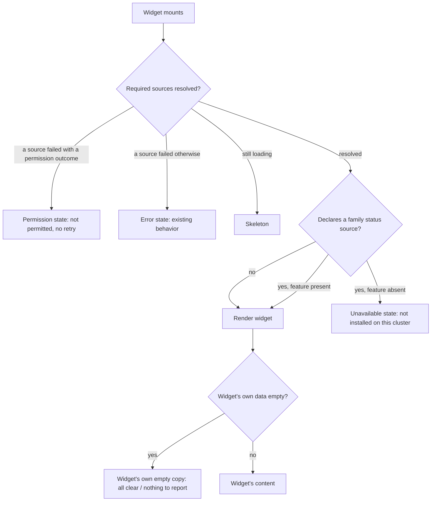
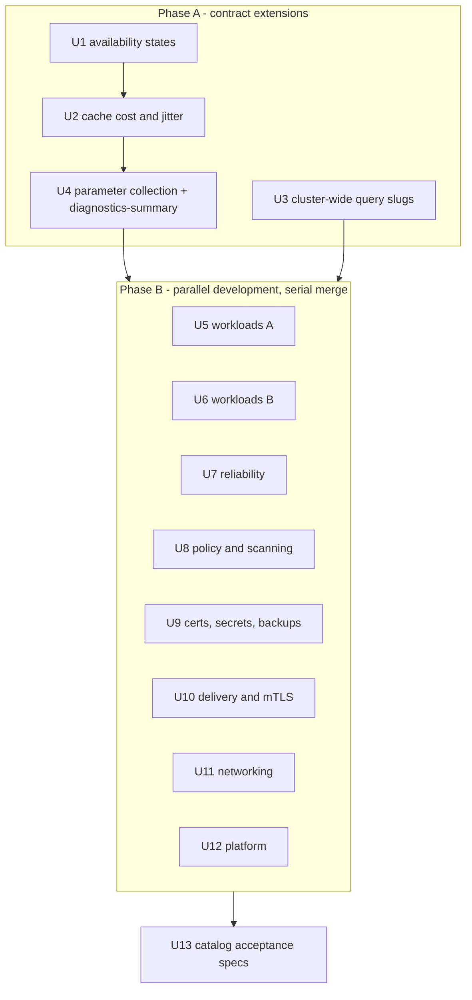

# Release G / P5 Widget Catalog - Plan

## Goal Capsule

- **Objective:** an operator assembles the overview dashboard their cluster actually needs — workloads, policy, certificates, GitOps, mesh, backups, platform — and a card for something their cluster does not run, or that their account cannot read, says so plainly instead of rendering as good news.
- **Means:** the 28 remaining catalog widgets, produced against the render contract P1 shipped, preceded by the availability, parameter and refresh-load machinery that contract does not yet have (KTD1, KTD3, KTD5).
- **Authority:** this plan governs sequencing and implementation. `docs/plans/2026-09-13-dashboard-builder-design.md` governs product scope and decisions D-1 through D-11; where its source table names a route that is not mounted at that path, this plan's corrected table wins (KTD9). `docs/plans/2026-09-10-EXECUTION-ORDER.md` governs G1–G8, amended here for G2 only (KTD2). This plan supersedes the spec's estimate of roughly seven P5 units with thirteen, so the execution order's Release G PR count and its grand total are both low; correct them at merge time, following the same reconciliation the release already uses for migration sequence numbers.
- **Execution profile:** one feature branch and one PR per unit, CI green before the next unit starts. U1, U2 and U4 are sequential; U3 depends on nothing and can run alongside them. U5–U12 are parallelizable **as development**, not as merging — every one of them edits the same pinned widget-id literals, so each branch rebases onto the latest merged `main` and re-resolves those entries before its PR opens, and they land one at a time.
- **Stop conditions:** stop and escalate if a parity test cannot be satisfied without changing the render contract itself, or if a widget's backing route turns out to need a new handler rather than a new registry entry.
- **Finishes and ships:** the implementing agent or developer running this plan, unit by unit, through the release's existing PR flow.

---

## Product Contract

### Summary

P5 completes the dashboard builder's catalog. P1–P4 shipped the widget registry, the keyed source cache, `WidgetHost`, the twelve-column grid, per-`(user, cluster)` layout persistence and the edit-mode palette, proven against ten widgets. This plan adds 28 more and defers one, taking the catalog to 38 of the spec's 39.

Three pieces of machinery land first. The widget shell learns to say "not installed" and "not permitted" as outcomes distinct from failure, because the ten shipped widgets are all backed by always-present informer reads and never had to. Parameter collection gets built, because no widget is parameterized yet and the palette places a widget the instant it is chosen. The source cache gets cost classes and refresh jitter, because a dashboard may hold forty widgets and today every source refetches on the same tick.

### Problem Frame

The overview dashboard shows seven fixed blocks about cluster capacity. Everything this platform learned to do since — policy compliance, certificate expiry, GitOps drift, mesh mTLS, backup health, secret sync — lives on its own page, reachable only by knowing it exists and navigating there. An operator watching a cluster keeps a dozen tabs open because the one page they leave running cannot be made to show what they are actually worried about.

### Key Decisions

Carried forward from the design spec (see origin: `docs/plans/2026-09-13-dashboard-builder-design.md`). The spec's rationale is not restated here.

- D-1. The catalog is the full 39 widgets of the spec's section 6. Governs R8, R9, R10, R11, R12, R13.
- D-7. Unknown widget ids are dropped-with-notice on read and rejected on write. Governs R14, R16.
- D-8. No user-authored PromQL and no URL fields, ever; parameterized widgets take validated values only. Governs R15.
- D-10. Logic that needs a unit test lives in `frontend/lib/` as a pure module. Governs R17.

Taken during this planning pass:

- **The Grafana panel embed moves to P6.** Chosen over shipping it in P5: it is the only catalog entry whose stored value must be re-validated against live cluster discovery rather than against a fixed table, which is a second validation model for one widget. Governs R18.

### Requirements

**Widget contract**

- R1. A widget whose backing feature is not installed on the cluster renders an explicit unavailable state, derived from that feature's own status route and never inferred from an empty list.
- R2. A widget the current user is not permitted to read renders an explicit permission state, distinct from a transient failure and carrying no retry affordance.
- R3. The palette marks a widget that cannot work on this cluster or for this account before it is added, through the existing disabled-entry affordance.
- R4. A widget that needs a namespace, or a namespace and a service, collects those values when it is added, and a placed widget's values can be changed without losing its grid position.
- R5. A stored namespace parameter is re-authorized on every read; a user who loses access to that namespace sees the R2 permission state.
- R6. A dashboard holding many widgets refreshes without issuing every expensive backend read on the same tick.
- R7. Every widget whose data has a matching full page links to that page.
- R17. Derived-value logic that a widget renders — segment maths, severity roll-ups, threshold classification — lives in a pure module with unit coverage, not inline in the component.

**Catalog coverage**

- R8. Workloads and scaling: `workload-health`, `pending-pods`, `pod-restarts`, `hpa-status`, `pdb-risk`, `top-consumers`.
- R9. Reliability: `diagnostics-summary`, `quota-pressure`, `node-conditions`, `storage-capacity`.
- R10. Security and compliance: `policy-compliance`, `policy-violations`, `vulnerability-severity`, `certs-expiring`, `eso-health`.
- R11. Delivery and data protection: `gitops-app-health`, `gitops-recent-syncs`, `velero-backups`, `snapshot-health`.
- R12. Networking: `mesh-golden-signals`, `mtls-coverage`, `hubble-flows`, `gateway-routes`.
- R13. Platform: `cluster-status`, `notifications-feed`, `audit-activity`, `saved-views`, `pinned-resources`.

**Registration and boundaries**

- R14. Every widget is registered in the browser registry and in the server allowlist, and both halves are pinned by the existing parity tests. A layout save carrying an unregistered id is refused.
- R15. No widget reaches Prometheus except through the server-side slug registry; a widget needing a query that registry does not hold gets a new entry there.
- R16. A widget id is never reused after retirement; a retired id stays in the server allowlist so stored layouts keep resolving.
- R18. `grafana-panel` is not built in P5.

### Acceptance Examples

- AE1. **Covers R1.** Given a cluster with no Kyverno or Gatekeeper, when `policy-compliance` is on the dashboard, then it reads as not installed — not as full compliance.
- AE2. **Covers R1.** Given a cluster with Kyverno installed and zero violations, when `policy-violations` is on the dashboard, then it reads as clear, not as unavailable.
- AE3. **Covers R2.** Given a non-admin user, when `audit-activity` is on the dashboard, then it reads as not permitted and offers no retry.
- AE4. **Covers R4, R5.** Given `diagnostics-summary` scoped to a namespace the operator later loses access to, or that is deleted, when the dashboard loads, then the widget surfaces the failure and the operator can re-point it at another namespace from where it sits.
- AE5. **Covers R14.** Given a layout save carrying a widget id absent from the server allowlist, when it is submitted, then the save is refused and names the offending field.

### Scope Boundaries

**In scope:** 28 catalog widgets; the availability, parameter and refresh-load extensions to the widget contract those widgets require; new cluster-wide entries in the server-side query registry; catalog-level acceptance specs.

**Deferred to follow-up work**

- `grafana-panel` — per R18, lands with P6.
- P6's per-category dashboards. `scopes` already exists on every widget definition, so assigning widgets to a workloads or networking dashboard is an additive edit per widget.
- A shared "empty versus unavailable" audit of the ten existing widgets. They are backed by always-present sources, so the new states never fire for them.

**Outside this product's identity**

- User-authored PromQL, free-text URLs, or any stored value that is executable or a redirect target. KTD4 of Release A survives, restated by the design spec's section 7.

### Sources

- `docs/plans/2026-09-13-dashboard-builder-design.md` — sections 3 (decisions), 5 (sub-projects), 6 (catalog), 7 (validation), 9 (verification), 10 (gaps P1 must design).
- `docs/plans/2026-09-13-release-g-p4-editor-impl.md` — its self-review names P5's 29 widgets as the uncovered remainder and records the stack rot this plan corrects.
- `backend/internal/preferences/dashboard.go` — `allowedWidgets`, `widgetSpec`, `ValidateDashboardLayout`, and the namespace parameter's special status.
- `backend/internal/preferences/parity_test.go` — `TestContractParity`, the mechanism that makes a one-sided registration fail CI.
- `backend/internal/monitoring/query_registry.go` — the server-side slug registry that satisfies D-8, and the reason a cluster-wide query is a new entry rather than a client concern.
- `backend/internal/k8s/resources/access.go` — `CanAccessGroupResource` versus `CanAccess`, per G7.
- `frontend/components/dashboard/WidgetHost.tsx`, `frontend/lib/dashboard/data.ts`, `frontend/lib/dashboard/types.ts` — the render contract and its three current states.
- `frontend/components/dashboard/WidgetPalette.tsx` — the existing disabled-entry mechanism R3 reuses.

---

## Planning Contract

### Key Technical Decisions

- KTD1. **The widget shell owns availability, and detects it from the feature's own status route.** A CRD-discovered family returns an empty list when its operator is absent, which is indistinguishable from an installed feature with nothing to report — so every affected widget declares its family's status as a required source and the shell resolves the state before the widget's own empty-state logic runs. Deciding this once in the contract rather than 28 times in the widget bodies is the same mitigation D-1 named for the render contract itself. Governs R1, R2, R3.

- KTD2. **A unit is one PR spanning both sides of the stack; G2's five-file cap is amended for this release.** Splitting a unit into a server-registration PR and a browser PR is not merely larger, it is broken: `TestContractParity` pins both halves to literals, so either half alone lands red. P4 exceeded the cap in every unit and recorded the overrun three times without amending it. This plan sizes units by coherence and states the real file list per unit. G2's intent — one reviewable unit, CI green before the next — is preserved.

- KTD3. **Parameter collection is its own unit, proven by one widget, before the widgets that need it.** The server has carried full parameter validation since P3 and the browser has never used it; the palette places a widget the instant it is chosen and the placement helper never writes a params field. That is design work, not mass production, so it lands with the simpler of the two parameterized widgets rather than being discovered inside a four-widget batch. The cascading namespace-then-service case lands later, with the networking unit. Governs R4, R5.

- KTD4. **`mtls-coverage` ships without parameters.** Its backing route treats an absent namespace as a cluster-scoped read, so the cluster-wide posture is the more useful default and it costs no parameter UI. Governs R12.

- KTD5. **The source cache gets cost classes and refresh jitter before the catalog grows.** Today four informer-backed sources refetch together on a sixty-second tick. The catalog admits up to forty items pointing at distinct routes, several of them Prometheus- or Hubble-backed, refreshing simultaneously for every viewer. Retrofitting a limiter after 28 sources exist touches every fetcher; adding it while there are four touches one file. Three classes, not two: informer-backed reads are cheap; Prometheus-, Hubble- and database-backed reads are expensive; CRD-discovered reads sit between them and default to expensive, because they back most of the new catalog and defaulting them to cheap by omission would reinstate the stampede this decision exists to prevent. Governs R6.

- KTD6. **PromQL-backed widgets get new entries in the server-side slug registry.** The raw query routes are admin-gated, and every existing slug is scoped to a single resource instance, so there is no parameterless cluster-wide query to reuse. Two widgets need one. This is a Go map entry each, not a new subsystem. Governs R15.

- KTD7. **Widget ids are the frozen surface; the four pinned literals follow them.** Each widget's id, minimum width and minimum height appear in the browser registry, two pinned browser test literals, the server allowlist and two pinned server test literals. The id and minimums are chosen once, in the unit that introduces the widget, and never adjusted afterwards — a minimum changed later is an editor that lets a user drag to a size the server refuses. R16 needs no new enforcement: the server allowlist is already append-only by convention, retired ids are never removed from it, and there is no separate retirement list to maintain. Governs R14, R16.

- KTD8. **Each widget's derived values are extracted to a pure module when the maths is more than a field read.** This is D-10 applied per widget. The donut-segment defect the release already fixed came from inlining exactly this kind of logic in a component the repo cannot unit-test. Governs R17.

- KTD9. **Four of the spec's source paths are corrected.** The spec's section 6 names routes that are not mounted at those paths: policy endpoints live under a plural prefix, vulnerabilities under the scanning prefix, Gateway API under its own top-level prefix rather than under networking, and the external-secrets list is nested under its own segment. There is no bare storage overview route; the storage widget composes from the storage classes route and the new cluster-wide query slug (KTD6). The corrected mapping is in the table below.

**Bake-off not run.** The one decision that would have qualified — how the browser registry and the server allowlist stay in agreement — is settled by an established codebase pattern rather than open: `TestContractParity` states its own rationale in the file, and the same pairing already guards the saved-view allowlists and the wizard regexes. Reopening a settled convention to run a competition is out of bounds.

### High-Level Technical Design

Directional guidance. The prose above is authoritative where they disagree.

How the shell resolves what a widget shows, once KTD1 lands:

Unit dependencies and the three phases:

### Corrected source mapping

The spec's section 6 table, with KTD9's corrections applied and the new work named.

| Widget id | Backing read | Correction or new work |
|---|---|---|
| `workload-health` | resource counts | local cluster only; counts omit kinds the user cannot list |
| `pending-pods`, `pod-restarts` | pods list via the generic resource route | — |
| `hpa-status`, `pdb-risk`, `node-conditions` | generic resource route by kind | — |
| `top-consumers` | server-side query slug | **new slug** (KTD6) |
| `diagnostics-summary` | diagnostics summary by namespace | **namespace parameter** (KTD3) |
| `quota-pressure` | namespace limits | — |
| `storage-capacity` | storage classes plus a query slug | **new slug** (KTD6); no bare storage route exists |
| `policy-compliance`, `policy-violations` | policy routes | **plural prefix**, not the spec's singular |
| `vulnerability-severity` | scanning vulnerabilities | **scanning prefix**, not the spec's security prefix |
| `certs-expiring` | expiring certificates | — |
| `eso-health` | external secrets list | **nested segment**; drift and sync health are inline on the item |
| `gitops-app-health`, `gitops-recent-syncs` | GitOps applications | commit enrichment needs a repo and shas, so it is optional |
| `velero-backups`, `snapshot-health` | Velero backups, storage snapshots | — |
| `mesh-golden-signals` | mesh golden signals | **namespace and service parameters** (KTD3) |
| `mtls-coverage` | mesh mTLS posture | parameterless (KTD4) |
| `hubble-flows` | Hubble flows | the REST route, not the flows socket |
| `gateway-routes` | Gateway API gateways and routes | **own top-level prefix**, not under networking |
| `cluster-status` | clusters | returns a service-unavailable error without a database, unlike the CRD families |
| `notifications-feed`, `saved-views`, `pinned-resources` | notifications, saved views, pins | — |
| `audit-activity` | audit logs | **admin-gated**; the R2 permission state is its normal case for most users |

### Assumptions

- The catalog's item cap of forty exceeds the 38 shipped ids, so a user can place every widget without hitting it. No cap change is planned.
- The existing widget families cover every P5 widget, so the palette's family labels need no new entries.
- The existing severity, status and chart primitives cover every P5 presentation. No new chart component is planned; a unit that finds otherwise should say so rather than inventing one silently.
- Acceptance specs continue to use the layout route stub rather than the live preferences endpoint, except where a unit states otherwise.

### Deferred to implementation

- The exact minimum width and height per widget. Each is chosen in the unit that introduces the widget and pinned in the same PR (KTD7); guessing them now would be a literal to correct twice.
- Whether the unavailable state reuses the error card's shape or gets its own quieter treatment. Decide it in U1 against the rendered result, not on paper.
- Which of the two parameterized widgets' pickers can share a component, once both exist.
- Whether a read against a deleted namespace comes back as forbidden or as not-found, which decides whether it lands in the permission state or the error state. Both are acceptable outcomes and the copy differs; settle it in U4 against the real response rather than guessing which the API returns.

---

## Implementation Units

### Unit index

| U-ID | Title | Primary files | Depends on |
|---|---|---|---|
| U1 | Availability and permission states | `WidgetHost.tsx`, `data.ts`, `types.ts`, `catalog.ts`, `WidgetPalette.tsx`, `DashboardV2.tsx` | — |
| U2 | Source cost classes and refresh jitter | `data.ts` | U1 |
| U3 | Cluster-wide query slugs | `query_registry.go` | — |
| U4 | Parameter collection, proven by `diagnostics-summary` | `placement.ts`, picker component, `DashboardV2.tsx`, `dashboard.go` | U1, U2 |
| U5 | Workloads and scaling A | `widgets/`, `registry.ts`, `dashboard.go` | U4 |
| U6 | Workloads and scaling B | `widgets/`, `registry.ts`, `dashboard.go` | U3, U4 |
| U7 | Reliability | `widgets/`, `registry.ts`, `dashboard.go` | U3, U4 |
| U8 | Policy and scanning | `widgets/`, `registry.ts`, `dashboard.go` | U4 |
| U9 | Certificates, secrets and backups | `widgets/`, `registry.ts`, `dashboard.go` | U4 |
| U10 | Delivery and mTLS | `widgets/`, `registry.ts`, `dashboard.go` | U4 |
| U11 | Networking | `widgets/`, `registry.ts`, `dashboard.go` | U4 |
| U12 | Platform | `widgets/`, `registry.ts`, `dashboard.go` | U4 |
| U13 | Catalog acceptance specs | `e2e/tests/` | U5–U12 |

Every unit in U5–U12 also touches `frontend/components/dashboard/widgets/index.ts`, `frontend/lib/dashboard/registry_test.ts` and `backend/internal/preferences/parity_test.go`, per KTD7. Those three are omitted from the index rows to keep it scannable and are named in each unit's file list.

---

### Phase A — contract extensions

#### U1. Availability and permission states

**Goal:** the widget shell can say "not installed on this cluster" and "not permitted for this account" as outcomes in their own right, and the palette says so before a widget is added.

**Requirements:** R1, R2, R3. Implements KTD1.

**Dependencies:** none.

**Files:**
- Modify: `frontend/lib/dashboard/types.ts` — the source-state shape and the widget definition's declaration of a family status source
- Modify: `frontend/lib/dashboard/data.ts` — status sources for the six CRD-discovered families, and classification of a permission failure
- Modify: `frontend/components/dashboard/WidgetHost.tsx` — state resolution per the design diagram
- Modify: `frontend/lib/dashboard/catalog.ts` — a disabled reason for unavailable and not-permitted entries
- Modify: `frontend/lib/dashboard/catalog_test.ts`
- Modify: `frontend/components/dashboard/WidgetPalette.tsx` — accept the family-status state and render the new disabled reasons
- Modify: `frontend/src/islands/DashboardV2.tsx` — fetch family status for the whole catalog, not only for placed widgets, and pass it to the palette
- Modify: `frontend/lib/dashboard/data_test.ts`

**Approach:**
1. Add a status source per CRD-discovered family — policy, GitOps, certificates, mesh, external secrets, Velero. Each family already mounts its own status route; the detected flag on that payload is the signal, per KTD1.
2. Let a widget definition declare which family status it depends on. A widget with no declaration keeps today's behavior exactly.
3. Classify a failed fetch as a permission outcome when the response is a forbidden one, and carry that through the source state so the shell can branch. Everything else stays the existing error state.
4. Resolve the states in the shell in the diagram's order, before the widget's render runs. A widget never learns it is unavailable; it is not rendered.
5. Extend the palette's existing disabled-reason mechanism with the two new reasons. It already blocks the add and skips the entry in keyboard navigation, so the affordance is reused rather than invented.
6. Give the palette the family-status state it needs to compute those reasons. The source cache fetches only what placed widgets declare, and the disabled-reason helper takes no status argument today — so a widget that is merely *in the catalog* has no status to judge. The island that owns the cache requests every family's status once on mount, independently of what is placed, and passes the result into the palette alongside the placed items. Without this, R3 cannot hold for any widget the user has not already added.

**Patterns to follow:** the existing disabled-reason ordering in `catalog.ts`; the collect-the-offenders assertion style used throughout `frontend/lib/dashboard/*_test.ts`, so a failure names the widget.

**Execution note:** the state resolution is pure and belongs in a `lib/` module with the test written first; the shell's branch on it is thin and is proven in U13.

**Test scenarios:**
- A widget declaring a family status whose payload reports the feature absent resolves to unavailable, and its render is not called.
- A widget declaring a family status whose payload reports the feature present, with an empty data list, resolves to rendered — the widget's own empty copy shows. Covers AE2.
- A widget whose required source failed with a forbidden response resolves to the permission state, not the error state.
- A widget whose required source failed with any other error resolves to the existing error state, unchanged.
- A widget with stale data plus a new error keeps today's stale-banner behavior, unchanged.
- A widget declaring no family status resolves exactly as it does today, for all of loading, error and data.
- The palette marks an entry whose family is absent, and blocks adding it — for a widget that is not on the dashboard, since that is the case the existing fetch path does not cover.
- The palette marks an entry the account cannot read, and blocks adding it.
- Ordering: an entry that is both already-placed and unavailable reports one reason deterministically.
- The unavailable, permission and error states are each distinguishable from the other two by something a user can see — heading copy or icon, not colour alone. This is what holds the Definition of Done's distinctness bar however the open question about the unavailable card's shape is resolved.

**Verification:** the ten shipped widgets render identically to before on a cluster where every feature is present — this unit must be invisible until a P5 widget uses it.

---

#### U2. Source cost classes and refresh jitter

**Goal:** a dashboard holding many widgets spreads its refreshes instead of issuing every backend read on the same tick.

**Requirements:** R6. Implements KTD5.

**Dependencies:** U1.

**Files:**
- Modify: `frontend/lib/dashboard/types.ts` — a cost class on the source declaration
- Modify: `frontend/lib/dashboard/data.ts` — concurrency bound and per-source refresh offset
- Modify: `frontend/lib/dashboard/data_test.ts`

**Approach:**
1. Give each data source one of the three cost classes KTD5 names. The four existing sources are all cheap, so today's behavior is the cheap path.
2. Bound how many expensive fetches are in flight at once, queueing the rest. Cheap fetches stay unbounded.
3. Give each expensive source a stable offset within the refresh interval, derived from its key so it is the same on every tick and different between sources. Viewers of the same dashboard still align with each other; that is acceptable and separating them would need a per-session seed this plan does not want.
4. Leave the range-sensitive source set mechanical: a unit adding a range-backed source adds its key there.

**Patterns to follow:** the existing in-flight dedupe in the source cache — the bound is the same shape of bookkeeping, keyed by cost class.

**Test scenarios:**
- Two widgets sharing one source key still issue one fetch, unchanged.
- More expensive sources than the bound allows: the excess queue and run as slots free, and all resolve.
- A queued fetch whose widget is removed before it starts does not run.
- Expensive sources get distinct offsets; the same key gets the same offset across ticks.
- Cheap sources are unaffected by the bound.
- A failing expensive fetch releases its slot.
- The existing time-range refetch behavior is unchanged for the range-sensitive source.

**Verification:** on a dashboard of the ten shipped widgets, network behavior at load and at the refresh tick is identical to before.

---

#### U3. Cluster-wide query slugs

**Goal:** the two Prometheus-backed widgets have a server-side query to call that is not admin-gated and needs no user-authored PromQL.

**Requirements:** R15. Implements KTD6.

**Dependencies:** none. Can land in parallel with U1 and U2.

**Files:**
- Modify: `backend/internal/monitoring/query_registry.go` — a top-consumers slug and a storage-capacity slug
- Modify: the registry's existing test file alongside it

**Approach:**
1. Add two entries. Every existing entry is scoped to one resource instance and takes a namespace and a name; these two are cluster-wide and take neither, which is a shape the registry does not hold yet — confirm the slug handler's parameter resolution tolerates that before writing the template.
2. Declare the required verbs and group-resource for each so the handler's per-slug authorization applies, per G7. Top consumers reads pods; storage capacity reads persistent volume claims.
3. Do not touch the separate template-query map. It is not per-resource authorized and is not the mechanism D-8 names.

**Execution note:** write the authorization assertion first. A cluster-wide slug that resolves to an empty namespace must still be authorized, and getting that wrong turns a scoped check into an open one.

**Test scenarios:**
- Each new slug renders to valid PromQL with no parameters supplied.
- A caller without the declared verb on the declared group-resource is refused, and the refusal is a permission outcome rather than a server error.
- A caller with the verb succeeds.
- The existing per-resource slugs are unaffected by whatever parameter-resolution change the cluster-wide shape needs.
- The registry's own drift or listing test, if it pins the slug set, is updated in the same change.

**Verification:** `cd backend && go vet ./... && go test ./...` passes, and the two slugs are reachable by a non-admin caller holding the declared verbs.

---

#### U4. Parameter collection, proven by `diagnostics-summary`

**Goal:** a widget that needs a namespace asks for one when it is added, a placed widget's namespace can be changed in place, and the first parameterized widget ships.

**Requirements:** R4, R5, R9 (`diagnostics-summary` only), R14. Implements KTD3.

**Dependencies:** U1, U2.

**Files:**
- Create: `frontend/components/dashboard/WidgetParamDialog.tsx`
- Create: `frontend/components/dashboard/widgets/DiagnosticsSummaryWidget.tsx`
- Create: `frontend/lib/dashboard/params.ts` and `frontend/lib/dashboard/params_test.ts`
- Modify: `frontend/lib/dashboard/placement.ts` and `frontend/lib/dashboard/placement_test.ts`
- Modify: `frontend/components/dashboard/WidgetPalette.tsx`, `frontend/components/dashboard/DashboardGrid.tsx`, `frontend/src/islands/DashboardV2.tsx`
- Modify: `frontend/lib/dashboard/registry.ts`, `registry_test.ts`, `types.ts`, `data.ts`, `frontend/components/dashboard/widgets/index.ts`
- Modify: `backend/internal/preferences/dashboard.go`, `backend/internal/preferences/parity_test.go`

**Approach:**
1. Insert a value step between choosing a widget in the palette and placing it, for widgets that declare parameters only. Everything else keeps placing immediately.
2. Thread the collected values through placement so the layout item carries them. The item type already has the field; nothing writes it today.
3. Add a re-parameterize affordance on a placed parameterized widget in edit mode, reusing the same dialog pre-filled. Without it the only repair for a deleted namespace is delete-and-re-add, which loses the widget's position — AE4 is the case that forces this.
4. Register `diagnostics-summary` on both sides, declaring the namespace parameter. The server's key for a namespace is exact and is what triggers read-time re-authorization; spelling it differently silently opts out of R5.
5. Update the browser tripwire that asserts no widget declares parameters, and the server parity assertion that pins the same absence. Both are designed to fail here; that is their job.
6. Reuse the existing namespace select as the picker's input rather than building one.

**Technical design:** directional. The palette's choose handler becomes: if the definition declares parameters, open the dialog and place on confirm; otherwise place as today. The dialog returns a values map or nothing, and returning nothing is a cancel that places no widget.

**Patterns to follow:** the modal shell and focus handling already used by the layout copy dialog; the confirm-dialog conventions this release settled in P4.

**Execution note:** the parameter-validation helpers are pure and belong in `lib/` with tests first, per KTD8. The dialog itself is proven in U13.

**Test scenarios:**
- Choosing a parameterless widget places it immediately, with no dialog — the existing path, unchanged.
- Choosing a parameterized widget opens the dialog and places nothing until it is confirmed.
- Cancelling the dialog places nothing and leaves the layout untouched.
- A confirmed dialog produces a layout item carrying the values, placed by the existing placement rules.
- Two instances of the same parameterized widget with different namespaces both place, and are not treated as duplicates.
- Two instances with the same namespace are refused as a duplicate.
- Re-parameterizing a placed widget changes its values and leaves its position and size untouched.
- A value the server would refuse — over-long, containing control characters — is refused in the dialog before a round trip.
- `diagnostics-summary` renders its severity roll-up from the summary payload.
- `diagnostics-summary` whose namespace the caller has lost access to resolves to the U1 permission state.
- `diagnostics-summary` whose namespace has been deleted surfaces the failure and can be re-pointed at another namespace without losing its grid position. Covers AE4.
- The server refuses a save whose parameter key is not declared for that widget. Covers AE5.
- `TestContractParity` passes with the new id, its minimums and its declared parameter pinned on both sides.

**Verification:** a namespace-scoped widget can be added, saved, reloaded, re-pointed at another namespace and saved again, and a user without access to the chosen namespace sees the permission state rather than a broken card.

---

### Phase B — catalog production

Every unit below follows the same shape, so it is stated once here rather than eight times. Each unit: creates one component per widget under `frontend/components/dashboard/widgets/`; extracts each widget's derived-value logic to a pure module with a test when the maths is more than a field read (KTD8); adds each id to `frontend/components/dashboard/widgets/index.ts`; adds a source key and fetcher to `frontend/lib/dashboard/types.ts` and `frontend/lib/dashboard/data.ts` for each backend read not already cached, with its cost class (U2); declares the family status source where the widget's feature is CRD-discovered (U1); registers each id with its minimums in `frontend/lib/dashboard/registry.ts` and in `backend/internal/preferences/dashboard.go`; updates the two pinned literals in `frontend/lib/dashboard/registry_test.ts` and the two in `backend/internal/preferences/parity_test.go` (KTD7); and links each widget to its full page (R7).

Test scenarios stated per unit are the derived-value and state cases specific to those widgets. Three scenarios apply to every unit and are not repeated: the widget's pure module handles an empty payload without throwing; the widget's id, minimums and parameters match on both sides; and a widget for an absent feature resolves to unavailable rather than to its empty copy.

**Merging is serial even though development is not.** Every unit in this phase edits the same four pinned literals, so two branches adding different widgets conflict textually in all of them. Code the units concurrently; rebase each branch onto the latest merged `main` and re-resolve those entries before opening its PR, so the shared files take one unit at a time. A unit that adds a CRD-discovered source classes it as expensive unless it has a reason not to, per KTD5.

#### U5. Workloads and scaling A

**Goal:** `workload-health`, `pending-pods` and `pod-restarts` ship.

**Requirements:** R8, R7, R14, R17.

**Dependencies:** U4.

**Files:** three components under `frontend/components/dashboard/widgets/`; `frontend/lib/dashboard/workload-health.ts` and its test; `frontend/lib/dashboard/pod-health.ts` and its test, shared by the two pod widgets; plus the per-unit shared files named above.

**Approach:**
1. `workload-health` rolls deployments, stateful sets and daemon sets into ready-versus-degraded from the counts route. That route is local-cluster only and omits kinds the caller cannot list, so a missing key means "not visible to you", not zero — the roll-up must not render an omitted kind as fully degraded.
2. `pending-pods` and `pod-restarts` both read the pods list and both classify pod state, so the classification is one module with two selectors over it rather than two near-copies.
3. `pod-restarts` ranks by restart count and surfaces crash-looping pods first.

**Test scenarios:**
- A counts payload omitting a kind the caller cannot list renders that kind as unknown, not as zero-ready.
- A counts payload from a remote cluster context, where the route refuses, resolves to the widget's unavailable-or-error path rather than rendering zeros.
- Ready-versus-degraded splits correctly when every workload is ready, when none is, and when the payload is empty.
- Pending classification distinguishes unschedulable from merely pending.
- Restart ranking puts a crash-looping pod above a higher-restart-count pod that is currently running, since the loop is the actionable one.
- A pod with no restart history sorts last rather than throwing.

**Verification:** all three render on a live cluster and each links to its workloads page.

---

#### U6. Workloads and scaling B

**Goal:** `hpa-status`, `pdb-risk` and `top-consumers` ship.

**Requirements:** R8, R7, R14, R15, R17.

**Dependencies:** U3, U4.

**Files:** three components; `frontend/lib/dashboard/autoscaling.ts` and its test; plus the per-unit shared files.

**Approach:**
1. `hpa-status` shows current against target replicas and flags an autoscaler pinned at its ceiling — that is the state worth surfacing, not the raw numbers.
2. `pdb-risk` flags budgets with no allowed disruptions, which is the case that blocks a node drain.
3. `top-consumers` calls the cluster-wide slug from U3, not a raw query route (R15), and switches between CPU and memory as a display choice rather than a stored parameter — a second stored value here would mean two catalog entries or a parameter for something that is a view toggle.

**Test scenarios:**
- An autoscaler at its maximum with demand above target is flagged; one at maximum with demand met is not.
- An autoscaler with no current metrics renders unknown rather than zero.
- A budget allowing zero disruptions is flagged; one allowing some is not.
- A budget whose selector matches no pods renders as informational rather than as risk.
- `top-consumers` renders a ranked list from the slug response and renders the permission state when the caller lacks the slug's declared verb.
- Switching between CPU and memory does not change the stored layout.

**Verification:** `top-consumers` works for a non-admin user holding pod-read permission — the case that motivated KTD6.

---

#### U7. Reliability

**Goal:** `quota-pressure`, `node-conditions` and `storage-capacity` ship.

**Requirements:** R9, R7, R14, R15, R17.

**Dependencies:** U3, U4.

**Files:** three components; `frontend/lib/dashboard/pressure.ts` and its test, shared by the quota and storage widgets; plus the per-unit shared files.

**Approach:**
1. `quota-pressure` ranks namespaces by how close they sit to their quota, across whichever resources each quota actually constrains. A namespace with no quota is absent from the ranking, not at zero pressure.
2. `node-conditions` surfaces pressure and not-ready conditions rather than the full condition list.
3. `storage-capacity` composes the storage classes read with the U3 slug, since no single storage overview route exists (KTD9).

**Test scenarios:**
- Quota pressure ranks by proportion used, not absolute value, so a small nearly-full namespace outranks a large mostly-empty one.
- A namespace with no quota is omitted from the ranking entirely.
- A quota constraining only one resource ranks on that resource alone.
- Node conditions surface disk, memory and PID pressure and not-ready; a node with none of them is not listed.
- A cluster where every node is healthy renders the widget's clear state.
- `storage-capacity` renders when the classes read succeeds and the slug fails, degrading to what it has rather than to an error.

---

#### U8. Policy and scanning

**Goal:** `policy-compliance`, `policy-violations` and `vulnerability-severity` ship.

**Requirements:** R10, R1, R7, R14, R17.

**Dependencies:** U4.

**Files:** three components; `frontend/lib/dashboard/severity.ts` and its test, shared by the violations and vulnerability widgets; plus the per-unit shared files.

**Approach:**
1. All three widgets read CRD-discovered features and declare their family status source (KTD1). This unit is where AE1 and AE2 are first exercised for real.
2. `policy-compliance` renders the compliance score on the existing gauge primitive. `policy-violations` ranks by severity.
3. `vulnerability-severity` breaks down by severity across the scanned workloads.
4. Reuse the policy, scan and mesh badge components rather than styling new severity chips.

**Test scenarios:**
- No policy engine installed: both policy widgets resolve to unavailable. Covers AE1.
- Policy engine installed with zero violations: `policy-violations` renders clear, not unavailable. Covers AE2.
- Severity ranking orders critical above high above medium, and an unrecognized severity sorts last rather than throwing.
- A compliance payload the endpoint reports as history-unavailable renders the widget's own degraded state rather than the shell's error state, since the current score is still present.
- `vulnerability-severity` with no scanner installed resolves to unavailable; with a scanner and no findings, to clear.

---

#### U9. Certificates, secrets and backups

**Goal:** `certs-expiring`, `eso-health`, `velero-backups` and `snapshot-health` ship.

**Requirements:** R10, R11, R1, R7, R14, R17.

**Dependencies:** U4.

**Files:** four components; `frontend/lib/dashboard/expiry.ts` and its test; plus the per-unit shared files.

**Approach:**
1. `certs-expiring` classifies against the warning and critical thresholds the certificates payload already resolves per certificate. Do not re-derive thresholds in the browser — the annotation resolution chain and its conflict handling live on the server and the payload carries the outcome.
2. `eso-health` reads drift and sync state inline from the external-secrets list; no second call is needed.
3. `velero-backups` and `snapshot-health` are list roll-ups by status.
4. All four declare a family status source.

**Test scenarios:**
- A certificate the payload marks as threshold-conflicted renders under the default classification, matching what the server resolved, and is not silently recomputed.
- Expiry classification splits critical, warning and healthy at the payload's own boundaries, inclusive at the boundary.
- An external secret in each of the drift states renders distinctly, including the state that means drift is not determinable.
- A failed backup outranks an in-progress one in the roll-up.
- Each of the four resolves to unavailable when its operator is absent, and to a clear state when the operator is present with nothing to report.

---

#### U10. Delivery and mTLS

**Goal:** `gitops-app-health`, `gitops-recent-syncs` and `mtls-coverage` ship.

**Requirements:** R11, R12, R1, R7, R14, R17.

**Dependencies:** U4.

**Files:** three components; `frontend/lib/dashboard/sync-state.ts` and its test; plus the per-unit shared files.

**Approach:**
1. `gitops-app-health` rolls applications into synced, out-of-sync and degraded across both tools, keyed by the composite id convention the GitOps feature already uses.
2. `gitops-recent-syncs` lists recent sync activity from the applications payload. Commit enrichment needs a repository and a set of shas, so it is an optional enhancement rather than the widget's data source — the widget must be useful without it.
3. `mtls-coverage` ships parameterless per KTD4, reading the cluster-wide posture.

**Test scenarios:**
- Applications from both tools roll up together and are distinguishable by tool in the rendering.
- An application that is both out-of-sync and degraded is counted once, in the more severe bucket.
- `gitops-recent-syncs` renders fully with commit enrichment absent.
- `mtls-coverage` with no mesh detected resolves to unavailable.
- `mtls-coverage` with a mesh detected and no workloads renders its clear state rather than unavailable.
- Mixed strict and permissive workloads render the coverage proportion, and a cluster with no strict workloads renders zero coverage rather than an empty card.

---

#### U11. Networking

**Goal:** `mesh-golden-signals`, `hubble-flows` and `gateway-routes` ship, and the parameter picker gains its cascading case.

**Requirements:** R12, R4, R1, R7, R14, R17.

**Dependencies:** U4.

**Files:** three components; the cascading picker extension to `frontend/components/dashboard/WidgetParamDialog.tsx` and `frontend/lib/dashboard/params.ts`; plus the per-unit shared files.

**Approach:**
1. `mesh-golden-signals` needs a namespace and a service, and the service value space is not enumerable ahead of time — this is the harder parameter case KTD3 deferred here. The service input is scoped to the chosen namespace, is only enabled once a namespace is chosen, and is populated from the namespace's service list over the generic resource route, the same route `hpa-status` and `node-conditions` read. It is a select or filterable combobox over that list, never a free-text field: an unvalidated service name is the shape D-8 exists to keep out of a stored parameter.
2. Both values are declared on the server side, with the namespace under the exact key that triggers read-time re-authorization (R5).
3. `hubble-flows` uses the REST flows route, not the flows socket (KTD9) — a dashboard widget must not hold a socket open per card.
4. `gateway-routes` reads from the Gateway API prefix, not the networking prefix (KTD9), and covers gateways and routes together.

**Test scenarios:**
- The service input is disabled until a namespace is chosen, and clears when the namespace changes.
- The service list is drawn from the chosen namespace, and a namespace the caller cannot list services in yields an empty, disabled input rather than a free-text fallback.
- Confirming with a namespace but no service is refused, since the backing read requires both.
- A saved golden-signals widget whose namespace the caller can no longer read resolves to the permission state.
- Two golden-signals widgets for different services in the same namespace both place.
- `hubble-flows` with Hubble absent resolves to unavailable; with Hubble present and no flows, to clear.
- `gateway-routes` renders when gateways exist with no routes, and when routes exist across several gateways.

---

#### U12. Platform

**Goal:** `cluster-status`, `notifications-feed`, `audit-activity`, `saved-views` and `pinned-resources` ship.

**Requirements:** R13, R1, R2, R7, R14.

**Dependencies:** U4.

**Files:** five components; plus the per-unit shared files. Most of these are list roll-ups thin enough to need no pure module; a unit that finds otherwise extracts one per KTD8.

**Approach:**
1. `cluster-status` is the one widget whose backing route reports unavailability as a service-unavailable error rather than as an absent feature (KTD9), so it needs that case mapped to the unavailable state explicitly rather than to the shell's generic error.
2. `audit-activity` is admin-gated, so the permission state from U1 is its normal rendering for most users and the palette marks it accordingly (R3). This is the widget that proves AE3.
3. `saved-views` and `pinned-resources` are launchers over the preferences the user already has; they reuse Release A's payloads and link into those surfaces.
4. `notifications-feed` shows the unread feed; the unread-count route is available if the widget's compact mode wants only a badge.

**Test scenarios:**
- `cluster-status` with no database configured resolves to unavailable, not to the error state.
- `cluster-status` with a database and only the local cluster renders that single entry rather than an empty card.
- `audit-activity` for a non-admin resolves to the permission state with no retry affordance, and the palette marks the entry before it is added. Covers AE3.
- `audit-activity` for an admin renders recent activity.
- `saved-views` and `pinned-resources` render empty states that link to where the user creates one.
- `notifications-feed` renders unread items, and its compact mode renders when the widget is sized small.

---

### Phase C — proof

#### U13. Catalog acceptance specs

**Goal:** the catalog-level behaviors are proven end to end, rather than each widget being spot-checked by hand.

**Requirements:** R1, R2, R3, R4, R6, R14.

**Dependencies:** U5–U12.

**Files:**
- Create: `e2e/tests/dashboard-catalog.spec.ts`
- Modify: `e2e/tests/dashboard-layout-stub.ts` — widget-data stubs for the new sources
- Modify: `e2e/tests/dashboard-palette.spec.ts` — the pinned catalog size

**Approach:**
1. Cover the contract, not the widgets. One spec per catalog-level behavior, not one per widget — the per-widget derived logic is already unit-covered and duplicating it here buys nothing and costs suite time.
2. Follow the house docstring style: state what the spec covers and what it deliberately does not, naming the test that owns the remainder.
3. Clean up created layouts after each spec, as the pins suite does. The admin user is shared across the suite and a leftover layout changes what every later spec sees.
4. The pinned catalog size in the palette spec moves once, here, rather than being bumped in each of U5–U12.

**Test scenarios:**
- A dashboard holding widgets for uninstalled features renders them as unavailable, and the rest of the dashboard renders normally. Covers AE1.
- An installed feature with no data renders the widget's clear state, distinguishable from unavailable. Covers AE2.
- A non-admin user sees the permission state on the admin-gated widget and cannot add it from the palette. Covers AE3.
- Adding a parameterized widget prompts for its value, and cancelling adds nothing.
- A placed parameterized widget can be re-pointed at another namespace and keeps its position across a reload. Covers AE4.
- A save carrying an unregistered widget id is refused. Covers AE5. Assert this against the real endpoint or in Go, and record which — the stub deliberately does not check widget ids.
- A dashboard holding many expensive widgets does not issue every expensive read simultaneously on load.
- The palette lists the full catalog and its search finds a widget from each family.

**Verification:** the suite is green and leaves no layout behind.

---

## Verification Contract

Repo-wide, per Agent Directive 4. Scoped checks do not satisfy this.

| Gate | Command | Applies to |
|---|---|---|
| Frontend lint, types and build guards | `cd frontend && bun run check` | every unit |
| Frontend unit tests | `cd frontend && bun test` | every unit |
| Backend vet and tests | `cd backend && go vet ./... && go test ./...` | U3, U4, U5–U12, U13 |
| Acceptance suite | `cd e2e && npx playwright test` | U4, U13, and any unit changing the palette or grid |

Two gates carry most of this plan's weight and are named separately because a unit that skips them lands broken:

- `TestContractParity` fails whenever a widget is registered on one side only, and names the file holding the other half. It is the reason KTD2 refuses to split a unit across two PRs.
- The browser registry's pinned id and minimum literals are its mirror. A unit updates all four literals or it does not pass.

---

## Definition of Done

**Global**

- All 28 widgets of R8 through R13 are registered on both sides, appear in the palette under their family, and are placeable.
- Every widget is reachable by keyboard and operable at narrow widths, matching the bar P2 set for the grid.
- The unavailable, permission, empty and error states are visually distinct, and no widget renders an absent feature as a healthy one.
- Every widget with a matching full page links to it.
- Every gate in the Verification Contract passes repo-wide.
- `grafana-panel` is recorded as P6 work in the release's execution order, not silently dropped.
- No dead-end or experimental code from abandoned approaches remains in the shipped diff.

**Per unit**

- One branch, one PR, CI green before the next unit starts.
- The unit's test scenarios are covered, including the three that apply to every Phase B unit.
- Widget ids, minimums and declared parameters are pinned in all four literals and never adjusted in a later unit.
- Any pure module the unit introduces has unit coverage; any component it introduces is covered by U13 or by an existing spec.
