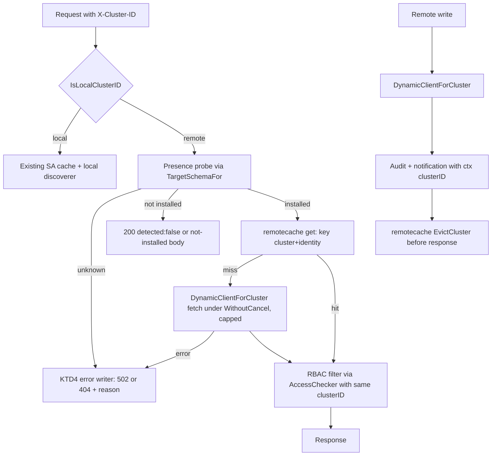
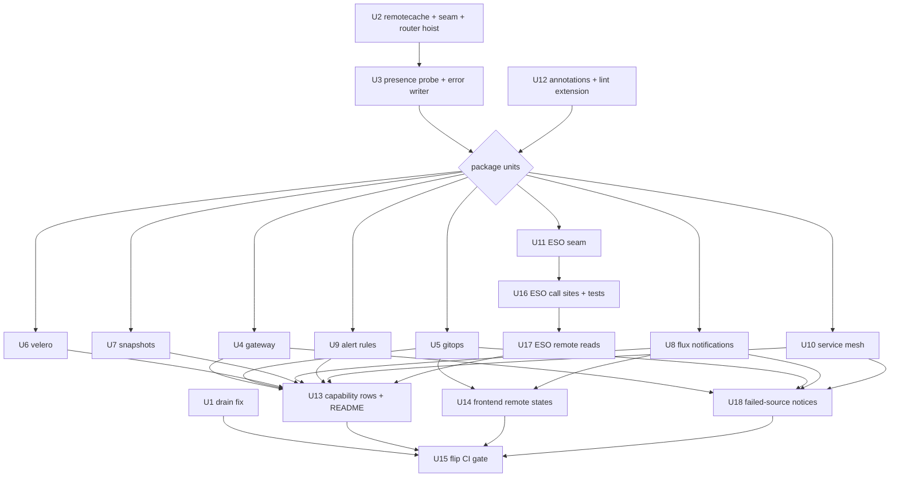

# R-8 Remote Cluster Routing - Plan

## Goal Capsule

- **Objective:** When an operator selects a registered remote cluster, the GitOps, Velero, volume snapshot, Flux notification, alert rule, Gateway API, service mesh, External Secrets and node drain features show and change that cluster, never the local one. Anything a feature cannot do remotely is declared, not silently served from local.
- **Means:** Route every per-user call through `ClusterRouter` on top of a shared per-cluster foundation, then make the cluster-routing lint a failing CI gate (KTD1, KTD2, KTD9).
- **Authority:** This plan's Requirements win on behavior and its KTDs win on mechanism. `CLAUDE.md` Agent Directives (5-file phases, Step-0 cleanup, forced verification, `recoverutil`) bind every unit. `docs/plans/2026-09-10-release-c-remote-workflow-impl.md` R-1, R-2 and R-8 are the origin constraints.
- **Execution profile:** Each Implementation Unit is one phase of at most five files and ships as its own PR. The user approves each phase before the next starts (Directive 2). U1 is independent. U2, U3 and U12 precede every package unit. U13, U14 and U18 follow the package units. U15 is last.
- **Stop conditions:** Stop and ask when a unit would exceed five files, when a package cannot be migrated without changing a carve-out in R12–R15, or when a remote test can only pass by reading local data.
- **Finishing:** `ce-work` implements and verifies each unit. Each PR goes through `/ce:review` before merge, per `CLAUDE.md`.

---

## Product Contract

### Summary

Every handler that `scripts/check-cluster-routing.sh` flags moves onto the operator-selected cluster: its lists, detail reads, writes, RBAC checks, audit rows, notifications and "is this installed" answers all name the same cluster. A shared per-cluster cache, presence probe and remote-error writer land first so ten packages make these choices once. Features tied to local-only infrastructure refuse remote explicitly and get capability rows. The CI gate then flips to `fail`.

### Problem Frame

Release C made the YAML workflow and dashboard cluster-aware and left the routing lint in `warn` mode (origin R-8). The lint reports 48 violations. Behind most of them is a wrong-cluster bug that is worse than the lint suggests. Under a remote selection, the affected handlers:

- run the RBAC check against the remote cluster (the `AccessChecker` is cluster-aware);
- write the audit row with the remote cluster's id;
- then send the write to the **local** cluster through `K8sClient.DynamicClientForUser`.

GitOps sync and delete, Velero schedule trigger and delete, snapshot create and delete, Flux notification CRUD, PrometheusRule CRUD and node drain all behave this way. Their list pages read local service-account caches and local CRD discovery, so the operator sees local objects labelled as the remote cluster. They then act on those objects believing they are remote. This is origin risk R-2, "silent local fallback", in its worst form: the audit trail says one cluster and the mutation lands on another.

Node drain has a second, independent bug. It runs on the request context in a bare goroutine after returning 202, so the drain is cancelled almost immediately and a panic would crash the process.

The lint cannot see most of this. It matches only `.ClientForUser(` and `.DynamicClientForUser(`, so a green gate would still pass local list data served under a remote name.

### Requirements

**Routing correctness**

- R1. Every list, detail, write and write-guard lookup in the migrated features reads and changes the cluster named by the request's `X-Cluster-ID`, with no fallback to local on any remote failure.
- R2. Each migrated feature's installed or not-installed answer (status route, page empty state, dashboard Widget Availability) comes from the selected cluster's own discovery.
- R3. Audit rows and write-triggered notifications carry the request's cluster id, for allowed and denied writes alike.
- R4. After a successful remote write, the next list for that cluster shows the change. Stale-cache windows must not invite duplicate creates.
- R5. Cached remote data is never shared across Kubernetes identities (origin R-1).

**Failure disclosure**

- R6. A remote cluster that is unreachable, has invalid credentials or is unknown returns a fixed message and a reason from the capability endpoint's closed reason set. The response never carries the remote host, address or raw client error.
- R7. "Not installed", "unreachable" and "discovery failed" are distinguishable to the frontend.
- R8. A multi-source list, such as Argo plus Flux or Istio plus Linkerd, discloses a failed source rather than silently omitting it.

**Node drain**

- R9. A drain runs to completion on the cluster it was requested for, independently of the HTTP request lifetime, with panic recovery.
- R10. Drains of the same node name on different clusters do not block each other, and deregistering a cluster cancels its in-flight drains.

**Declared limits**

- R11. The capability table, `GET /capabilities/{clusterID}`, the README "Remote cluster support" table and the frontend operation-id list stay in step with what each feature does remotely.
- R12. External Secrets writes and bulk refresh stay refused on remote (existing decision, `externalsecrets/actions.go`).
- R13. Cilium CNI config read and update stay refused on remote (existing P2-5 decision, `networking/handler.go` `rejectNonLocal`).
- R14. Surfaces that depend on the local Prometheus, Alertmanager or ESO poller report "unavailable on remote" rather than local data. These are mesh golden signals, the mTLS metrics cross-check, ESO history, evidence, metrics and the drift hint, and the active and history alert feeds.
- R15. Log, flow and exec streams stay local-only.

**Structural guard**

- R16. CI fails on any unannotated direct per-user client call in a handler package. Each migrated package is also guarded against local-schema and service-account reads.

### Key Decisions

- **Migrate the affected features to work on remote clusters** (session-settled: user-directed — chosen over refusing remote with 501 and over annotate-only: the user wants the features to work against the selected cluster, not be switched off or papered over). Governs R1, R2, R3, R4.
- **Keep existing carve-outs refused.** ESO writes, CNI config and live streams were earlier deliberate decisions and this plan does not reopen them. Governs R12, R13, R15.

### Success Criteria

- Against a fake remote seeded with different objects from the local fake, every migrated feature returns the remote objects, and the local fake records zero actions.
- `CHECK_CLUSTER_ROUTING_GATE=fail bash scripts/check-cluster-routing.sh` passes in CI, and every remaining `nolint:cluster-routing` names a carve-out from R12–R15 or a legitimately local call site.

### Scope Boundaries

- Remote access stays admin-only (origin R-9 is unchanged).
- No informers for remote clusters; remote reads are direct API calls behind a short cache.
- Live WebSocket updates are not added for remote clusters. Pages on a remote cluster refresh on demand.

#### Deferred to Follow-Up Work

- **Policy (Kyverno/Gatekeeper) remote support.** Its lists serve local data filtered by remote RBAC. The lint cannot see this, because it uses service-account reads only. U2's foundation makes this a small follow-up. The README names it as a known gap (U13).
- **cert-manager per-cluster discovery.** Its remote lists are gated on local detection. Same follow-up shape as policy.
- **Topology on remote.** It is informer-local and serves local data under the remote name. Needs a refusal or a remote builder.
- **Storage drivers and StorageClasses lists on remote** (`HandleListDrivers`, `HandleListClasses` read local informers). Snapshot classes and drivers used by the snapshot flow are in scope (U7).
- **Flux notification `v1beta2` on remote.** The package builds `v1beta3` bodies only, so a remote serving only `v1beta2` reports not installed until a follow-up adds version-specific bodies.
- **Mobile typed errors** for the new reason codes. The backend contract lands here; mobile renders them as generic errors until the follow-up.

---

## Planning Contract

### Key Technical Decisions

- KTD1. **One shared per-cluster cache type in a new `internal/k8s/remotecache` package.** It is keyed on `(clusterID, identity)`, has a 30s TTL, singleflight on the full key, and fetches under `context.WithoutCancel` capped at the caller's deadline or 30s. It supports `EvictCluster(clusterID)` across every identity and registers through `ClusterRouter.RegisterEvictHook`. The local path keeps each package's existing service-account cache untouched. Around eight hand-rolled `cachedData` + gen + singleflight copies would otherwise be duplicated again for remote. (session-settled: user-approved — chosen over copying cert-manager's per-package remote cache into each package: one implementation of TTL, singleflight, context and eviction rules instead of eight that drift.)
- KTD2. **The cache key includes the identity** (the same `cacheKey(username, groups)` that `TargetSchemaFor` uses). cert-manager keys only on the cluster id and is safe only while R-9 holds. It also shares the first caller's errors with every coalesced waiter. Keying on identity removes the R-9 dependency, at the cost of one fetch per admin identity per 30s. That cost is acceptable because remote access is admin-only. Governs R5.
- KTD3. **Feature presence comes from `ClusterRouter.TargetSchemaFor(...).Discovery`.** A helper checks group/version/resource presence per cluster and identity, and returns a tri-state verdict: installed, not installed, or unknown with a reason code.
  - It reads discovery the way the capability endpoint's `fetchDiscoveryLists` / `failedDiscoveryGroups` do. A nil list or a group in the failed set is unknown (`discovery_unavailable`). Absence from a loaded list is not installed (`discovery_missing`). The remote discovery is a memcache client whose per-group-version lookup returns a plain `ErrCacheNotFound` for an unserved group, so per-GV lookups would misreport absence as unknown.
  - A not-installed or unknown verdict is cached for at most the KTD1 30s TTL. The re-check after that calls `TargetSchema.Invalidate` before probing again, so a CRD installed on the remote later is seen within about 30s.
  - A NoMatch or a collection-level NotFound from a list handles the reverse case (installed, then removed): invalidate, re-probe once, and return not installed.
  - Local presence keeps each package's existing discoverer. Governs R2, R7.
- KTD4. **One remote-error writer in `internal/httputil`.** It covers two kinds of failure:
  - Target-resolution failures: 502 (`unreachable`, `credentials_invalid`), 404 (`cluster_unknown`) or 503 (`db_unavailable` when the cluster registry's database is down). Classification reuses the capability endpoint's `classifyTargetSchemaErr`, moved to a shared location, which checks the database case before the network ones.
  - Errors from remote API calls after the client resolved. Transport and URL errors become 502 `unreachable`. Kubernetes status errors keep their HTTP code with a fixed message.

  Every response carries a `reason` from the capability endpoint's closed `ReasonCode` set and no detail. The raw error goes only to the log. On a remote-reachable path, no migrated handler echoes `err.Error()` into a response. Governs R6, R7.
- KTD5. **Status routes keep each family's existing body shape and field types, and add an optional `reason`.** Today GitOps and mesh `detected` is a string enum, gateway and Flux notifications report `available` bool, and Velero and ESO report `detected` bool. Mobile decodes the string families as `String?`, so a boolean there would throw.
  - On remote, not installed is the family's existing negative value (for example `""`/none for GitOps and mesh, `false` for the boolean families) with reason `discovery_missing`.
  - Unknown is the same negative value with reason `unreachable` or `discovery_unavailable`. `reason` is absent on local.
  - List routes return the KTD4 error when the target cannot be resolved, never an empty 200. ESO's existing 503 "not detected" on local is unchanged. Governs R7.
- KTD6. **Test seam: a small `ClusterClients` interface in package `k8s`** (`ClientForCluster`, `DynamicClientForCluster`, `TargetSchemaFor`), which `*ClusterRouter` satisfies. Handlers depend on the interface, so tests inject a fake remote. The SSRF policy blocks loopback, so an `httptest` server cannot stand in for a remote cluster. This generalises the yaml `clusterTargeter` seam instead of adding a per-package override.
- KTD7. **Writes evict that cluster's cache entries synchronously before responding.** Remote clusters get no informer events, so nothing else would refresh them. Governs R4.
- KTD8. **Multi-source lists return a partial 200 with a per-source coverage field on remote.** The coverage field is additive, and the existing list shape that web and mobile decode is unchanged. This follows the remote dashboard pattern. The list pages render a failed-source notice from it (U18). Detail reads and write-guard lookups fail closed. Governs R8.
- KTD9. **Guard migrated packages with a `REMOTE_ROUTED_DIRS` list in the lint.** In those packages `.BaseDynamicClient()`, `.BaseClientset()`, `.DiscoveryClient()` and `.RESTMapper()` are violations unless annotated. The annotation is the explicit local-path marker.
  - U12 creates the empty list. Each package unit adds its package in the unit that migrates it, mirroring `SCHEMA_ROUTED_DIRS`, and annotates that package's remaining local calls, including those in its discovery files.
  - When that pushes a unit past five files, the list entry and annotations land as a second phase of the same unit.
  - The lint then sees the list-path bug class, which the call-only pattern misses. Governs R16.
- KTD10. **Carve-outs keep their local call and gain an annotation plus a capability row.** The annotation form is `// nolint:cluster-routing <carve-out: reason>` on the line above. No new refusal code is written where one already exists. Governs R12, R13, R15.
- KTD11. **Node drain resolves its client on the request path and runs detached.** The goroutine runs under `context.WithoutCancel` plus the drain timeout and is wrapped in `recoverutil.Safe`. The task records its cluster id, and an evict hook cancels in-flight drains for a deregistered cluster. Governs R9, R10.
- KTD12. **Capability rows land in one unit (U13) after the package units.** The Go table, its pinned test and the README parity test must change together. Batching keeps each package unit under the five-file limit. Until U13 lands, a migrated feature has no row, which is true today as well.
- KTD13. **Alert rule remote support means PrometheusRule object CRUD only.** Whether the rules fire depends on the target running prometheus-operator. The active and history alert feeds stay on the local Alertmanager (R14). A remote cluster without the CRD returns a not-installed verdict, not `[]`.

### High-Level Technical Design

Request path for a migrated feature on a remote selection:

Unit dependencies:

### Assumptions

- `internal/server/middleware` does not import `internal/alerting` or the other migrated packages, so the handlers can read `ClusterIDFromContext` without an import cycle. It already imports certmanager, gitops, velero and notification.
- The per-package Step-0 sweep finds no dead production code. The research sweep found none. If it does find some, that cleanup is committed separately first (Directive 1).

---

## Implementation Units

| U-ID | Title | Key files | Depends on |
|---|---|---|---|
| U1 | Node drain runs detached on its cluster | `k8s/resources/nodes.go`, `tasks.go` | none |
| U2 | Per-cluster cache, client seam, router hoist | `k8s/remotecache/`, `k8s/cluster_clients.go`, `cmd/kubecenter/main.go` | none |
| U3 | Presence probe and remote-error writer | `k8s/presence.go`, `httputil/remote_error.go` | U2 |
| U4 | Gateway API on remote | `gateway/handler.go`, `gateway/discovery.go` | U3, U12 |
| U5 | GitOps on remote | `gitops/handler.go`, `gitops/discovery.go` | U3, U12 |
| U6 | Velero on remote | `velero/handler.go`, `velero/discovery.go` | U3, U12 |
| U7 | Volume snapshots on remote | `storage/handler.go` | U3, U12 |
| U8 | Flux notifications on remote | `notification/handler.go` | U3, U12 |
| U9 | Alert rules on remote | `alerting/rules.go`, `alerting/handler.go` | U3, U12 |
| U10 | Service mesh on remote | `servicemesh/handler.go`, `mtls.go`, `discovery.go` | U3, U12 |
| U11 | ESO client seam, local behaviour unchanged | `externalsecrets/handler.go`, `main.go` | U3, U12 |
| U12 | Annotate local sites, extend the lint | `scripts/check-cluster-routing.sh`, carve-out call sites | none |
| U13 | Capability rows and README | `server/handle_capabilities*.go`, `readme_capability_parity_test.go`, `README.md`, `lib/capability-types.ts` | U4–U10, U17 |
| U14 | Frontend remote states | `useWsRefetch`, dashboard status handling, alert-rules page | U5, U8 |
| U15 | Flip the CI gate | `.github/workflows/ci.yml`, `e2e/tests/remote-capabilities.spec.ts` | U1, U13, U14, U18 |
| U16 | ESO call sites and test overrides | ESO read helpers and their tests | U11 |
| U17 | ESO reads on remote | `externalsecrets/handler.go`, `path_discovery.go` | U16 |
| U18 | Failed-source notices on list pages | GitOps, mesh routing, gateway, Flux notification islands | U4, U5, U8, U10 |

All backend paths below are under `backend/internal/` unless shown in full.

### U1. Node drain runs detached on its cluster

- **Goal:** A drain completes on the requested cluster after the 202 response, survives panics, and never collides with a same-named node on another cluster.
- **Requirements:** R1, R3, R9, R10. Mechanism KTD11.
- **Dependencies:** None.
- **Files:** `backend/internal/k8s/resources/nodes.go`, `backend/internal/k8s/resources/tasks.go`, `backend/internal/k8s/resources/nodes_test.go` (new), `backend/internal/k8s/resources/tasks_test.go` (new or extended), `backend/cmd/kubecenter/main.go` (evict-hook registration).
- **Approach:**
  1. Resolve the typed client with `h.impersonatingClient(r, user)` in `HandleDrainNode`, before the 202. A resolution failure returns the KTD4 error once U3 exists, or 500 until then.
  2. Launch the drain with `go recoverutil.Safe(...)` over a `context.WithoutCancel(r.Context())` plus `req.Timeout`. On panic, mark the task Failed outside the wrapped closure.
  3. Add a cluster id to `Task`, and key `HasActiveTask` on (cluster, kind, name). `GET /tasks/{id}` reports the cluster.
  4. Keep a per-cluster cancel registry in `TaskManager`, and register an evict hook that cancels running drains for the evicted cluster.
- **Patterns to follow:** `certmanager/handler.go` `WithoutCancel` use; `go recoverutil.Safe` in `velero/handler.go` and `gitops/handler.go`; `docs/solutions/backend-resilience-conventions.md`.
- **Test scenarios:**
  - A drain whose handler has returned still cordons and evicts. The fake clientset records the cordon patch and evictions after the response was written.
  - A drain with a remote cluster in context calls the remote fake. The local fake records zero actions.
  - A panic inside the drain body marks the task Failed and does not crash the test process.
  - `node-1` draining on local does not block a drain of `node-1` on a remote cluster, and a second drain of `node-1` on the same cluster is refused.
  - `EvictCluster(remote)` cancels a running remote drain, which ends Failed with a "cluster removed" message. A local drain is untouched.
  - The audit row for a remote drain carries the remote cluster id.
- **Verification:** Drain tests pass. The `nodes.go` scanner violation is gone. No bare `go` remains in the drain path.

### U2. Per-cluster cache, client seam and router hoist

- **Goal:** One reusable per-cluster, per-identity cache and one client-provider interface that every package unit builds on, with `ClusterRouter` constructed before every handler that needs it.
- **Requirements:** R4, R5. Mechanism KTD1, KTD2, KTD6, KTD7.
- **Dependencies:** None.
- **Files:** `backend/internal/k8s/remotecache/cache.go` (new), `backend/internal/k8s/remotecache/cache_test.go` (new), `backend/internal/k8s/cluster_clients.go` (new, interface plus compile-time assertion), `backend/cmd/kubecenter/main.go`.
- **Approach:**
  1. `remotecache` is a generic keyed cache over (clusterID, identity) with TTL, singleflight on the full key, capped `WithoutCancel` fetch context, `EvictCluster`, and a bounded entry count, mirroring the 128-entry bound in `discovery_cache.go`. Errors are not cached.
  2. `ClusterClients` exposes exactly the three router methods handlers need. `*ClusterRouter` asserts it at compile time.
  3. Hoist `clusterRouter` construction in `main.go` above the mesh, storage and alert-rules handler construction. It depends only on `k8sClient`, `clusterStore`, `dbEncKey` and `logger`.
- **Patterns to follow:** `k8s/discovery_cache.go` (bound, identity key), `certmanager/handler.go` `fetchAllRemote` (context and singleflight rules), `cluster_router.go` `cacheKey`.
- **Test scenarios:**
  - Two identities on the same cluster get independent entries, and one identity's fetch error is not returned to the other.
  - Concurrent gets on one key run the fetch once.
  - A blocked fetch for cluster A does not delay a get for cluster B.
  - The fetch context survives caller cancellation but stops at the 30s cap.
  - `EvictCluster(A)` removes every identity's entry for A and leaves B's.
  - A get after TTL refetches.
  - Entry count stays at the bound under many identities.
- **Verification:** `remotecache` tests pass under `-race`. `main.go` builds, and startup wiring order is unchanged for handlers already using the router.

### U3. Presence probe and remote-error writer

- **Goal:** Packages answer "is this feature installed on the selected cluster" and report remote failures in one shared, leak-free shape.
- **Requirements:** R2, R6, R7. Mechanism KTD3, KTD4, KTD5.
- **Dependencies:** U2.
- **Files:** `backend/internal/k8s/presence.go` (new), `backend/internal/k8s/presence_test.go` (new), `backend/internal/httputil/remote_error.go` (new), `backend/internal/httputil/remote_error_test.go` (new).
- **Approach:**
  1. The presence helper takes the `ClusterClients` seam, a cluster id, the identity and a list of group/version/resources. It returns a verdict and a reason code, following KTD3 for the discovery reads, the verdict cache and both re-probe directions.
  2. The reason codes reuse the capability `ReasonCode` values. Move them, together with `classifyTargetSchemaErr` and the discovery-list helpers, to a shared location if importing from `server` would create a cycle. Keep `server`'s names as aliases so `TestCapabilities_ReasonCodesAreClosed` still pins one set.
  3. The error writer covers both KTD4 failure kinds.
- **Patterns to follow:** `server/handle_capabilities.go` reason classification and `fetchDiscoveryLists` / `failedDiscoveryGroups`; `networking/handler.go` wire-versus-log separation.
- **Test scenarios:**
  - A CRD present on the remote schema and absent locally gives "installed" for remote. The reverse gives "not installed".
  - With a memcache-wrapped fake discovery, an unserved group/version (`ErrCacheNotFound`) gives "not installed", not unknown.
  - A failed discovery group, or no list at all, gives unknown with `discovery_unavailable`, never "not installed".
  - A remote without the CRD reports "not installed". The CRD is then added to the fake discovery, and after the verdict window the same probe reports "installed".
  - Installed, then removed: a list that returns NoMatch or a collection NotFound triggers one invalidate and re-probe, and the result is "not installed".
  - An unreachable error writes 502 with reason `unreachable`, and the body contains no host, IP or raw error text.
  - An unknown cluster writes 404 with `cluster_unknown`.
  - A credentials failure writes 502 with `credentials_invalid`.
  - A `pgconn` connect error writes 503 with `db_unavailable`.
  - A post-resolution transport error whose text contains an IP writes 502 `unreachable` with no IP in the body. A remote 403 keeps 403 with a fixed message.
- **Verification:** Tests pass. The reason set has one definition.

### U4. Gateway API on remote

- **Goal:** Gateway, route and relationship views read the selected cluster, including the remote's served API versions.
- **Requirements:** R1, R2, R7, R8.
- **Dependencies:** U3, U12.
- **Files:** `backend/internal/gateway/handler.go`, `backend/internal/gateway/discovery.go`, `backend/internal/gateway/handler_remote_test.go` (new), `backend/cmd/kubecenter/main.go`, `scripts/check-cluster-routing.sh` (add gateway to `REMOTE_ROUTED_DIRS` per KTD9).
- **Approach:**
  1. Parameterise `InstalledKinds` on a discovery interface so that remote uses `TargetSchemaFor` and picks v1 or v1alpha2 from the remote.
  2. Remote list goes through `remotecache`. Detail, `resolveRouteRelationships` and `resolveBackendServices` use `ClusterClients`.
  3. Status follows KTD5.
- **Execution note:** Gateway is read-only and the smallest package, so land it first to prove the U2/U3 foundation end to end before the write-bearing packages.
- **Patterns to follow:** `certmanager/handler.go` remote branch shape; `k8s/resources/dashboard_remote.go` paging limits.
- **Test scenarios:**
  - Remote list returns remote gateways and routes. The local fake is seeded with different objects and records zero actions.
  - A remote serving only v1alpha2 while local serves v1 lists through v1alpha2.
  - Remote relationships resolve parent gateways and backend Services from the remote fake.
  - An unreachable remote returns the KTD4 502 and does not touch the local fake.
  - When one kind's list is forbidden on the remote, the list returns the other kinds plus a coverage entry naming the failure.
  - Remote status: installed on remote and absent locally reports detected.
- **Verification:** The gateway scanner violations are gone and the remote tests pass.

### U5. GitOps on remote

- **Goal:** Argo CD and Flux applications, ApplicationSets, actions and commit lookups operate on the selected cluster.
- **Requirements:** R1, R2, R3, R4, R7, R8.
- **Dependencies:** U3.
- **Files:** `backend/internal/gitops/handler.go`, `backend/internal/gitops/discovery.go`, `backend/internal/gitops/handler_remote_test.go` (new), `backend/cmd/kubecenter/main.go`.
- **Approach:**
  1. Remote lists (apps, appsets) go through `remotecache`. Detail, `prepareAction` (sync, suspend, rollback), appset refresh and delete use `ClusterClients`.
  2. `HandleGetCommits` gates its repo check against the same cluster's apps.
  3. Presence per cluster (KTD3) covers Argo and Flux independently. The union list follows KTD8.
  4. The notification emitted after an action carries the ctx cluster id (R3), and writes evict remote cache entries (KTD7).
- **Execution note:** Run the Step-0 dead-code sweep on `gitops/handler.go` (1014 LOC) first and commit any removal separately.
- **Patterns to follow:** U4's handler shape; existing `newArgoFakeDynClient` / `newFluxFakeDynClient` fixtures.
- **Test scenarios:**
  - Remote list returns remote Argo and Flux apps. The local fake records zero actions.
  - A remote sync patches the remote app. The audit row and notification carry the remote id, and the next list reflects the change.
  - A remote sync returning 403 is reported as 403, with no retry on local and a denied audit row.
  - Commits on remote authorize against remote apps: a repo URL present only in a local app is refused.
  - Argo installed remotely but Flux listing forbidden gives a partial list with a Flux coverage entry.
  - Unreachable remote on detail, action and list returns the KTD4 error with zero local actions.
- **Verification:** The five gitops violations are gone and the remote tests pass.

### U6. Velero on remote

- **Goal:** Backups, restores, schedules, locations and their actions operate on the selected cluster, including the delete-backup safety check.
- **Requirements:** R1, R2, R3, R4, R7.
- **Dependencies:** U3.
- **Files:** `backend/internal/velero/handler.go`, `backend/internal/velero/discovery.go`, `backend/internal/velero/handler_remote_test.go` (new), `backend/cmd/kubecenter/main.go`.
- **Approach:**
  1. `getImpersonatingClient` and the detail handlers use `ClusterClients`. Remote lists go through `remotecache`.
  2. `HandleDeleteBackup`'s in-progress-restore guard reads the remote restores and fails closed when it cannot.
  3. `requestBackupLogs` honours the request context instead of an uninterruptible sleep loop.
  4. The post-write `InvalidateCache` also evicts the remote cluster (KTD7). Notifications carry the ctx cluster id.
- **Execution note:** `velero/handler.go` is 1419 LOC. Run the Step-0 sweep and commit any removal separately before the routing change. If the routing change turns out to need restructuring beyond swapping client acquisition, stop and propose splitting the file first.
- **Patterns to follow:** U5.
- **Test scenarios:**
  - Remote backup list and detail return remote objects. The local fake records zero actions.
  - Deleting a remote backup while a remote restore is in progress is refused, even though the local cache has no restore. If the remote restore list fails, the delete is refused.
  - Triggering a remote schedule creates the Backup on the remote. The next list shows it (no 30s stale window), and the audit row carries the remote id.
  - Backup logs on remote create the DownloadRequest on the remote. A cancelled request context stops polling.
  - Unreachable remote returns the KTD4 error.
  - A remote create or delete that fails with a transport error naming the remote IP returns a body with no IP or raw error text (KTD4 post-resolution errors). The handlers' current `err.Error()` details are replaced on these paths.
- **Verification:** The eight velero violations are gone and the remote tests pass.

### U7. Volume snapshots on remote

- **Goal:** Snapshot list, detail, create and delete, and the snapshot classes and drivers the create flow offers, all come from the selected cluster.
- **Requirements:** R1, R2, R3, R4.
- **Dependencies:** U3.
- **Files:** `backend/internal/storage/handler.go`, `backend/internal/storage/handler_remote_test.go` (new), `backend/cmd/kubecenter/main.go`.
- **Approach:**
  1. Snapshot CRUD uses `ClusterClients`.
  2. `checkSnapshotCRDs` becomes per-cluster presence (KTD3).
  3. `HandleListSnapshotClasses` and `getSnapshotDrivers` read the target on remote.
  4. `auditWrite` uses the ctx cluster id instead of the static `ClusterID` field.
- **Patterns to follow:** U4.
- **Test scenarios:**
  - A remote snapshot create reaches the remote fake with the audit row carrying the remote id. The local fake records zero actions.
  - Snapshot classes on remote list the remote's classes, and a class present only locally is absent.
  - Remote without the snapshot CRDs reports not installed. Local with the CRDs does not change that answer.
  - Unreachable remote returns the KTD4 error.
- **Verification:** The four storage violations are gone. No request-path audit row in `storage` reads the static cluster id.

### U8. Flux notifications on remote

- **Goal:** Flux Providers, Alerts and Receivers list and change on the selected cluster.
- **Requirements:** R1, R2, R3, R4, R7, R8.
- **Dependencies:** U3.
- **Files:** `backend/internal/notification/handler.go`, `backend/internal/notification/handler_remote_test.go` (new), `backend/cmd/kubecenter/main.go`.
- **Approach:**
  1. The twelve write handlers use `ClusterClients`. Remote lists go through `remotecache`, fetched under the capped context rather than `context.Background()`.
  2. `HandleStatus` uses KTD5 on remote instead of inferring availability from fetch success.
  3. The remote uses the same `v1beta3` the package hardcodes. A remote that does not serve `notification.toolkit.fluxcd.io/v1beta3` reports not installed (KTD3), as local effectively does today.
  4. Writes evict remote entries.
- **Patterns to follow:** U4; the existing generic `resourceCache[T]` stays the local cache.
- **Test scenarios:**
  - Creating a remote Provider reaches the remote fake. The audit row carries the remote id, and the next list shows it.
  - A remote serving only `v1beta2` reports not installed, and no write is attempted.
  - Receivers forbidden on the remote while Providers are allowed returns partial data with a coverage entry.
  - Suspending on an unreachable remote returns the KTD4 error with zero local actions.
- **Verification:** The twelve notification violations are gone and the remote tests pass.

### U9. Alert rules on remote

- **Goal:** PrometheusRule CRUD targets the selected cluster, with an explicit not-installed answer and the local-only alert feeds declared.
- **Requirements:** R1, R2, R3, R14. Mechanism KTD13.
- **Dependencies:** U3.
- **Files:** `backend/internal/alerting/rules.go`, `backend/internal/alerting/handler.go`, `backend/internal/alerting/rules_test.go` (new), `backend/cmd/kubecenter/main.go`.
- **Approach:**
  1. Replace the `K8sClientFactory` interface with `ClusterClients`, and read the cluster id from the ctx the methods already receive.
  2. `Available()` becomes per cluster via KTD3 and no longer latches globally.
  3. Remote List without the CRD returns not-installed.
  4. Audit rows in `alerting/handler.go` use the ctx cluster id.
- **Test scenarios:**
  - Remote List returns the remote rules. Create, Update and Delete reach the remote fake, and the local fake records zero actions.
  - Remote without the PrometheusRule CRD returns not installed, not an empty list.
  - Local availability true does not make remote available, and the reverse.
  - Rule-write audit rows carry the remote id.
  - A remote rule write that fails with a transport error naming the remote IP returns a body with no IP or raw error text. The handler's current `err.Error()` error mapper is replaced on remote paths (KTD4).
  - `/alerts` active and history ignore `X-Cluster-ID` and are unchanged. This pins R14.
- **Verification:** The five `rules.go` violations are gone. `Available()` has no global latch.

### U10. Service mesh on remote

- **Goal:** Mesh routing lists, route detail and mTLS posture read the selected cluster. Prometheus-backed signals are declared unavailable on remote, and topology's mesh overlay stays local.
- **Requirements:** R1, R2, R8, R14.
- **Dependencies:** U3.
- **Files:** `backend/internal/servicemesh/handler.go`, `backend/internal/servicemesh/mtls.go`, `backend/internal/servicemesh/handler_remote_test.go` (new), `backend/cmd/kubecenter/main.go`. A second phase covers `backend/internal/servicemesh/discovery.go` annotations and the `REMOTE_ROUTED_DIRS` entry (KTD9).
- **Approach:**
  1. `HandleGetRoute` and `userClient` use `ClusterClients`. Remote routing lists go through `remotecache`, with Istio and Linkerd presence per cluster.
  2. On remote, mTLS posture returns pods and policies with an explicit "metrics cross-check unavailable" marker, and makes no Prometheus query.
  3. Golden signals on remote return an unavailable reason.
  4. The `MeshRouteProvider` methods used by topology keep reading the local cache only.
- **Patterns to follow:** Existing `dynOverride` / `clientsetOverride` seams in `servicemesh` tests. Replace them with `ClusterClients` only where the remote path needs it.
- **Test scenarios:**
  - Remote routes list remote VirtualServices. The local fake records zero actions.
  - Remote mTLS returns remote pod posture with the unavailable marker, and the Prometheus fake receives zero queries.
  - Remote golden signals return the unavailable reason with zero Prometheus queries.
  - The topology mesh overlay under a remote selection still reads only the local cache.
  - Istio installed on the remote and Linkerd list failing gives a partial list with a coverage entry.
- **Verification:** The two mesh violations are gone. Existing mesh tests still pass.

### U11. ESO client seam, local behaviour unchanged

- **Goal:** The ESO per-user client helpers take the request context and resolve through `ClusterClients`, with no behaviour change on local.
- **Requirements:** R1 (enabling step).
- **Dependencies:** U3, U12.
- **Files:** `backend/internal/externalsecrets/handler.go`, `backend/cmd/kubecenter/main.go` (pass the `ClusterClients` into `NewHandler`), plus at most three caller files among `actions.go`, `detail_evidence.go`, `history_handler.go`, `metrics.go` and `path_discovery.go`.
- **Approach:**
  1. `dynForUser` and `clientForUser` accept the ctx and resolve the cluster from it.
  2. Existing callers are updated in this unit and U16 in batches of at most five files. The override seams keep behaviour-equivalent semantics so the local suite stays green between phases.
- **Execution note:** The helpers have callers in six production files, and their overrides are used in seven test files. Characterise the current local behaviour with the existing suite green before changing the signatures.
- **Test expectation:** The existing ESO suite passes unchanged in behaviour. This is a refactor with no new behaviour.
- **Verification:** `go test ./internal/externalsecrets/...` is green, and the scanner count for ESO is unchanged or lower.

### U16. ESO call sites and test overrides

- **Goal:** Every remaining caller and test override uses the new seam.
- **Requirements:** R1 (enabling step).
- **Dependencies:** U11.
- **Files:** The remaining ESO caller files and the seven override-using test files (`actions_test`, `bulk_test`, `detail_evidence_test`, `handler_test`, `history_handler_test`, `metrics_test`, `path_discovery_test`). Split into phases of at most five files.
- **Approach:** Mechanical signature updates only. Change no behaviour or assertions.
- **Test expectation:** The existing suite passes. This is a mechanical refactor.
- **Verification:** The ESO suite is green after each phase.

### U17. ESO reads on remote

- **Goal:** ESO list, detail and path-discovery reads come from the selected cluster. Poller- and Prometheus-backed data is marked unavailable, and writes stay refused.
- **Requirements:** R1, R2, R12, R14.
- **Dependencies:** U16.
- **Files:** `backend/internal/externalsecrets/handler.go`, `backend/internal/externalsecrets/path_discovery.go`, `backend/internal/externalsecrets/bulk_worker.go`, `backend/internal/externalsecrets/handler_remote_test.go` (new), `scripts/check-cluster-routing.sh`. A second phase covers local service-account and discovery annotations in `discovery.go`, `poller.go` and `persist.go` (KTD9).
- **Approach:**
  1. Remote lists go through `remotecache`. The drift column on remote is "unknown", never absent or false.
  2. `bulk_worker.go`'s factory keeps its local call with a carve-out annotation (R12).
  3. History, evidence and metrics keep their existing remote refusals.
- **Test scenarios:**
  - Remote ExternalSecret list and detail return remote objects. The local fake records zero actions.
  - Remote list rows carry drift "unknown", never false.
  - Remote path discovery reads the remote store and secrets.
  - The remote force-sync and bulk refresh 501s are unchanged.
- **Verification:** The three ESO violations are gone (two migrated, one annotated), and the local suite is green.

### U12. Annotate local call sites and extend the lint

- **Goal:** Every call that is legitimately local carries a reasoned annotation, and the lint can guard migrated packages against local-schema and service-account reads.
- **Requirements:** R13, R15, R16. Mechanism KTD9, KTD10.
- **Dependencies:** None. Every package unit depends on this one, because it creates the `REMOTE_ROUTED_DIRS` list the package units add themselves to (KTD9).
- **Files:** `scripts/check-cluster-routing.sh`, `backend/internal/k8s/resources/access.go`, `backend/internal/server/handle_ws_logs.go`, `backend/internal/networking/handler.go`, `backend/internal/k8s/client_test.go`.
- **Approach:**
  1. Annotate `access.go` (local branch of the cluster-aware client), `handle_ws_logs.go` (behind the local-only guard, R15), the two CNI config calls (R13) and `client_test.go` (a unit test of the factory itself).
  2. Replace the literal `"local"` comparisons in `networking/handler.go` with `k8s.IsLocalClusterID`.
  3. Add `REMOTE_ROUTED_DIRS` to the script (empty until a package unit adds itself), plus self-test cases: a `.BaseDynamicClient()` call in a routed dir is a violation, the same call outside is clean, and an annotated call is clean.
- **Test scenarios:**
  - The script self-test passes with the new cases, and a mutated matcher fails it.
  - The scan reports none of the five annotated sites.
  - The existing `TestRejectNonLocal_*` networking tests still pass after the `IsLocalClusterID` change, and an empty cluster id is still treated as local.
- **Verification:** The script's violation count drops by exactly the annotated sites. Networking tests pass.

### U13. Capability rows and README

- **Goal:** The capability table, its tests, the README and the frontend id list declare what each migrated and carved-out feature does remotely.
- **Requirements:** R11, R12, R13, R14, R15.
- **Dependencies:** U4–U10, U17.
- **Files:** `backend/internal/server/handle_capabilities.go`, `backend/internal/server/handle_capabilities_test.go`, `backend/internal/server/readme_capability_parity_test.go` (`readmeRemotePartialAllowed`), `README.md`, `frontend/lib/capability-types.ts`. The e2e spec change moves to U15.
- **Approach:**
  1. Add remote-supported rows for the migrated features (GitOps, Velero, snapshots, Flux notifications, alert rules, Gateway API, mesh routing, ESO reads, node drain).
  2. Add remote-unsupported rows for the carve-outs: CNI config, mesh golden signals, ESO history and metrics.
  3. Mark mTLS posture "Partial", with `readmeRemotePartialAllowed` updated.
  4. Each row comment cites its guard. Drain is cluster-scoped for `ScopePinned`.
  5. README prose states the alert-rule scope (KTD13), the Velero log-URL reachability note, and the deferred known gaps (policy, cert-manager discovery, topology, storage drivers and classes).
- **Test scenarios:**
  - `TestCapabilityOperations_RemoteSupportPinned` and `TestReadmeCapabilityTableParity` pass with the new rows.
  - `CAPABILITY_OPERATION_IDS` matches the Go table.
- **Verification:** The server tests and `bun run check` pass.

### U14. Frontend remote states

- **Goal:** Pages on a remote cluster tell unreachable apart from not installed, stop refetching on local WebSocket events, and say where local-only feeds apply.
- **Requirements:** R7, R14.
- **Dependencies:** U5, U8.
- **Files:** `frontend/lib/useWsRefetch.ts`, `frontend/src/lib/useNotificationCrud.ts`, `frontend/lib/dashboard/data.ts`, the alert-rules island, and `frontend/lib/useWsRefetch_test.ts` (new or extended).
- **Approach:**
  1. `useWsRefetch` does nothing when the selected cluster is not local, matching `ResourceTable`. Pages show a "refresh to update" hint.
  2. Dashboard family-status handling maps the KTD5 `reason` to Widget Availability "unreachable" versus "not installed".
  3. The alert-rules page shows a banner under remote selection saying firing and alert feeds are the local Alertmanager's.
- **Test scenarios:**
  - `useWsRefetch` under a remote selection subscribes to nothing, and under local it subscribes as before.
  - A status response `{detected: null, reason: "unreachable"}` renders the widget as unreachable, not "not installed".
  - The alert-rules banner renders only under remote selection.
- **Verification:** `bun run check` and `bun test` pass.

### U15. Flip the CI gate

- **Goal:** CI fails on any new unannotated routing violation.
- **Requirements:** R16.
- **Dependencies:** U1, U12, U13, U14, U18, and every package unit.
- **Files:** `.github/workflows/ci.yml`, `e2e/tests/remote-capabilities.spec.ts`.
- **Approach:**
  1. Set `CHECK_CLUSTER_ROUTING_GATE: fail`, and update the step comment to name R-8.
  2. Extend the e2e remote spec to assert the new unsupported capability rows and to make a drain API call on the two-cluster fixture. That spec runs only against a registered remote and stays gated as today.
- **Test scenarios:**
  - The e2e remote spec asserts the carve-out rows from U13 as unsupported and the migrated features as supported.
- **Verification:** The PR's CI run shows the routing step passing with the gate at `fail`.

### U18. Failed-source notices on list pages

- **Goal:** When one source of a multi-source remote list fails, the page names it, so no source silently disappears.
- **Requirements:** R8. Mechanism KTD8.
- **Dependencies:** U4, U5, U8, U10.
- **Files:** The GitOps applications list island, the mesh routing list island, the gateway routes list island, `frontend/src/lib/useNotificationCrud.ts`, and one shared notice component or test file. Split into two phases if the islands and their tests exceed five files.
- **Approach:** Read the KTD8 coverage field and render a "could not load `<source>`" notice above the list for each failed source. Render nothing when coverage is absent or all sources succeeded, which is always true on local.
- **Test scenarios:**
  - A remote response whose coverage marks Flux as failed renders a Flux notice on the GitOps list, with the Argo rows still shown.
  - Coverage with every source succeeded renders no notice.
  - A local response (no coverage field) renders no notice.
- **Verification:** `bun run check` and `bun test` pass.

---

## Verification Contract

| Gate | Command | When |
|---|---|---|
| Backend | `cd backend && go vet ./... && go test ./...` | Every unit |
| Race | `cd backend && go test -race ./internal/k8s/remotecache/... ./internal/k8s/resources/...` | U1, U2, and any unit touching caches |
| Routing lint | `CHECK_CLUSTER_ROUTING_GATE=fail bash scripts/check-cluster-routing.sh` | Every unit; zero violations required from U15 |
| Frontend | `cd frontend && bun run check && bun test` | U13, U14 |
| Remote proof | Each package's `handler_remote_test.go` seeds different local and remote fakes and asserts remote data plus zero local actions | U4–U10, U17 |
| Review | `/ce:review` before merge | Every PR |

The lint passing is necessary but not sufficient. The remote-proof tests are what show R1 (Success Criteria).

---

## Definition of Done

- Every unit's Verification holds and its PR is merged after review.
- `scripts/check-cluster-routing.sh` reports zero violations in fail mode. Every migrated package is in `REMOTE_ROUTED_DIRS`.
- No request-path audit row or notification in the migrated packages reads a static cluster id.
- Every remaining `nolint:cluster-routing` names a carve-out (R12, R13, R15) or a legitimately local site.
- The capability table, README and frontend id list agree (parity tests green).
- No abandoned-attempt code, temporary seams or debug logging remain in the diff.
- `docs/plans/2026-09-10-release-c-remote-workflow-impl.md` open item 3 (R-8) can be marked done. The deferred items in Scope Boundaries are filed as follow-ups.

---

## Risks and Dependencies

| Risk | Mitigation |
|---|---|
| Remote list latency: each admin identity makes a live fetch per 30s per feature | KTD1 cache plus paged lists with the dashboard's page caps. Acceptable because remote access is admin-only. |
| ESO seam change breaks many existing tests | U11 execution note: keep the local suite green first and change signatures mechanically. |
| A package unit exceeds five files once tests and wiring are counted | Stop condition. Split the unit's read and write paths into two phases rather than batching. |
| The lint extension flags legitimate local discovery inside a migrated package | Annotate with the local-path reason. The annotation is the intended marker (KTD9). |
| Frontend shows remote reason codes as generic errors on mobile | Deferred mobile follow-up. The backend contract is stable from U3. |

---

## Sources

- `docs/plans/2026-09-10-release-c-remote-workflow-impl.md`: R-1 (identity-keyed discovery), R-2 (no local fallback), R-8 (this item), R-9 (admin-only remote).
- `backend/internal/certmanager/handler.go` `fetchAllRemote` / `EvictRemoteCache`: the partial precedent for remote caching.
- `backend/internal/k8s/cluster_router.go` `TargetSchemaFor`, `RegisterEvictHook`, `cacheKey`.
- `backend/internal/yaml/handler.go` `clusterTargeter` and `yaml/remote_test.go`: the test-seam precedent.
- `backend/internal/k8s/resources/dashboard_remote.go`: the remote paging and coverage pattern.
- `docs/solutions/backend-resilience-conventions.md`: `recoverutil` and goroutine rules.
