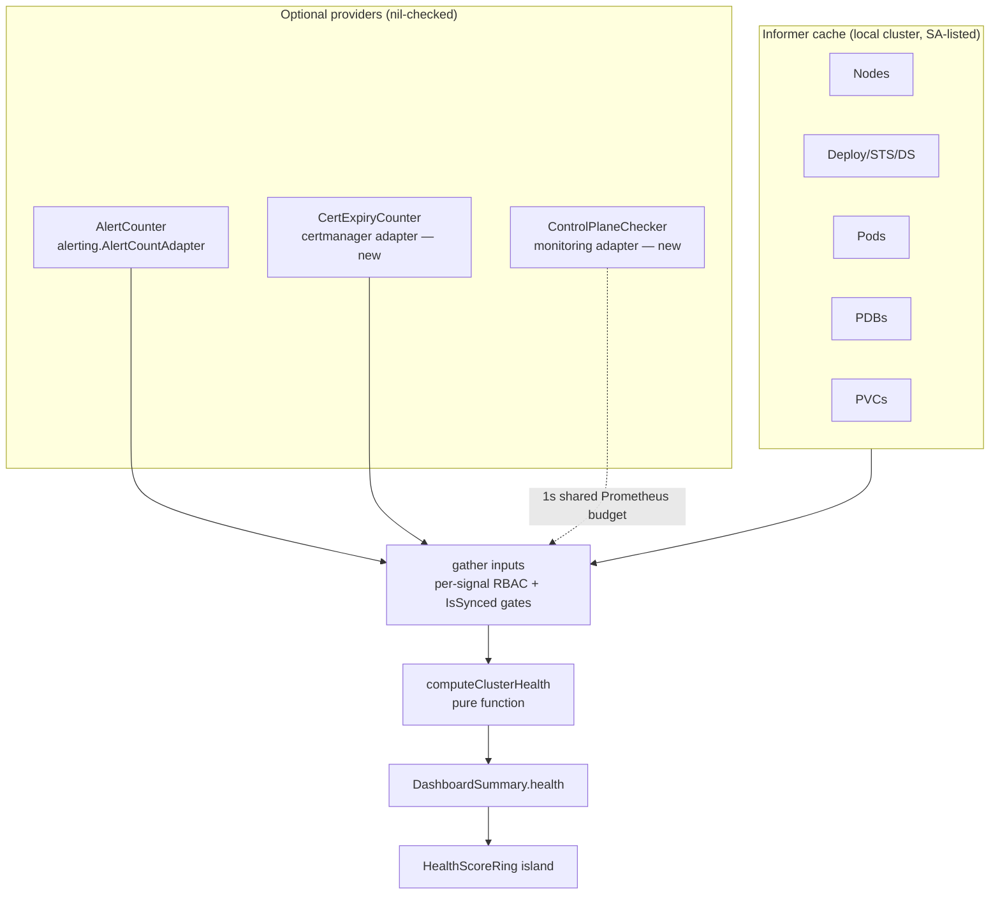

# feat: Backend-computed cluster health score

## Summary

Move cluster health computation from the frontend formula to the backend: a `health` object on `GET /api/v1/cluster/dashboard-summary` carrying a structurally derived categorical status (`healthy`/`degraded`/`critical`/`unknown`), a nullable 0–100 score, per-signal results, and human-readable reasons. The Overview ring renders the server result; `calculateHealthScore` in `frontend/lib/health-score.ts` is deleted.

---

## Problem Frame

The current score is computed client-side in `frontend/lib/health-score.ts` from three counts. It has four structural flaws: absolute-count penalties are not scale-invariant (5 failed pods costs the same in a 10-pod and 10,000-pod cluster — the documented Kubecost failure mode); pod-phase counting misses CrashLoopBackOff entirely (phase stays `Running`); a weighted average lets healthy pods outvote a dead control plane; and missing data scores 0/100 red instead of "unknown". Industry consensus (OpenShift ClusterOperator conditions, kubernetes-mixin severity taxonomy, Fairwinds ratio scoring) converged on: tiered signals with different veto power, ratios over counts, and category derived structurally — never from the number.

---

## Requirements

**Scoring model**

- R1. Categorical status is derived from the explicit veto table in High-Level Technical Design, never from the numeric score.
- R2. The numeric score is 0–100 and nullable; it aggregates ratio-based sub-scores with weights renormalized over available signals.
- R3. Any non-`healthy` status carries at least one human-readable reason; unavailable signals carry a reason for their unavailability. Reason strings carry counts, ratios, and categories only ("2 of 5 nodes not ready") — never node hostnames, namespace names, or workload/pod names, since reasons are built from cluster-scoped caches and would bypass per-resource RBAC.
- R4. Signals: nodes (ready ratio + pressure conditions), workloads (Σavailable/Σdesired across Deployments/StatefulSets/DaemonSets), pods (crashloop + image-pull fraction), alerts (Alertmanager counts), certificates (cert-manager expiring buckets), storage (pending PVCs), control plane (Prometheus `up`, best-effort).
- R5. Each signal resolves to a tri-state: `ok` / `skipped(reason)` / `unknown(reason)`. RBAC denial, an unsynced informer cache, or an uninstalled optional component never feeds the score as zero.

**API and data sources**

- R6. `health` is added to `DashboardSummary` additively — existing fields unchanged, local cluster only (inherits the existing guard). Always present in new-backend responses, so absence means exactly one thing: stale backend.
- R7. Remote-call signals (Prometheus `up`) join the endpoint's existing 1-second concurrent Prometheus budget; on timeout the affected signals become `unknown` and informer-backed signals still compute.
- R8. No NaN or ±Inf can reach `writeJSON` (the PR #348 bug class: the 200 header is sent before `json.Encode` fails, silently truncating the body).
- R9. Per-signal RBAC gating: core resources via the existing `canList`; the control-plane signal gated on the nodes `canList` (infrastructure visibility — denied → `skipped("insufficient permissions")`); certificate counts filtered per-user via the existing `certmanager.filterByRBAC` before bucketing, so a restricted user's counts cover only certificates they can see.

**Frontend**

- R10. `HealthScoreRing` renders the server result; ring, chips, and the card's pulse dot color from `status`, never from score thresholds.
- R11. Three absence states render distinctly: `health` field absent (stale backend) → "update pending" placeholder; `status: "unknown"` → gray ring with "—"; summary fetch failure → existing keep-last-data behavior.
- R12. `scoreColor` is retained for the two compliance islands (relocated); `calculateHealthScore`, `HealthMetrics`, and `HealthScore` are deleted.

---

## Key Technical Decisions

- **In-request computation, pure-function calculator.** Health is computed inside `HandleDashboardSummary` from informer caches (O(cached-list), no new poller or cache lifecycle). The calculator is a pure function over a plain-values input struct in `backend/internal/k8s/resources/health.go` — testable without informers, mirroring `diagnostics/rules_test.go` style.
- **Category from veto table; score is secondary.** The categorical status answers "what action to take"; the number exists for trending and the ring display. They are computed independently (a cluster can score 85 and still be `critical`).
- **New data sources arrive via narrow consumer-side interfaces + provider adapters**, mirroring the existing `AlertCounter`/`UtilizationProvider` pattern: `CertExpiryCounter` implemented in `certmanager`, `ControlPlaneChecker` implemented in `monitoring`. Both nil-checked, both optional.
- **Control-plane semantics.** Any component scraped-and-down (etcd, scheduler, controller-manager) → `degraded`, never `critical` — kubeadm binds all three to localhost, making `up==0` false positives common, and etcd metrics often additionally require client certs. A genuinely dead etcd surfaces as `critical` through the node/workload signals. Series absent (k3s embedded control plane, no scrape config) → `skipped`, no penalty.
- **Copy the diagnostics detection predicates, don't import the package.** CrashLoop/ImagePull/PendingPVC checks in `diagnostics/rules.go` are 3-line waiting-reason predicates strictly coupled to per-target `DiagnosticTarget`. Copying keeps `resources` decoupled; the predicate strings must match exactly so the dashboard and diagnostics page never disagree about the same pod.
- **Alerts contribute to `degraded` only, never `critical`.** Alert detail lives in its own card; app-level alerts shouldn't paint the cluster critical when everything informer-visible is green. The always-firing heartbeat alerts (`Watchdog`, legacy `DeadMansSwitch`) are filtered via a new `ActiveAlertCountsExcluding(ctx, names...)` interface method implemented in `alerting.AlertCountAdapter` — the store's alerts carry `AlertName`, and the existing two-value method stays untouched for the alerts card.
- **No hysteresis.** The backend reports instant truth per request — it is stateless and per-user. A flapping node alternating the ring is a real cluster signal, not a rendering bug to smooth. Routine deploys don't flap the ring because actively-progressing workloads are excluded at the signal level (see the veto table notes), not smoothed after the fact.
- **Weights renormalize over available signals.** A user who can't list nodes gets a score computed from the signals they can see, with the gap explained in `signals[]` — not a score silently dragged down by zeros.

---

## High-Level Technical Design

### Data flow



### Veto table (authoritative — implementers must not invent their own)

Evaluated top-down; first matching tier wins. "With data" means the signal resolved `ok`.

| Status | Conditions (any one suffices) |
|---|---|
| `unknown` | nodes signal unavailable (RBAC-denied, cache unsynced, or 0 nodes visible with list permission) — nodes are the required backbone |
| `critical` | node ready ratio < 2/3 with data; workload availability < 50% with data (progressing workloads excluded) |
| `degraded` | any NotReady node; any node pressure condition (Memory/Disk/PID/NetworkUnavailable); workload availability < 95% (progressing workloads excluded); any crashloop/image-pull pod; PDB with `currentHealthy < desiredHealthy` whose workload is not progressing; pending PVC (excluding WaitForFirstConsumer awaiting a consumer); cert-manager warning or critical expiry bucket non-empty; any control-plane component scraped and down; any critical alert active |
| `healthy` | none of the above |

The `degraded` tier is deliberately strict — a single crashloop or NotReady node shows yellow even on large clusters where something is almost always slightly broken. Yellow means "something needs attention"; the score number conveys magnitude.

Actively-progressing workloads (Deployment `Progressing` condition with reason `ReplicaSetUpdated`/`NewReplicaSetCreated`; StatefulSet `status.updateRevision != status.currentRevision`) are excluded from both availability rows and the workloads sub-score, surfacing as a non-penalizing "N workloads rolling out" reason. Without this, every chart install or rolling update flashes the ring — kubernetes-mixin guards the equivalent alerts with `for: 15m` for the same reason.

### Score aggregation (directional — constants are implementer-tunable within these shapes)

Four weighted sub-scores, each 0–100, weights renormalized over signals that resolved `ok`:

- **Nodes (0.35):** `readyRatio × 100`, minus a small bounded deduction per pressure-affected node.
- **Workloads (0.35):** `Σ min(available, desired) / Σ desired × 100`. Per-workload ratio clamped to [0,1] before summing (surge protection). Excluded from both sides: desired=0 (scaled to zero), `spec.paused` Deployments, DaemonSets with `desiredNumberScheduled == 0`, and actively-progressing workloads (rollout in flight — see the veto-table note). Empty denominator after exclusions → signal `skipped("no workloads to evaluate")`.
- **Pods (0.20):** `100 − min(100, crashFraction × amplification)` where crashFraction = crashloop+imagepull pods over pods with `phase ∈ {Running, Pending}` and nil `deletionTimestamp` (excludes Succeeded/Failed/terminating — completed Jobs must not dilute, evicted leftovers must not depress).
- **Alerts (0.10):** `100 − 10·critical − 3·(active − critical)`, clamped, heartbeat alerts (`Watchdog`, `DeadMansSwitch`) excluded. Counts are inherently absolute; the low weight bounds their influence.

Flat deductions after the weighted sum, then clamp to [0, 100]: cert warning bucket −3, cert critical bucket −10, pending PVCs −3, and −10 per control-plane component scraped-and-down (etcd, scheduler, controller-manager each). Guard every division (0/0 → signal skipped, never NaN); `score` is null when status is `unknown`.

### Wire shape (directional)

```
health: {
  status: "healthy" | "degraded" | "critical" | "unknown",
  score: number | null,
  signals: [ { name, status: "ok"|"skipped"|"unknown", score: number|null, reason?: string } ],
  reasons: string[]   // non-empty whenever status != healthy; counts/categories only, never resource names
}
```

`signals[]` always carries the full fixed signal set — unavailable entries are marked `skipped`/`unknown` with a reason, never omitted, so the frontend layout is stable across users.

---

## Implementation Units

### U1. Pure health calculator and types

- **Goal:** The scoring/veto engine as a pure function with full unit coverage, no informer or HTTP dependencies.
- **Requirements:** R1, R2, R3, R5 (tri-state types), R8 (NaN guards).
- **Dependencies:** none.
- **Files:** `backend/internal/k8s/resources/health.go`, `backend/internal/k8s/resources/health_test.go`.
- **Approach:** Define `ClusterHealth`, `HealthSignal`, and a `HealthInputs` struct of plain values (counts, ratios, tri-state flags). `computeClusterHealth(HealthInputs) ClusterHealth` implements the veto table and score aggregation from High-Level Technical Design. JSON tags camelCase per API convention.
- **Patterns to follow:** `backend/internal/diagnostics/rules_test.go` (pure table tests over constructed inputs); `pkg/api` response conventions.
- **Test scenarios:**
  - Happy path: all signals ok, everything green → `healthy`, score 100, empty reasons.
  - Veto precedence: nodes unavailable + workloads at 40% → `unknown` (not `critical`); ready ratio 0.5 + one crashloop pod → `critical` (not `degraded`).
  - Each `degraded` row of the veto table individually triggers `degraded` with a matching reason string.
  - Any control-plane component down → `degraded` and −10 each (etcd + scheduler both down → −20, status still `degraded`); control plane skipped → no effect on status or score.
  - Renormalization: alerts signal skipped → remaining weights scale to 1.0; score from only nodes+workloads when pods+alerts unavailable.
  - Nullable: status `unknown` → score null; all signals unavailable → `unknown`, null, reasons populated.
  - Boundaries: ready ratio exactly 2/3 → not critical; workload availability exactly 95% → not degraded; exactly 50% → not critical.
  - NaN guards: 0 nodes, 0 desired replicas, 0 eligible pods — no NaN/Inf in any output field (assert via `math.IsNaN`/`IsInf` sweep over outputs).
  - Surge clamp: deployment with available > desired contributes ratio 1.0, not >1.
  - Progressing exclusion: a mid-rollout fixture (Deployment `Progressing`/`ReplicaSetUpdated` at 3/10 available) stays `healthy` with a "rolling out" reason and no availability penalty; the same fixture without the Progressing condition trips `critical` (<50%).
  - Reason format: no fixture resource name appears in any generated reason string (counts/categories only, R3).
  - Score clamping: stacked flat deductions cannot push below 0.
- **Verification:** `cd backend && go vet ./... && go test ./...` passes.

### U2. Cert-expiry adapter

- **Goal:** Expose cheap warning/critical expiring-cert counts to the resources Handler.
- **Requirements:** R4 (certificates signal), R5.
- **Dependencies:** none (parallel with U1).
- **Files:** `backend/internal/certmanager/adapter.go`, `backend/internal/certmanager/adapter_test.go`, `backend/internal/k8s/resources/handler.go` (interface + field), `backend/internal/server/server.go` (wiring).
- **Approach:** `CertExpiryCounter` interface in `resources/handler.go` takes the calling user (`ExpiringCounts(ctx, user) (warning, critical int, err error)`). The adapter lives in the `certmanager` package (required: `thresholdBucket` and `filterByRBAC` are package-private) and reads the cache via a new non-fetching peek (e.g. `PeekCertificates() ([]Certificate, bool)` under the cache mutex, never entering the singleflight fetch) — `CachedCertificates` falls through to a cluster-wide fetch with a 10s timeout on any miss, which would blow the dashboard's 1s budget; the 60s poller keeps the cache warm in steady state, so a cold cache returns an error mapped to `skipped("cert cache warming")`, bounded to startup. The cached list is filtered per-user via the existing `certmanager.filterByRBAC` before bucketing with `thresholdBucket` (R9 — the shared cache stays cluster-wide; only the filter+count runs per request). cert-manager not installed → the adapter checks discovery and returns an error mapped to `skipped("cert-manager not installed")`; the `deps.CertManagerHandler != nil` wiring guard is a test-harness escape hatch only, since `main.go` constructs the handler unconditionally.
- **Patterns to follow:** `backend/internal/alerting/adapter.go` (adapter shape); `backend/internal/server/server.go:165-201` (nil-checked optional wiring).
- **Test scenarios:**
  - Certs in warning/critical/ok buckets → correct counts (reuse poller test fixtures for threshold-resolved certs).
  - Per-user filtering: a user restricted to one namespace gets counts covering only that namespace's certs.
  - Cold cache (peek not-ok) → error, and no API fetch is triggered (assert via fake client call count).
  - Empty warm cache → 0, 0, no error; cert-manager absent per discovery → error (caller maps to `skipped`).
- **Verification:** backend vet + tests pass; `server.New` wires the adapter only when `deps.CertManagerHandler != nil`.

### U3. Control-plane checker

- **Goal:** Best-effort per-component control-plane up/down/not-scraped status from Prometheus.
- **Requirements:** R4 (control-plane signal), R5, R7.
- **Dependencies:** none (parallel with U1, U2).
- **Files:** `backend/internal/monitoring/controlplane.go`, `backend/internal/monitoring/controlplane_test.go`, `backend/internal/k8s/resources/handler.go` (interface + field), `backend/internal/server/server.go` (wiring).
- **Approach:** `ControlPlaneChecker` interface returning per-component tri-state (up / down / not-scraped) for scheduler, controller-manager, etcd. One instant query — `max by (job) (up{job=~"<documented job regex>"})` — via the existing `monitoring.PrometheusClient.Query`; job absent from the result → not-scraped. Job-label constants documented in one place (kube-prometheus-stack defaults: `kube-scheduler`, `kube-controller-manager`; etcd job name varies — match both `etcd` and `kube-etcd`).
- **Patterns to follow:** `backend/internal/monitoring/utilization.go` (`UtilizationAdapter`: hold `*Discoverer`, nil-check `PrometheusClient()`, query, parse).
- **Test scenarios:**
  - Vector with all three jobs at 1 → all up.
  - Job present at 0 → down; job missing entirely → not-scraped (the k3s case: empty vector → all not-scraped).
  - Prometheus client nil / query error / context timeout → error propagates (caller maps to `unknown`).
  - etcd reported under `kube-etcd` job name → recognized.
- **Verification:** backend vet + tests pass.

### U7. Alert-count exclusion method

- **Goal:** Let the health signal count alerts without the always-firing heartbeat alerts.
- **Requirements:** R4 (alerts signal).
- **Dependencies:** none (parallel with U1–U3).
- **Files:** `backend/internal/alerting/adapter.go`, `backend/internal/alerting/adapter_test.go` (new), `backend/internal/k8s/resources/handler.go` (interface method).
- **Approach:** Extend the consumer-side `AlertCounter` interface with `ActiveAlertCountsExcluding(ctx, excludeAlertNames ...string) (active, critical int, err error)`; implement in `alerting.AlertCountAdapter` by filtering on `AlertName` while iterating `Store.ActiveAlerts`. The existing two-value method stays untouched for the alerts card.
- **Patterns to follow:** existing `alerting/adapter.go` shape; `alerting_test.go` store fixtures.
- **Test scenarios:**
  - Watchdog + one critical alert → counts 1 active / 1 critical (Watchdog excluded).
  - `DeadMansSwitch` excluded when passed; no exclusions passed → matches `ActiveAlertCounts`.
  - Empty store → 0, 0, no error.
- **Verification:** backend vet + tests pass.

### U4. Dashboard integration

- **Goal:** Gather signal inputs in `HandleDashboardSummary` and attach `health` to the response.
- **Requirements:** R5, R6, R7, R8, R9, plus feeding R4's signals.
- **Dependencies:** U1, U2, U3, U7.
- **Files:** `backend/internal/k8s/resources/dashboard.go`, `backend/internal/k8s/resources/dashboard_test.go` (new), `backend/internal/k8s/informers.go` (`IsSynced` accessor).
- **Approach:** A `gatherHealthInputs` step: per-signal `canList` gates (nodes, pods, deployments, statefulsets, daemonsets, poddisruptionbudgets, persistentvolumeclaims); certificates via the per-user-filtered U2 adapter (R9); the control-plane signal gated on the nodes `canList` (denied → `skipped("insufficient permissions")`). Sync gating via a new non-blocking `InformerManager.IsSynced(resource string) bool` exposing the factory's already-computed per-informer sync state (string keys matching the lister accessors: "pods", "nodes", "deployments", …); unsynced → that signal `unknown("cache syncing")` — prevents a `critical` flash at every backend restart. Crashloop/image-pull scan walks `ContainerStatuses` and `InitContainerStatuses` for waiting reasons `CrashLoopBackOff`/`ImagePullBackOff`/`ErrImagePull` (exact strings from `diagnostics/rules.go`). Pending-PVC exclusion predicate: a Pending PVC is excluded when its StorageClass (resolved via `Informers.StorageClasses()`, default class when `spec.storageClassName` is nil) has `volumeBindingMode: WaitForFirstConsumer` AND the PVC lacks the scheduler's `volume.kubernetes.io/selected-node` annotation — SA-read classification metadata only, no per-user gate. The `ControlPlaneChecker` call joins the existing 1s `sync.WaitGroup` Prometheus block (`dashboard.go:211-232`), restructured to run when either `Utilization` or the checker is non-nil. Alert counts come from `ActiveAlertCountsExcluding(ctx, "Watchdog", "DeadMansSwitch")` (U7). Reason strings are counts/categories only per R3. `health` marshals always-present (no `omitempty`). ClusterRole already grants PVC/PDB list/watch (`helm/kubecenter/templates/clusterrole.yaml:22,47`) — no Helm change.
- **Patterns to follow:** existing `dashboard.go` per-signal `canList` gating and 1s-budget WaitGroup; `resources_test.go:29-53` `testHandler` harness (fake clientset + real synced `InformerManager`).
- **Test scenarios:**
  - Healthy fixture cluster (ready nodes, available workloads, running pods) → `status: healthy`, score present, signals all ok; nil `Alerts`/`Utilization`/cert/control-plane providers → those signals `skipped`, status still computable.
  - One crashlooping pod (waiting reason in container status) → `degraded` with crashloop reason; same pod Succeeded → excluded, `healthy`.
  - Access checker denying nodes → `status: unknown`, score null, reason names the missing permission; denying only PDBs → PDB signal skipped, others computed.
  - Response JSON round-trips with no NaN (fixture engineered with 0-desired workloads and 0 eligible pods).
  - Existing `DashboardSummary` fields unchanged (decode old fields against a fixture, guards R6 additivity).
  - Pending PVC on a WaitForFirstConsumer class without the selected-node annotation → excluded (`healthy`); same PVC with the annotation → `degraded`.
  - Unsynced informer (fixture with `IsSynced` false for nodes) → `status: unknown` with "cache syncing" reason.
- **Verification:** backend vet + tests pass repo-wide; manual smoke against the homelab cluster shows plausible status/score and confirms whether Watchdog reaches the alert store (if it does, follow-up: also exclude it from the alerts card's counts).

### U5. Relocate scoreColor

- **Goal:** Free `frontend/lib/health-score.ts` for deletion without breaking the two compliance islands.
- **Requirements:** R12.
- **Dependencies:** none (parallel with backend units).
- **Files:** `frontend/lib/score-color.ts` (new), `frontend/lib/score-color_test.ts` (new), `frontend/islands/ComplianceDashboard.tsx`, `frontend/islands/ComplianceTrendChart.tsx`.
- **Approach:** Move `scoreColor` verbatim (thresholds ≥90/≥70 and the `category === "alerts"` accent case) into `score-color.ts`; add `healthStatusColor(status)` mapping the four health statuses to theme variables (`var(--success)`/`var(--warning)`/`var(--error)`/muted) for U6 — named to avoid colliding with the existing `statusColor` export in `frontend/lib/status-colors.ts` (different signature, 7+ importers). Also define the shared `ClusterHealth` wire type here so consumers have an import home after `health-score.ts` is deleted. Update the two compliance imports. `health-score.ts` keeps `calculateHealthScore` until U6 deletes it.
- **Patterns to follow:** existing pure-lib test files (`frontend/lib/wizard-constants_test.ts`) run via `deno task test`; theme via CSS custom properties only.
- **Test scenarios:**
  - `scoreColor`: 90→success, 90 with alerts category→accent, 70-89→warning, <70→error (boundary values 90 and 70 exact).
  - `healthStatusColor`: each of the four statuses maps to its variable; unknown→muted, never error.
- **Verification:** `cd frontend && deno task check` (note: ~40 pre-existing local `deno check` errors are known on this machine; CI gates are lint + fmt + build — confirm via CI after push).

### U6. Ring renders server health

- **Goal:** The Overview card displays backend-computed health with reason drill-down; the frontend formula is gone.
- **Requirements:** R10, R11, R12.
- **Dependencies:** U4 (response shape), U5.
- **Files:** `frontend/islands/HealthScoreRing.tsx`, `frontend/islands/DashboardV2.tsx`, `frontend/components/ui/GaugeRing.tsx` (indeterminate prop), `frontend/lib/health-score.ts` (delete).
- **Approach:** `DashboardSummary` interface in `DashboardV2.tsx` gains `health?: ClusterHealth` (optional on the TS side — R11's stale-backend case; the type imports from `score-color.ts`, U5). `HealthScoreRing` takes the `health` object: `health === undefined` → placeholder copy ("Health score unavailable — backend update pending"); `status === "unknown"` → GaugeRing with a new `indeterminate` prop that renders a fully-filled arc in the passed (muted) color regardless of value — without it, a null score forces value 0, which draws an empty arc, not a gray ring — plus "—" as `displayValue`; otherwise GaugeRing colored via `healthStatusColor` with `valueGradient` off, so the arc color alone carries status. Four sub-score chips (Nodes, Workloads, Pods, Alerts — the weighted signals); certificates/storage/control-plane surface through the reasons list only. Chips always render, "—" when unavailable, with the reason in a visually-hidden span referenced via `aria-describedby` (the `title` attribute is not keyboard- or screen-reader-accessible). The reasons list shows the three most severe entries with a "show N more" toggle so the card height stays bounded. The card-title pulse dot in `DashboardV2.tsx` colors from `healthStatusColor(summary?.health?.status ?? "unknown")` — muted on initial load or stale backend, never hardcoded success. Delete `health-score.ts`. `HealthScoreRing`'s own `IS_BROWSER` guard is safe to remove: `DashboardV2`'s guard is the SSR isolation boundary (it returns a placeholder div before any child renders).
- **Patterns to follow:** signal reads in the synchronous render path, not `useEffect` (namespace-picker reactivity contract); CSS custom properties for all colors.
- **Test scenarios:** Test expectation: none beyond U5's `healthStatusColor` lib tests — island rendering is verified manually (no island test harness exists). Manual checks: stale-backend placeholder (run new frontend against current backend before U4 merges), unknown state renders a filled gray ring (RBAC-restricted user), healthy and degraded states on homelab, reason text reachable by keyboard, "show more" toggle with 4+ reasons.
- **Verification:** `deno task check` clean of new errors; CI build green; homelab smoke test of the Overview page in all reachable states.

---

## Scope Boundaries

**Deferred to follow-up work**

- apiserver SLO burn-rate signal (Tier 5) — needs kube-prometheus recording rules to be reliable.
- Remote-cluster health — dashboard-summary is local-only today; remote health needs a direct-API gathering path.
- Mobile app adoption of the `health` object (additive field is backward-compatible; mobile keeps its current dashboard until then).
- Health-over-time series in `dashboard-trends` (would let the ring show a trend arrow).
- Watchdog filtering in the shared `AlertCountAdapter` (alerts card) if the homelab smoke test shows it leaking into counts.

**Outside this feature's identity**

- Per-namespace or per-workload health scores (the diagnostics page owns drill-down health).
- Operator-configurable weights/thresholds via annotations — revisit only if real clusters disagree with the defaults.

---

## Risks & Dependencies

- **Control-plane job-label variance.** kube-prometheus-stack job names differ across versions/distros (notably etcd). Mitigated by documented regex constants and the not-scraped → `skipped` rule; scraped-and-down maps to `degraded`, so a broken scrape shows at worst a spurious yellow, never a false `critical`.
- **1s budget pressure.** The control-plane query shares the existing budget with CPU/memory queries; all three run concurrently so the wall-clock bound holds. Timeout degrades that signal to `unknown` (R7).
- **Stale-backend rollout window.** New frontend against old backend sees no `health` field — R11's placeholder covers it; old frontend against new backend ignores the extra field.
- **Local toolchain noise.** Local `deno check` carries ~40 pre-existing errors and local `deno task build` fails on a monaco cache issue on this machine; CI is the arbiter for frontend gates.

---

## Sources & Research

**External (shaped the scoring model):**

- kubernetes-mixin alert taxonomy — signal selection and severities: https://monitoring.mixins.dev/kubernetes/
- OpenShift ClusterOperator conditions — the categorical model: https://github.com/openshift/enhancements/blob/master/dev-guide/cluster-version-operator/dev/clusteroperator.md
- Kubecost Cluster Health Score + issue #1206 — the absolute-penalty failure mode this design avoids: https://docs.kubecost.com/v/1.0x/using-kubecost/navigating-the-kubecost-ui/cluster-health-score
- Fairwinds ratio scoring; CAST AI efficiency/reliability separation; Komodor two-axis model (firing-now vs latent).

**Codebase anchors:**

- `backend/internal/k8s/resources/handler.go:22-58` — consumer-side interface pattern (`UtilizationProvider`, `AlertCounter`, `TrendProvider`).
- `backend/internal/k8s/resources/dashboard.go:211-232` — the 1s concurrent Prometheus budget to join.
- `backend/internal/monitoring/utilization.go`, `backend/internal/alerting/adapter.go` — adapter shapes to mirror.
- `backend/internal/certmanager/handler.go` `CachedCertificates`, `backend/internal/certmanager/poller.go` `thresholdBucket` — cheap expiring-cert classification.
- `backend/internal/diagnostics/rules.go:27-45,78-103,275` — canonical waiting-reason predicates to copy verbatim.
- `backend/internal/k8s/resources/resources_test.go:29-53` — handler test harness.
- `frontend/components/ui/GaugeRing.tsx` — reused with one addition (`indeterminate` prop for the unknown state; `displayValue` override carries "—").

**Institutional learnings (vault sessions):**

- 2026-06-11 overview-real-sparklines — 1s budget is a deliberate invariant; NaN-through-`writeJSON` truncates bodies silently; "honest absence" convention.
- 2026-06-06 gateway-api-rbac-hotfix — informers list as the service account; ClusterRole grants verified present for PVC/PDB.
- 2026-05-23 promql-scope-hardening — all PromQL is server-owned; never relay client-supplied queries.
