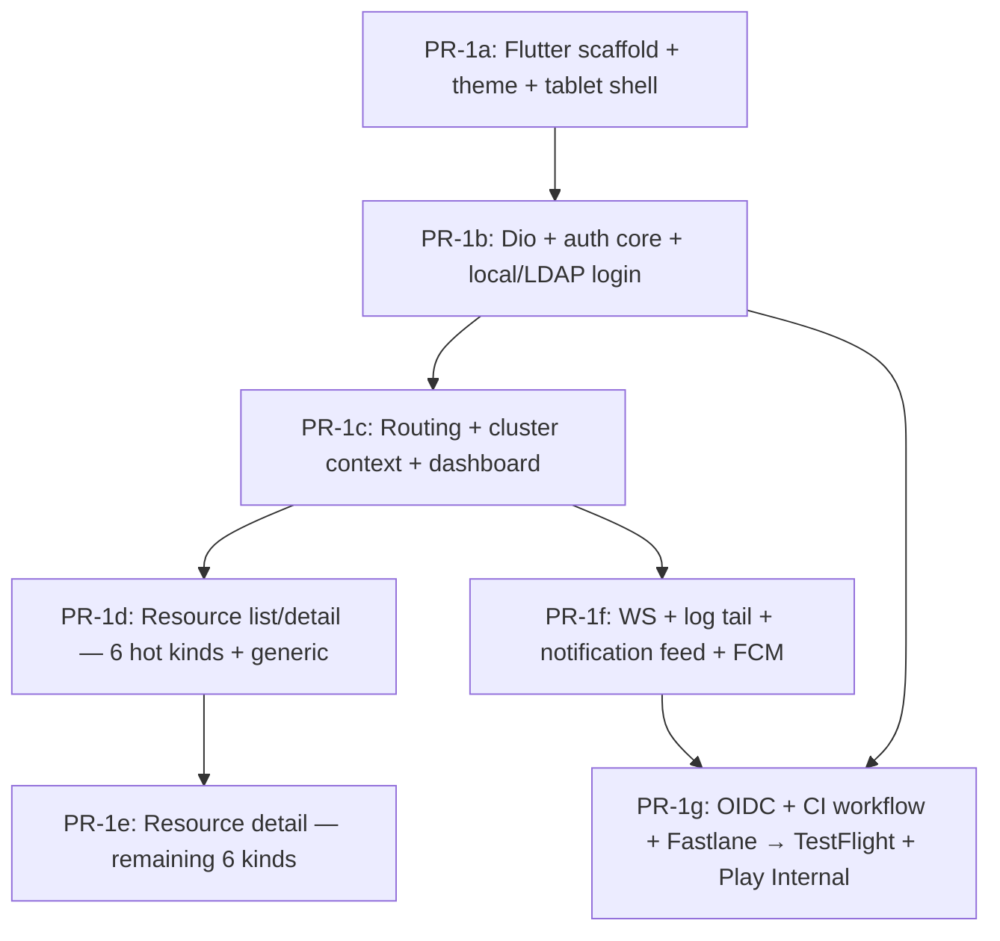

# Mobile App M1 — PR sequence

## Summary

Break M1 of `plans/mobile-app.md` into a sequence of seven PRs (PR-1a → PR-1g) so each one is reviewable on its own, ships a demonstrable surface, and stays inside CLAUDE.md's phased-execution discipline. PR-0 already merged the cross-cutting prerequisites (theme generator, refresh body-token fallback, `ChannelMobilePush` + FCM dispatch + device registry); this plan defines the shape of the actual Flutter app build-out from `flutter create mobile/` through TestFlight + Play Internal distribution.

---

## Problem Frame

The master plan (`plans/mobile-app.md`) describes M1 as a single 4–6-week milestone, but says nothing about how to land it incrementally. Without explicit cut points, the natural temptation is one mega-PR that no reviewer can hold in their head and that locks the repo's `mobile/` tree into a frozen "pre-merge" state for weeks. CLAUDE.md's Rule 2 (PHASED EXECUTION, ≤5 files per phase) and the repo-wide expectation that every push gets `/ce:review` make that approach a non-starter.

This plan picks the seven cut points that give each PR (a) a clearly demonstrable surface, (b) a reviewable diff size, and (c) a sensible dependency story so PR-1b can land before PR-1c without leaving the `main` branch in a broken state.

---

## Requirements

- R1. Each PR ships a demonstrable surface — running `flutter run` after the PR merges shows something a reviewer can interact with, not a half-built abstraction.
- R2. Every PR is small enough for `/ce:review` to handle in one pass without context overflow (rough heuristic: ≤25 hand-written files of new code, excluding `flutter create` scaffolding and generated artifacts).
- R3. Dependency order is honored — no PR introduces a dependency on a feature that hasn't been merged yet.
- R4. Each PR is self-contained for verification: `flutter analyze && flutter test` clean, and the demonstrable surface works end-to-end against a homelab backend.
- R5. By PR-1g end, the app builds + signs + uploads to TestFlight (iOS) and Play Internal (Android) on every `main` merge, matching the master plan's "internal beta from end-of-M1" commitment.
- R6. PR-1g landing **does not require** Apple Developer Program / Google Play Console accounts to already exist — the CI workflow uses Fastlane lanes that fail-loud-but-recoverably when secrets are absent, and PR-1g's docs spell out the operator-side setup.
- R7. The theme pipeline from PR-0 stays the canonical source — `mobile/lib/theme/themes.g.dart` keeps deriving from `shared/themes/*.json` and `make check-themes` keeps passing.
- R8. Backend changes are not required for any M1 PR (PR-0 covers them). If a PR needs new backend behavior, that's a scope error — surface it and split.

---

## Scope Boundaries

- **Out of scope:** M2 (writes), M3 (wizards), M4 (advanced observability), M5 (polish + public store launch). Each gets its own plan when the time comes.
- **Out of scope:** Apple Watch / Wear OS companion apps.
- **Out of scope:** Offline cache layer (`drift` / `hive` / `isar`). M1 fails loud when offline, per the master plan.
- **Out of scope:** Phone-side exec terminal. Tablets-only, deferred.

### Deferred to Follow-Up Work

- **Custom themes via `/v1/themes`**: deferred to v2 per the master plan.
- **Localization beyond English**: `intl` plumbing lands in PR-1a, but no second language ships in M1.
- **Saved Views & Custom Dashboards** (previous roadmap #9 → #10): deferred behind the entire mobile app per the merged CLAUDE.md update.

---

## Context & Research

### Relevant code and patterns (in-repo)

- `frontend/lib/api.ts` — Bearer + X-Cluster-ID + 401 refresh + 403 hook. PR-1b's Dio interceptor stack mirrors this directly.
- `frontend/lib/auth.ts` — login/refresh/logout state machine. PR-1b's `auth_repository.dart` mirrors the shape (Riverpod-backed instead of Preact signals).
- `frontend/lib/cluster.ts` + `frontend/lib/constants.ts:353` (`DOMAIN_SECTIONS`) — cluster context and route catalog.
- `frontend/assets/themes.generated.css` (already imported in `styles.css`) and `mobile/lib/theme/themes.g.dart` (PR-0 placeholder) — PR-1a swaps the placeholder for real `ThemeData` integration.
- `frontend/islands/ResourceTable.tsx` — generic list adapter. PR-1d's `mobile/lib/widgets/resource_table.dart` mirrors the column-config + row-action pattern.
- `frontend/components/ui/{ErrorBanner,LoadingSpinner,EmptyState}.tsx` — three states every screen renders. PR-1a ships `mobile/lib/widgets/empty_states.dart` with the three.
- `backend/internal/server/handle_auth.go:88-156` — body-mode refresh path landed in PR-0. PR-1b's Dio interceptor calls `/v1/auth/refresh` with JSON body and persists the rotated `refreshToken` from the response.
- `backend/internal/notifications/handler.go` — `HandleRegisterDevice` endpoints. PR-1f's FCM registration POSTs here with `{deviceToken, platform}` after `firebase_messaging` returns its token.

### Institutional learnings

- **Service mesh v1 scope** memory: the repo intentionally defers Istio Ambient and custom Linkerd cluster domains. Mobile must not re-litigate either — when surfacing mesh data in PR-1e/PR-1f, treat Ambient pods as "Istio installed but unmeshed" and assume `svc.cluster.local`.
- **Auto-memory feedback (ultraplan handoff):** unrelated to this plan, but: when this plan is shipped to Ultraplan ("send to Ultraplan"), do not ExitPlanMode and do not implement — wait.
- **Phased execution (CLAUDE.md Rule 2):** every PR in this sequence respects "no >5 files per phase" inside its own implementation. The PR-level decomposition here is one layer above; each PR's *internal* commit sequence still honors the rule.

### External references

- Flutter docs (`docs.flutter.dev`) — `flutter create`, `pubspec.yaml` schema, Material 3 + Cupertino bridges, `LayoutBuilder`.
- Riverpod 2.x docs — `riverpod_generator`, `StreamProvider`, scoped overrides for cluster context.
- `go_router` + `go_router_builder` — type-safe routes, deep-link parsing.
- `firebase_messaging` Flutter plugin — APNS + FCM unified token retrieval, foreground/background handlers.
- Fastlane `match` (iOS) + `supply` (Android) — code signing + Play upload from CI.

---

## Key Technical Decisions

- **Seven PRs, not five or ten.** Five is too coarse — PR-1d (resource list/detail) alone touches enough kinds to warrant its own review. Ten is too granular — splitting log tail from notifications from FCM into three separate PRs creates artificial sequencing without each PR being independently demonstrable. Seven hits the right balance.
- **OIDC login is its own PR (PR-1g), not bundled with PR-1b.** OIDC requires custom-tabs (Android) + safari-view-controller (iOS) + Universal Links + the `oidc_access_token` cookie-exchange flow from `backend/internal/server/handle_auth.go:262`. Bundling it with local/LDAP doubles PR-1b's surface area and pulls in iOS entitlement work that local login doesn't need. PR-1g groups OIDC with CI/Fastlane because both are operator-prerequisites work — Apple Developer Program enrollment, Universal Link domain verification, and FCM project setup all happen at the same operational layer.
- **Resource detail screens split across PR-1d and PR-1e.** Rather than one mega-PR with all 12 specialized kinds, PR-1d ships the 6 highest-traffic kinds (Pod, Deployment, Service, ConfigMap, Secret, Node) with the generic detail covering everything else, and PR-1e adds the remaining 6 specialized kinds (ReplicaSet, StatefulSet, DaemonSet, Ingress, PVC, Namespace). PR-1d-after gives a usable read-only browse experience; PR-1e is incremental polish.
- **WebSocket infrastructure lands in PR-1f alongside its first consumer.** Adding the WS helper in an earlier PR without a consumer means writing infrastructure with no caller to validate it. PR-1f introduces `mobile/lib/api/websocket_client.dart` together with the pod log tail that uses it; the notification feed later in the same PR exercises a second consumer to prove the helper isn't shaped exclusively for logs.
- **Tablet adaptive shell from PR-1a, not bolted on later.** Every screen uses `LayoutBuilder` + a `768px` breakpoint from day one. Retrofitting two-pane layouts onto phone-only screens is the kind of churn PR-0's CLAUDE.md "no premature abstractions" rule explicitly warns against — but this is the opposite case (the dual layout *is* the right abstraction; doing it later means rewriting screens twice).
- **`flutter create` is run interactively, not through automation.** PR-1a's first commit is `flutter create mobile/ --org io.kubecenter --project-name kubecenter` run by hand on the maintainer's machine, with the resulting tree committed as-is. Recreating the iOS/Android platform folders by hand or via post-create script is a known fragility (versions drift, hidden files get missed). Hand-running the command once and committing the unmodified output gives reviewers a recognizable baseline.
- **OIDC handler reuse on backend:** PR-1g uses the existing `oidc_access_token` cookie-exchange path from `backend/internal/server/handle_auth.go:262-274` (60s short-lived cookie + `/api/auth/oidc-token-exchange` BFF endpoint). No backend changes required for mobile OIDC — the mobile WebView just hits the same redirect chain the web frontend uses and reads the access token from the cookie via the same exchange endpoint.

---

## Open Questions

### Resolved during planning

- **Q: Single-cluster or multi-cluster picker in PR-1c?** Resolved: multi-cluster from day one. The cluster pill is on every screen per master plan; building it for one cluster and refactoring later is unnecessary churn.
- **Q: Where does the FCM project live?** Resolved: a Google Cloud project named `k8scenter-mobile`, with the service-account credential delivered to the backend via `KUBECENTER_FCM_CREDENTIALS_PATH` (PR-0 wiring). The same project's iOS bundle ID + Android package name are referenced in PR-1a's `flutter create --org io.kubecenter` flag.
- **Q: Notification feed RBAC scope?** Resolved: mirror web — `/v1/notifications` already RBAC-filters server-side based on the requesting user, so the mobile feed just renders what the API returns.
- **Q: Theme picker in M1?** Resolved: yes, in PR-1a. The 7 themes already exist and `themes.g.dart` already enumerates them; the picker is a single bottom-sheet with a `ListView.builder` over `kubeThemes.values`.

### Deferred to implementation

- **Pubspec dep version pins.** The master plan names the libraries (Riverpod 2.x, Dio, etc.) but pinning to a specific 2.x.y is implementation-time work — `flutter pub upgrade` after `flutter create` produces a starting point and the maintainer chooses pins from there.
- **Exact Riverpod provider shape for cluster context.** Whether the active cluster is a `StateProvider<String>` or a custom `Notifier` depends on whether mid-flight cluster switches need to broadcast invalidation across many providers. PR-1c picks the shape based on what the dashboard's data flow actually needs.
- **Drawer vs bottom navigation on phones.** The master plan says "drawer for top-level domains"; the actual Material 3 idiom is bottom navigation for ≤5 destinations and drawer for more. Pick at PR-1d when domain count is concrete.
- **Universal Link domain.** Apple requires a verified `apple-app-site-association` JSON at `https://<domain>/.well-known/apple-app-site-association`. Where that gets hosted (the k8sCenter Helm chart? a separate static site?) is a PR-1f / PR-1g implementation detail.

---

## High-Level Technical Design

The PR graph is mostly linear. The two parallel branches that meet at PR-1g are:
1. **Resource browse track** (PR-1d → PR-1e) — incremental kind coverage, reviewable independently.
2. **Live data + push track** (PR-1f) — depends on routing being in place (PR-1c) but not on resource detail. Could be developed in parallel with PR-1d/e by a second contributor; the dependency edge is `PR-1c → PR-1f`, not `PR-1e → PR-1f`.

> *This illustrates the intended PR sequencing and is directional guidance for review, not implementation specification. The implementing agent should treat it as context for ordering, not a literal Mermaid contract.*

---

## Implementation Units

### U1. PR-1a — Flutter scaffold + theme integration + tablet adaptive shell

**Goal:** Stand up the `mobile/` Flutter project so it boots, picks themes, switches between phone and tablet layouts, and renders the empty navigation shell. No real data, no auth, no backend calls — just proof that the toolchain works end-to-end and the theme pipeline from PR-0 is wired through.

**Requirements:** R1, R2, R3, R4, R7.

**Dependencies:** None (PR-0 already merged).

**Files:**
- Create (via `flutter create mobile/ --org io.kubecenter --project-name kubecenter`): full `mobile/ios/`, `mobile/android/`, `mobile/lib/main.dart`, `mobile/test/widget_test.dart`, `mobile/pubspec.yaml`, `mobile/analysis_options.yaml`, `mobile/.metadata`. Roughly 30 files. Reviewers verify the tree against `flutter create` output for the pinned Flutter version, not file-by-file.
- Modify: `mobile/pubspec.yaml` — add deps (`flutter_riverpod`, `riverpod_annotation`, `riverpod_generator`, `build_runner`, `dio`, `go_router`, `flutter_secure_storage`, `web_socket_channel`, `firebase_messaging`, `flutter_local_notifications`, `fl_chart`, `code_text_field`, `xterm`, `intl`, `freezed_annotation`, `json_annotation`).
- Modify: `mobile/lib/main.dart` — `runApp(const ProviderScope(child: KubeCenterApp()))`.
- Create: `mobile/lib/app.dart` — root `MaterialApp.router` with `KubeTheme`-derived `ThemeData`.
- Create: `mobile/lib/theme/kube_theme_builder.dart` — converts `KubeThemeColors` (from generated `themes.g.dart`) into `ThemeData` + a `KubeColors` `ThemeExtension`.
- Modify: `mobile/lib/theme/themes.g.dart` — regenerated by `tools/theme-gen/main.ts` so the generated map carries `KubeThemeColors` consumed by the builder above. Update `tools/theme-gen/main.ts` to emit the same shape.
- Create: `mobile/lib/theme/theme_controller.dart` — Riverpod controller that reads/writes the active theme id to `SharedPreferences` (or `flutter_secure_storage` reused).
- Create: `mobile/lib/widgets/empty_states.dart` — `LoadingState`, `EmptyState`, `ErrorState` widgets.
- Create: `mobile/lib/widgets/adaptive_scaffold.dart` — `LayoutBuilder` switching between phone (single-pane + drawer) and tablet (two-pane master-detail) at the 768px breakpoint.
- Create: `mobile/lib/routing/app_router.dart` — minimal `go_router` config with a single `/` route rendering the placeholder dashboard.
- Create: `mobile/lib/features/dashboard/dashboard_placeholder.dart` — placeholder card stack.
- Create: `mobile/lib/features/settings/theme_picker_sheet.dart` — bottom-sheet listing the 7 themes; tap selects.
- Modify: `tools/theme-gen/main.ts` — emit `KubeThemeColors` data class compatible with `kube_theme_builder.dart`. Re-run generator so committed `themes.g.dart` matches.
- Create: `.github/workflows/mobile-ci.yml` — minimal: install Flutter, `flutter analyze`, `flutter test`. No signing, no upload yet (those land in PR-1g).
- Create: `mobile/test/widget_test.dart` — replace stock counter test with an app-boots + theme-renders smoke test.
- Create: `mobile/test/theme/kube_theme_builder_test.dart` — verify each of the 7 themes produces a non-null `ThemeData` with the expected `colorScheme.primary` matching `accent`.
- Modify: `Makefile` — add `mobile-analyze` and `mobile-test` targets; add them to `lint` and `test`.
- Modify: `CLAUDE.md` — append a line under "Build Progress" noting M1 PR-1a shipped.

**Approach:**
- Run `flutter create mobile/ --org io.kubecenter --project-name kubecenter` interactively on a maintainer's machine with the pinned Flutter version (≥ 3.27 stable). Commit the entire generated tree as the first commit on the branch — reviewers diff this commit against an empty `mobile/`.
- Subsequent commits are the hand-written files (pubspec edits, lib/, test/). Each subsequent commit is small enough to review on its own — the `flutter create` blob is reviewed once as a recognized baseline.
- The theme builder bridges the JSON-emitted Dart tokens into Material 3 `ThemeData`. Map: `accent` → `colorScheme.primary`, `accentSecondary` → `colorScheme.secondary`, `bgBase` → `scaffoldBackgroundColor`, `success/warning/error` → semantic colors via `ThemeExtension<KubeColors>` for tokens that don't fit Material's slot model.
- `AdaptiveScaffold` reads `MediaQuery.sizeOf(context).width >= 768` and chooses between two layouts. Phone gets `Scaffold(drawer: …, body: …)`. Tablet gets a `Row` with a fixed-width left rail and a flexible right pane.
- `mobile-ci.yml` runs on `pull_request` filtered to `paths: [mobile/**]` and on push-to-main. Uses `subosito/flutter-action@v2` to install Flutter at the pinned version, then `flutter pub get && flutter analyze && flutter test`.

**Patterns to follow:**
- `frontend/lib/themes.ts` — `applyTheme` shape mirrors what `kube_theme_builder.dart` returns.
- `frontend/components/ui/EmptyState.tsx`, `LoadingSpinner.tsx`, `ErrorBanner.tsx` — three-state pattern.
- The existing `tools/theme-gen/main.ts` generator structure — extending its Dart emit step rather than rewriting it.

**Test scenarios:**
- Happy path: app boots, renders the placeholder dashboard with the Nexus theme by default. Test asserts `find.byType(MaterialApp)` is present and the scaffold background matches `KubeTheme.nexus.colors.bgBase`.
- Happy path: theme picker switches the active theme. Test pumps the picker, taps "Dracula", verifies the new background color.
- Happy path: tablet breakpoint switches layout. Test sets `MediaQuery.sizeOf` to `Size(900, 700)` (landscape tablet), verifies the master-detail two-pane shell renders. Sets it to `Size(390, 800)` (phone portrait), verifies single-pane.
- Edge case: theme persistence survives "app restart". Test sets theme to Gruvbox, simulates an app restart by re-pumping the widget tree with the same `SharedPreferences` mock, verifies Gruvbox is still active.
- Integration: `flutter analyze` clean and `flutter test` clean in CI.

**Verification:**
- `cd mobile && flutter analyze` produces zero warnings, zero errors.
- `cd mobile && flutter test` passes all assertions.
- `make check-themes` still passes (PR-0's parity check) — generator round-trip for `themes.g.dart` matches committed file.
- `flutter run -d chrome` (or any device emulator) boots the app and renders the dashboard placeholder; theme picker works visually.

---

### U2. PR-1b — Dio + auth core + local/LDAP login

**Goal:** Operator can log in to a homelab backend with username + password. Access token sits in memory; refresh token persists in `flutter_secure_storage`. The `/v1/auth/refresh` body-mode path from PR-0 is exercised end-to-end.

**Requirements:** R1, R2, R3, R4, R8.

**Dependencies:** U1 (Flutter scaffold + theme).

**Files:**
- Create: `mobile/lib/api/dio_client.dart` — `Dio` singleton with three interceptors:
  - `AuthInterceptor` — injects `Authorization: Bearer <token>` from in-memory access token; on 401 with no `_retry` flag, attempts refresh via `/v1/auth/refresh` body mode, retries once.
  - `ClusterInterceptor` — injects `X-Cluster-ID` from active cluster provider. Stub provider in PR-1b (real one in PR-1c).
  - `CSRFInterceptor` — injects `X-Requested-With: XMLHttpRequest` on all non-GET requests.
- Create: `mobile/lib/api/api_error.dart` — typed parse of `{error: {code, message, detail}}` shape.
- Create: `mobile/lib/auth/secure_storage.dart` — wrapper around `flutter_secure_storage` for refresh token persistence (single key: `kc_refresh_token`).
- Create: `mobile/lib/auth/auth_repository.dart` — Riverpod `AsyncNotifier` with login/refresh/logout methods. Mirrors `frontend/lib/auth.ts`.
- Create: `mobile/lib/auth/auth_state.dart` — `freezed`-generated sealed class: `Unauthenticated | Authenticating | Authenticated(user, rbac) | RefreshRequired`.
- Create: `mobile/lib/auth/user.dart` — `freezed` `UserInfo` matching the `/v1/auth/me` response shape.
- Create: `mobile/lib/features/login/login_screen.dart` — username/password form, optional provider dropdown (defaults to "local"; LDAP shows when `/v1/auth/providers` reports an LDAP provider).
- Create: `mobile/lib/features/login/login_controller.dart` — Riverpod controller that calls `authRepository.login`.
- Modify: `mobile/lib/routing/app_router.dart` — add `/login` route and a `redirect` guard that bounces unauthenticated users to it.
- Modify: `mobile/lib/main.dart` — wrap `runApp` in a startup bootstrap that hydrates the refresh token from secure storage and attempts a body-mode refresh before rendering the first route.
- Create: `mobile/test/api/dio_client_test.dart` — unit tests for the three interceptors using `dio_test_adapter` or hand-rolled `MockHttpClientAdapter`.
- Create: `mobile/test/auth/auth_repository_test.dart` — login-then-refresh-then-logout flow.
- Create: `mobile/test/features/login/login_screen_test.dart` — widget test exercising form submission + error-state rendering.

**Approach:**
- The 401 retry path in `AuthInterceptor` mirrors `frontend/lib/api.ts:165-174`: on 401, dedupe concurrent refreshes with a `Completer<bool>?` field, attempt a single refresh, then retry the original request once. If refresh fails, transition auth state to `Unauthenticated` and let the `app_router` redirect guard kick in.
- Body-mode refresh uses `POST /v1/auth/refresh` with `{"refreshToken": "<persisted token>"}`. On success, the response carries `accessToken` + a fresh `refreshToken` (PR-0 echoes both in body mode). Persist the new refresh token before returning.
- Login screen shows a single provider dropdown only if `/v1/auth/providers` returns more than one credential provider — most homelab deployments only have local, so the dropdown stays hidden.
- LDAP login is identical to local from the mobile side: same `/v1/auth/login` endpoint, just `provider: "ldap"` in the request body. Backend handles the rest.

**Patterns to follow:**
- `frontend/lib/api.ts:127-200` — interceptor stack shape, refresh dedupe, error parsing.
- `frontend/lib/auth.ts:35-92` — login/logout flow.
- `frontend/components/k8s/LoginForm.tsx` (or similar) — form layout for screen parity.

**Test scenarios:**
- Happy path: login with valid credentials → access token stored in memory, refresh token in secure storage, auth state transitions to `Authenticated`.
- Happy path: 401 on a subsequent request → interceptor calls `/v1/auth/refresh` body-mode, receives new tokens, retries original request, returns success.
- Edge case: concurrent 401s → only one refresh fires; the second request waits on the in-flight refresh's `Completer` and replays once it resolves.
- Error path: invalid credentials → backend returns 401 with `error.message: "invalid credentials"`. Login screen renders the error in an `ErrorState` widget; auth state stays `Unauthenticated`.
- Error path: refresh token rejected (stale or rotated) → interceptor transitions to `Unauthenticated`, secure storage cleared, router redirects to `/login`.
- Edge case: app cold-start with no refresh token in secure storage → bootstrap skips the refresh attempt and lands on `/login`.
- Edge case: app cold-start with a valid refresh token → bootstrap exchanges it for an access token before the first route renders. Test asserts no user-visible login screen flash.
- Integration: `Covers PR-0 backend tests` — refresh body-mode test flow tests the same path the backend's `TestHandleRefresh_BodyMode` validates server-side.

**Verification:**
- `flutter analyze && flutter test` clean.
- Smoke against homelab: `flutter run --dart-define=BACKEND_URL=http://192.168.x.y:8080`. Log in with `admin`/`admin123`. Force-quit and reopen — app skips login screen and lands on the dashboard placeholder.
- Re-deploy backend (rotates JWT secret server-side, invalidating all refresh tokens). Reopen app — refresh fails, app routes to `/login`, no infinite loop.

---

### U3. PR-1c — Routing + cluster context + pill + picker + dashboard

**Goal:** Operator picks a cluster from the app-bar pill, every API call carries `X-Cluster-ID`, and the dashboard renders cluster summary data from `/v1/cluster/dashboard-summary`.

**Requirements:** R1, R2, R3, R4, R8.

**Dependencies:** U2 (auth core).

**Files:**
- Create: `mobile/lib/cluster/cluster_provider.dart` — Riverpod `Notifier` holding active cluster id; exposes `setCluster(String id)` and notifies dependents.
- Modify: `mobile/lib/api/dio_client.dart` — `ClusterInterceptor` reads the real provider (replaces the stub from PR-1b).
- Create: `mobile/lib/cluster/cluster_repository.dart` — fetches `/v1/clusters` for the registered list.
- Create: `mobile/lib/cluster/cluster.dart` — `freezed` `Cluster` model.
- Create: `mobile/lib/widgets/cluster_pill.dart` — app-bar widget showing the active cluster's name; tap opens `ClusterPickerSheet`.
- Create: `mobile/lib/widgets/cluster_picker_sheet.dart` — bottom-sheet listing clusters with `RadioListTile`. Admin-only "Add cluster" entry shown if the auth user has admin role.
- Create: `mobile/lib/features/dashboard/dashboard_screen.dart` — replaces the placeholder. Renders summary cards for nodes, pods, deployments, etc. driven by `/v1/cluster/dashboard-summary`.
- Create: `mobile/lib/features/dashboard/dashboard_repository.dart` — fetches the summary endpoint.
- Create: `mobile/lib/features/dashboard/dashboard_state.dart` — `freezed` summary model matching the backend `DashboardSummary` JSON.
- Modify: `mobile/lib/routing/app_router.dart` — add `/dashboard` as the post-login default; update redirect guard.
- Modify: `mobile/lib/widgets/adaptive_scaffold.dart` — accept the `clusterPill` slot in the app-bar.
- Create: `mobile/test/cluster/cluster_provider_test.dart` — switching clusters invalidates dependent providers.
- Create: `mobile/test/features/dashboard/dashboard_repository_test.dart` — happy path + 403 from missing access.
- Create: `mobile/test/widgets/cluster_picker_sheet_test.dart` — admin sees "Add cluster", non-admin doesn't.

**Approach:**
- `ClusterProvider` is a `Notifier<String>` with default value `"local"`. State changes trigger Riverpod's auto-invalidation for any provider that watches it (including the dashboard repository's data fetch).
- The pill renders the active cluster's name; on tap, `showModalBottomSheet` opens the picker. When a non-active cluster is selected, the provider updates and the dashboard refetches.
- Admin gate uses the auth state's RBAC summary (`AuthState.authenticated.user.roles.contains("admin")`).
- The dashboard summary endpoint returns aggregated counts + utilization. Render as a 2-column grid on phones, 4-column grid on tablets — matching the web's responsive behavior from Phase 6B.

**Patterns to follow:**
- `frontend/lib/cluster.ts` — provider shape.
- `frontend/lib/api.ts:142` — `selectedCluster.value` injection.
- `frontend/routes/index.tsx` (dashboard route) — summary card composition + responsive breakpoints.

**Test scenarios:**
- Happy path: switching clusters causes a fresh `/v1/cluster/dashboard-summary` request with the new `X-Cluster-ID`.
- Happy path: admin user opens picker → "Add cluster" entry is visible and tappable.
- Edge case: non-admin opens picker → "Add cluster" is hidden; picker still functions for cluster switching.
- Error path: dashboard summary returns 403 (RBAC denial on the new cluster) → screen renders `ErrorState` with the backend `error.message`, pill stays on the new cluster (user can switch back).
- Edge case: only one cluster registered → pill renders the cluster name but tap is a no-op (or shows a single radio item).
- Integration: cluster switch propagates through Riverpod. Test sets cluster to "remote-prod", asserts the dashboard repository's most recent fetch carried `X-Cluster-ID: remote-prod`.

**Verification:**
- `flutter analyze && flutter test` clean.
- Smoke: log in to homelab, see "local" pill, dashboard renders. `POST /api/v1/clusters` to register a remote cluster. Reload app → picker shows two clusters → switch → dashboard refetches with new `X-Cluster-ID` (verify via backend logs).

---

### U4. PR-1d — Resource list/detail (6 hot kinds + generic)

**Goal:** Operator browses the 6 highest-traffic resource kinds (Pod, Deployment, Service, ConfigMap, Secret, Node) with specialized list and detail screens, and any other kind via the generic detail. Drill-down navigation works on both phone and tablet layouts.

**Requirements:** R1, R2, R3, R4, R8.

**Dependencies:** U3 (cluster context + dashboard).

**Files:**
- Create: `mobile/lib/widgets/resource_table.dart` — generic list adapter taking `columns: List<ResourceColumn<T>>` and `items: List<T>`. Phone: card list. Tablet: data table.
- Create: `mobile/lib/widgets/resource_detail_scaffold.dart` — header (kind icon + name + namespace) + tabbed body (Overview, YAML, Events).
- Create: `mobile/lib/api/resource_repository.dart` — `Generic<T>` fetcher over `/v1/resources/:kind[/:namespace[/:name]]`.
- Create: `mobile/lib/features/workloads/pods/pod_list_screen.dart`, `pod_detail_screen.dart`, `pod.dart` (model).
- Create: `mobile/lib/features/workloads/deployments/deployment_list_screen.dart`, `deployment_detail_screen.dart`, `deployment.dart`.
- Create: `mobile/lib/features/networking/services/service_list_screen.dart`, `service_detail_screen.dart`, `service.dart`.
- Create: `mobile/lib/features/config/configmaps/configmap_list_screen.dart`, `configmap_detail_screen.dart`, `configmap.dart`.
- Create: `mobile/lib/features/config/secrets/secret_list_screen.dart`, `secret_detail_screen.dart`, `secret.dart` — values masked by default; reveal requires explicit tap + audit log on backend.
- Create: `mobile/lib/features/cluster/nodes/node_list_screen.dart`, `node_detail_screen.dart`, `node.dart`.
- Create: `mobile/lib/features/generic/generic_detail_screen.dart` — falls back for any kind without a specialized screen, renders YAML + Events.
- Modify: `mobile/lib/routing/app_router.dart` — add routes for each kind: `/clusters/:clusterId/<domain>/<kind>`, `/clusters/:clusterId/<domain>/<kind>/:namespace/:name`. Tablet layout uses two-pane; phone uses navigator stack.
- Modify: `mobile/lib/widgets/adaptive_scaffold.dart` — add the navigation drawer with `DOMAIN_SECTIONS`-equivalent constants (port from `frontend/lib/constants.ts:353`).
- Create: `mobile/lib/routing/domain_sections.dart` — Dart const list mirroring `DOMAIN_SECTIONS`.
- Test files: one per specialized list/detail pair (12 test files), one for the generic detail, one for `resource_table.dart`.

**Approach:**
- Specialized screens are thin: each one composes `ResourceTable` or `ResourceDetailScaffold` with kind-specific column configs and overview tabs. The shared widgets carry the heavy logic.
- Detail screen tabs: **Overview** is kind-specific (e.g., Pod shows containers + status; ConfigMap shows data keys); **YAML** is universal (read-only Monaco-equivalent via `code_text_field`'s syntax-highlighting in M1, no editing — that's M2); **Events** lists `Events` filtered by `involvedObject` matching this resource.
- Secret values mask: every value renders as `••••••••` with a "Reveal" button. Reveal calls a backend endpoint that audit-logs the access (this exists on the backend already; mobile just calls it).
- Generic detail: when `app_router` resolves a kind without a registered screen, it falls back to `GenericDetailScreen` with YAML + Events tabs only.
- Tablet two-pane: list on the left (40% width), detail on the right (60%). Selecting an item updates the right pane without a route push. Phone: list and detail are separate routes.

**Patterns to follow:**
- `frontend/islands/ResourceTable.tsx` — column config + row tap pattern.
- `frontend/components/k8s/PodOverview.tsx`, `DeploymentOverview.tsx`, etc. — overview composition for the same six kinds.
- `frontend/lib/k8s-types.ts` — Dart equivalents.

**Test scenarios:**
- Happy path: pod list renders list with columns Name, Namespace, Status, Restarts, Age. Tapping a pod opens detail.
- Happy path: deployment detail renders Overview tab with replicas, strategy, last update time. YAML tab renders the manifest. Events tab renders related events.
- Happy path: secret list renders with values masked. Tapping "Reveal" on one secret triggers a backend call and unmasks just that value.
- Edge case: generic detail handles unknown kinds. Test passes a `Cilium NetworkPolicy` (not in the 6 specialized) and verifies fallback rendering.
- Edge case: empty list (no pods in namespace) renders `EmptyState`.
- Error path: 403 RBAC denial on a kind → `ErrorState` with backend message.
- Error path: 404 (resource was deleted between list and detail) → detail screen shows "Resource not found" with a back-to-list affordance.
- Integration (tablet): selecting a list item updates the right pane in-place without a route push. Test asserts route stays at `/.../pods` (not `/.../pods/ns/name`).
- Integration (phone): selecting a list item navigates forward; back button returns to list with scroll position preserved.

**Verification:**
- `flutter analyze && flutter test` clean.
- Smoke: log in to homelab, navigate to Pods → list renders → tap pod → detail renders. Repeat for the other 5 kinds.
- Smoke: navigate to a non-specialized kind (e.g., NetworkPolicy) → generic detail renders with YAML + Events.
- Tablet smoke: same flow on a tablet emulator → two-pane layout active throughout.

---

### U5. PR-1e — Resource detail (remaining 6 specialized kinds)

**Goal:** Add specialized list/detail screens for ReplicaSet, StatefulSet, DaemonSet, Ingress, PVC, Namespace. Closes the gap to all 12 specialized kinds the master plan calls out.

**Requirements:** R1, R2, R3, R4, R8.

**Dependencies:** U4 (resource list/detail framework).

**Files:**
- Create: `mobile/lib/features/workloads/replicasets/{rs_list_screen,rs_detail_screen,replicaset}.dart`.
- Create: `mobile/lib/features/workloads/statefulsets/{sts_list_screen,sts_detail_screen,statefulset}.dart`.
- Create: `mobile/lib/features/workloads/daemonsets/{ds_list_screen,ds_detail_screen,daemonset}.dart`.
- Create: `mobile/lib/features/networking/ingresses/{ingress_list_screen,ingress_detail_screen,ingress}.dart`.
- Create: `mobile/lib/features/storage/pvcs/{pvc_list_screen,pvc_detail_screen,pvc}.dart`.
- Create: `mobile/lib/features/cluster/namespaces/{namespace_list_screen,namespace_detail_screen,namespace}.dart`.
- Modify: `mobile/lib/routing/app_router.dart` — register the six new kinds.
- Test files: one per kind (12 test files total).

**Approach:**
- Each screen is structurally identical to PR-1d's screens, just with a different overview composition. ReplicaSet shows owner Deployment, replica count, ready/desired. StatefulSet shows volume claim templates. DaemonSet shows desired/current/ready/up-to-date counts. Ingress shows backend services + TLS. PVC shows storage class + access modes + capacity. Namespace shows phase + labels + annotations + status.
- No new shared widgets — PR-1d's `ResourceTable` and `ResourceDetailScaffold` cover everything.

**Patterns to follow:**
- The six specialized screens from PR-1d.

**Test scenarios:**
- Happy path: each list renders. Each detail renders Overview, YAML, and Events tabs.
- Edge case: ReplicaSet with no owning Deployment → owner row shows "—" instead of a link.
- Edge case: Ingress with no TLS → TLS section hidden, not empty.
- Edge case: Namespace in `Terminating` phase → phase chip renders in error color.
- Integration: the routing table now resolves all 12 specialized kinds; an unknown kind still falls through to `GenericDetailScreen`.

**Verification:**
- `flutter analyze && flutter test` clean.
- Smoke against homelab: each of the six new kinds opens its specialized screen.

---

### U6. PR-1f — WebSocket infrastructure + pod log tail + Notification feed + FCM device registration + deep-links

**Goal:** Real-time live data lands. Operator tails pod logs, sees the Notification Center feed, receives push notifications on the device, and tapping a push deep-links to the affected resource.

**Requirements:** R1, R2, R3, R4, R8.

**Dependencies:** U3 (cluster context + dashboard). Independent of U4/U5 — can develop in parallel.

**Files:**
- Create: `mobile/lib/api/websocket_client.dart` — `web_socket_channel` wrapper handling auth in-band on connect, reconnect with exponential backoff, and stream lifecycle.
- Create: `mobile/lib/features/observability/logs/log_tail_screen.dart` — pod log viewer with WS tail.
- Create: `mobile/lib/features/observability/logs/log_tail_controller.dart` — Riverpod `StreamProvider` over `/ws/logs/:namespace/:pod/:container`.
- Create: `mobile/lib/features/notifications_center/feed_screen.dart` — list view of `/v1/notifications` with filter chips for source/severity.
- Create: `mobile/lib/features/notifications_center/feed_repository.dart`.
- Create: `mobile/lib/features/notifications_center/notification_item.dart` — single feed row + tap-to-deep-link.
- Create: `mobile/lib/notifications/fcm_registration.dart` — on app start (post-login), request notification permission, fetch FCM token, POST to `/v1/notifications/devices`.
- Create: `mobile/lib/notifications/deep_link_handler.dart` — parses `k8scenter://cluster/<id>/<kind>/<namespace>/<name>` and Universal Link variants; routes via `go_router`.
- Modify: `mobile/lib/main.dart` — register Firebase messaging foreground/background handlers.
- Modify: `mobile/android/app/src/main/AndroidManifest.xml` — `intent-filter` for `k8scenter://` scheme.
- Modify: `mobile/ios/Runner/Info.plist` — `CFBundleURLSchemes` for `k8scenter://` and `com.apple.developer.associated-domains` placeholder for Universal Links (real domain wired in PR-1g).
- Modify: `mobile/lib/routing/app_router.dart` — add `/clusters/:clusterId/<kind>/:namespace/:name` deep-link routes that resolve directly to the detail screens from PR-1d/e.
- Modify: `mobile/lib/widgets/adaptive_scaffold.dart` — add Notifications drawer entry with unread-count badge.
- Test files: WS client unit test (mock channel), log tail widget test, feed widget test, FCM registration unit test (mock plugin), deep link parser unit test.

**Approach:**
- WS client wraps `web_socket_channel` and on connect sends an auth message: `{"type": "auth", "token": "<bearer>"}`. The backend's `handleWSResources` and `handleWSLogs` both expect this shape. Reconnect with capped exponential backoff (1s → 2s → 4s → 8s → 16s, max 30s).
- Log tail UI: monospaced `ListView.builder` with auto-scroll-to-bottom, pause toggle, search. Long-press a line copies to clipboard.
- Notification feed: pull-to-refresh + tap-row-to-deep-link. Shows unread count via the existing `/v1/notifications/unread-count` endpoint.
- FCM registration runs once per app launch when authenticated. Permission flow: iOS shows the standard prompt; Android 13+ requires the runtime `POST_NOTIFICATIONS` permission. Token retrieval uses `FirebaseMessaging.instance.getToken()`. POST to `/v1/notifications/devices` with `{deviceToken, platform: 'ios'|'android'}`. Re-register on token rotation (`onTokenRefresh`).
- Deep-link parser handles two flavors: `k8scenter://cluster/local/Pod/default/nginx-7d4f-abc12` (custom scheme) and `https://kubecenter.example.com/m/cluster/local/Pod/default/nginx-7d4f-abc12` (Universal Link). Both route to `/clusters/local/workloads/pods/default/nginx-7d4f-abc12` via `go_router.go(...)`.
- Background FCM message tap: handled in `main.dart` via `FirebaseMessaging.onMessageOpenedApp` listener. Foreground: `flutter_local_notifications` shows an in-app banner that's tappable.

**Patterns to follow:**
- `backend/internal/server/handle_ws.go` and `handle_ws_logs.go` — auth-in-band handshake.
- `frontend/lib/ws.ts` — reconnect/backoff loop shape.
- `frontend/components/layout/NotificationCenterDrawer.tsx` — feed UI structure.

**Test scenarios:**
- Happy path: log tail screen connects to `/ws/logs/...`, receives messages, renders them in order.
- Happy path: notification feed renders 20 items; tapping one with `resourceKind: "Pod"`, `resourceNamespace: "default"`, `resourceName: "x"` deep-links to the pod detail screen.
- Happy path: FCM token registers via `POST /v1/notifications/devices` once on first authenticated launch.
- Happy path: incoming push notification with deep-link payload → app opens to the right resource detail.
- Edge case: WS connection drops → client reconnects with exponential backoff; UI shows "reconnecting" banner.
- Edge case: FCM token rotation → `onTokenRefresh` fires → app re-registers with the new token.
- Edge case: deep link arrives before login → app stores the link, completes login, then resolves the link.
- Edge case: deep link to a kind/namespace the user lacks RBAC for → detail screen renders 403 `ErrorState` with backend message.
- Error path: notification permission denied → app continues to function; FCM registration is skipped; in-app feed still works. Settings screen surfaces a "Notifications disabled" hint with a deep-link to OS settings.
- Error path: WS auth message rejected → client closes the channel, transitions auth state to `Unauthenticated`, router redirects to `/login`.
- Integration: parsing `k8scenter://cluster/local/Pod/default/x` produces the same router target as `https://<domain>/m/cluster/local/Pod/default/x`. Test asserts both inputs route to the same `RouteMatchList`.

**Verification:**
- `flutter analyze && flutter test` clean.
- Smoke: log in to homelab, open a pod's logs, see them streaming. Send a test notification via the backend's `POST /v1/notifications/channels/:id/test` endpoint with a Mobile Push channel — push arrives on a registered test device. Tap notification → app opens to the right resource.

---

### U7. PR-1g — OIDC login + CI workflow + Fastlane → TestFlight + Play Internal

**Goal:** OIDC login works in the app, and every `main` merge from this PR onward builds, signs, and uploads release builds to TestFlight (iOS) and Play Internal (Android). M1 ends here.

**Requirements:** R1, R2, R3, R4, R5, R6.

**Dependencies:** U2 (auth core), U6 (deep-link infrastructure — OIDC redirect uses the same Universal Links). Independent of U4/U5.

**Files:**
- Create: `mobile/lib/auth/oidc_login.dart` — opens `/api/v1/auth/oidc/<providerId>/login` in a `flutter_custom_tabs` (Android) / `SFSafariViewController` (iOS) tab; on redirect to `/auth/callback`, the in-app browser closes; the app reads the `oidc_access_token` cookie via the existing `/auth/oidc-token-exchange` BFF endpoint and persists tokens like local login.
- Modify: `mobile/lib/features/login/login_screen.dart` — render OIDC provider buttons fetched from `/v1/auth/providers`, each one launches `oidc_login.dart`.
- Modify: `mobile/lib/notifications/deep_link_handler.dart` — handle the OIDC callback URL pattern as a special case (don't route, just consume + complete login).
- Modify: `mobile/ios/Runner/Info.plist` — finalize `com.apple.developer.associated-domains` with the production domain.
- Modify: `mobile/android/app/src/main/AndroidManifest.xml` — finalize `intent-filter` for the production HTTPS host.
- Create: `mobile/fastlane/Fastfile` — `beta_ios` (build IPA, upload to TestFlight) + `beta_android` (build AAB, upload to Play Internal).
- Create: `mobile/fastlane/Matchfile` — `match` config pointing to a separate private GitHub repo for iOS certificates.
- Create: `mobile/fastlane/Appfile` — bundle identifiers + Apple team ID + Play package name.
- Modify: `.github/workflows/mobile-ci.yml` — add `mobile-deploy` job that runs on push-to-main, gates on `mobile-test`, runs Fastlane lanes with secrets.
- Create: `mobile/docs/RELEASE.md` — operator-side prerequisites: Apple Developer Program enrollment, Play Console setup, FCM project, Universal Link domain verification (`apple-app-site-association` + `assetlinks.json` hosting), GitHub secrets to set (`APPLE_TEAM_ID`, `MATCH_PASSWORD`, `MATCH_GIT_URL`, `APPSTORE_CONNECT_API_KEY`, `PLAY_SERVICE_ACCOUNT_JSON`, `KUBECENTER_FCM_CREDENTIALS_JSON`).
- Create: `helm/kubecenter/templates/well-known.yaml` — optional `ConfigMap` + `Ingress` snippet for hosting `apple-app-site-association` and `.well-known/assetlinks.json` from the cluster, configurable via `values.mobile.universalLinkDomain`.
- Modify: `helm/kubecenter/values.yaml` — add `mobile.universalLinkDomain` value (off by default).
- Test files: OIDC login widget test (mocks the in-app browser), CI workflow lint via `actionlint`.

**Approach:**
- OIDC reuses the backend's existing cookie-exchange flow: `handleOIDCCallback` (`backend/internal/server/handle_auth.go:191`) sets a 60-second `oidc_access_token` cookie scoped to `/api/auth/oidc-token-exchange`. Mobile opens the OIDC URL in an in-app browser, the redirect chain ends with the cookie set on a webview, and a frontend route at `/auth/callback` calls the BFF exchange endpoint. **Mobile twist:** instead of relying on the webview to call the BFF, the mobile app intercepts the redirect to `/auth/callback`, closes the browser, then calls `/api/auth/oidc-token-exchange` directly with the cookie attached (`http` package supports cookie sharing for in-app browsers via `flutter_custom_tabs`'s `customTabsOptions`).
- If the OIDC redirect cookie path isn't viable on mobile (subdomain/SameSite friction), fall back to an explicit body-mode flow: add a new `/api/v1/auth/oidc/<providerId>/exchange` endpoint that accepts the OIDC `code` directly. **Defer this decision to implementation** — first try the cookie path; if it fails on either platform, add the small backend endpoint and revisit.
- Fastlane `match` requires a separate private GitHub repo to hold encrypted iOS certs + provisioning profiles. The repo URL is a GitHub secret (`MATCH_GIT_URL`); the encryption password is `MATCH_PASSWORD`. Setup is documented in `mobile/docs/RELEASE.md`.
- CI workflow: `mobile-deploy` job has separate iOS and Android steps (parallel matrix). iOS step runs on `macos-latest`. Android step runs on `ubuntu-latest`. Both gate on `mobile-test` (run on `ubuntu-latest`, all platforms).
- The Helm chart additions are optional — operators not running k8sCenter on a public domain skip the Universal Link setup entirely. App still works with custom-scheme deep links (`k8scenter://`), just without the iOS Universal Link smoothness.

**Patterns to follow:**
- `backend/internal/server/handle_auth.go:191-274` — OIDC callback flow.
- `frontend/routes/auth/callback.tsx` — BFF cookie-exchange shape.
- `.github/workflows/ci.yml` and `.github/workflows/e2e.yml` — existing GitHub Actions conventions.

**Test scenarios:**
- Happy path: OIDC login button → in-app browser opens → user authenticates with provider → redirect chain completes → app picks up access token → auth state transitions to `Authenticated`.
- Edge case: user cancels mid-flow (closes the in-app browser tab) → app stays on `/login` with no error, token state unchanged.
- Edge case: OIDC provider returns `error=access_denied` → app renders `ErrorState` on the login screen with a friendly message.
- Edge case: OIDC redirect lands but cookie exchange fails → app surfaces a clear error and offers to retry.
- Integration (CI): pushing a commit to a feature branch under `mobile/**` triggers `mobile-test` only. Pushing to `main` triggers `mobile-test` + `mobile-deploy`.
- Integration (CI): `mobile-deploy` succeeds when all secrets are configured; fails with a clear "missing secret" error otherwise (no half-state where iOS uploads but Android doesn't).
- Integration: a successfully signed and uploaded build appears in TestFlight + Play Internal within 10 minutes of a `main` merge.

**Verification:**
- `flutter analyze && flutter test` clean.
- `actionlint .github/workflows/mobile-ci.yml` clean.
- Smoke (operator): set GitHub secrets per `mobile/docs/RELEASE.md`. Merge a no-op commit to `main`. Watch the `mobile-deploy` job. Verify build appears in TestFlight + Play Internal.
- Smoke (OIDC): configure an OIDC provider in the backend (e.g., Authelia at homelab). Open mobile app → tap OIDC button → complete flow → land on dashboard.

---

## System-Wide Impact

- **Interaction graph:** PR-1f introduces FCM device registration that flows into the existing notification rule engine — operators creating a "Mobile Push" channel + a routing rule will now have those rules dispatch to mobile devices. PR-0 wired this server-side; PR-1f closes the loop.
- **Error propagation:** Auth failures in any PR-1x bubble up to the same `Unauthenticated` state and trigger the `app_router` redirect. Network errors bubble up to per-screen `ErrorState` widgets. WebSocket auth failures (PR-1f) reuse the same path.
- **State lifecycle risks:** Refresh token in `flutter_secure_storage` is the only persistent auth state on device. Logout (PR-1b) must clear it; failed refresh (PR-1b) must clear it. Tested in PR-1b's auth_repository tests. FCM token rotation (PR-1f) must handle the case where the old token persists in `mobile_push_devices` server-side until next registration — backend's `RegisterDevice` upserts on `device_token`, so a rotation produces a new row + the old row needs sweeping (sweep is deferred to a follow-up plan, called out in `plans/mobile-app.md` Open Deferrals).
- **API surface parity:** The Notification Center's `Mobile Push` channel type behaves as a peer to Slack/email/webhook. Web admins can manage Mobile Push channels via the existing `/notifications/channels` admin UI. PR-1f's mobile app does not implement channel/rule admin — that's M2 or later; admins still use the web for channel configuration.
- **Integration coverage:** PR-1g's CI workflow runs `flutter test` against the same source tree the production builds use. Unit tests in PR-1b–PR-1f catch regressions before they ship to TestFlight.
- **Unchanged invariants:** No backend changes in any M1 PR. Web behavior is byte-identical throughout (PR-0 already verified this). The `mobile/` directory is fully isolated from `frontend/` and `backend/` — no cross-imports, no shared TypeScript-Dart bridges beyond the JSON theme files.

---

## Risks & Dependencies

| Risk | Mitigation |
|------|------------|
| `flutter create` produces a tree that diverges from a teammate's local Flutter version, breaking subsequent PRs. | Pin Flutter version in `mobile/pubspec.yaml` (`environment.flutter`) and in the CI workflow (PR-1a). Document the pinned version in `mobile/README.md`. |
| Apple Developer Program enrollment takes 24–48 hours and must happen before PR-1g lands. | Operator-side prerequisites in `mobile/docs/RELEASE.md` call this out explicitly. PR-1g's `mobile-deploy` job fails-loud-but-recoverably when secrets are missing — the rest of CI keeps passing. |
| OIDC cookie-exchange path doesn't work cross-domain on mobile in-app browsers. | PR-1g's Approach explicitly calls out the fallback: add a `POST /api/v1/auth/oidc/<providerId>/exchange` body endpoint on the backend. Decision deferred to implementation. |
| FCM token rotation produces orphan rows in `mobile_push_devices`. | Deferred sweep planned per master plan. Acceptable risk in M1 — orphans waste a few rows per user, no security concern. |
| Universal Links require domain verification that not every k8sCenter operator has set up. | Custom-scheme deep links (`k8scenter://`) work without domain setup. Universal Links are the polish; the Helm chart snippet in PR-1g makes it trivial for operators with public domains. |
| Single contributor working through 7 sequential PRs is slow. | Parallelizable tracks: PR-1d/1e (resource browse) and PR-1f (live data + push) can be developed in parallel after PR-1c lands. PR-1g lands last and depends on PR-1b + PR-1f. |
| `/ce:review` saturation if a PR drifts past ~25 hand-written files. | Each unit's `Files:` list above is the target. If implementation reveals a unit is genuinely larger, split mid-stream — adding "PR-1d-extra" with clear scope is cheap; ramming a too-big PR through review is expensive. |

---

## Carried-Over Issues (post-merge follow-ups)

Surfaced by `/ce:code-review` on PR-1d (#235) and explicitly deferred at fix-up time. Listed here so they survive future plan reads — commit-message-only notes don't.

| Origin | Issue | Target | Notes |
|---|---|---|---|
| PR-1d #10 | Tablet `DataTable` has no virtualization; nested `SingleChildScrollView`s materialize every row eagerly. | ~~PR-1e~~ **resolved in PR-1e** | `data_table_2 ^2.5.16` added; `resource_table.dart` now uses `DataTable2`. |
| PR-1d #11 | ConfigMap key list builds every key as an `ExpansionTile` inside a non-virtualized `Column`. | ~~PR-1e~~ **resolved in PR-1e** | ConfigMap detail rebuilt as `CustomScrollView` with `SliverList.builder`; `ResourceDetailScaffold.overviewScrollable=false` allows opt-out from the scaffold's own scroll wrap. |
| PR-1d #17 | No `FLAG_SECURE` (Android) or background-blur (iOS) on Secret detail — plaintext visible in app-switcher snapshot when revealed. | **M5 polish** (per master plan) | Master plan's M5 already covers "accessibility audit + perf pass + polish". Add `flutter_windowmanager` for Android FLAG_SECURE and an `AppLifecycleState`-driven blur cover for iOS at that point. |
| PR-1b carryover | `AuthInterceptor` refresh dedupe `Completer` can leak on synchronous throw inside `_attemptRefresh`. | ~~PR-1f or PR-1g~~ **resolved in PR-1e** | Wrapped `_attemptRefresh` body in async IIFE with try/catch/finally that clears `_refreshing` regardless of outcome. |
| PR-1d #22 | Drawer `onTap` fires `context.go` before `Navigator.pop` completes — visible jank on slow devices, double-tap can throw on deactivated context. | **acknowledged** | Common Flutter idiom; reordering to `go-then-pop` causes other quirks. Re-evaluate only if real users report jank. |

---

## Documentation / Operational Notes

- `mobile/README.md` — updated by PR-1a with the pinned Flutter version, run-locally instructions, and the Universal Link / FCM caveats.
- `mobile/docs/RELEASE.md` — created by PR-1g with the operator-side prerequisites checklist.
- `CLAUDE.md` Build Progress section — appended once at the end of M1 (PR-1g) summarizing what shipped.
- `plans/mobile-app.md` — `status: active → completed` flip happens at PR-1g merge, simultaneously with this plan's status flip.

---

## Sources & References

- Master plan: [plans/mobile-app.md](mobile-app.md)
- PR-0 commit: 72f414b (`feat(mobile): PR-0 — backend prerequisites + theme generator + mobile skeleton`)
- Web frontend patterns referenced throughout: `frontend/lib/api.ts`, `frontend/lib/auth.ts`, `frontend/islands/ResourceTable.tsx`, `frontend/components/wizard/WizardStepper.tsx`.
- Backend endpoints relied on: existing `/v1/auth/login`, `/v1/auth/refresh` (body-mode added in PR-0), `/v1/auth/me`, `/v1/clusters`, `/v1/cluster/dashboard-summary`, `/v1/resources/*`, `/v1/notifications`, `/v1/notifications/devices` (added in PR-0), `/ws/resources`, `/ws/logs/*`, `/api/v1/auth/oidc/*`, `/api/auth/oidc-token-exchange`.
- Flutter docs: [docs.flutter.dev](https://docs.flutter.dev/)
- Riverpod docs: [riverpod.dev](https://riverpod.dev/)
- Fastlane match docs: [docs.fastlane.tools/actions/match](https://docs.fastlane.tools/actions/match/)
