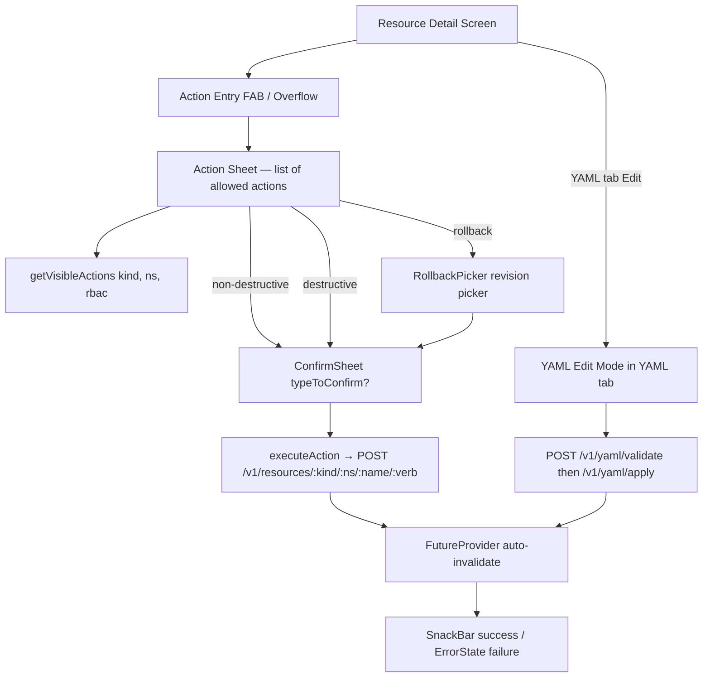

# Mobile App M2 — write actions + YAML editor (PR sequence)

## Summary

Land M2 of `plans/mobile-app.md` as two reviewable PRs (PR-2a → PR-2b) that take the M1 read-only oncall companion and add the write actions oncalls actually need at 2 a.m.: scale/restart/rollback/suspend/trigger/delete on resource detail, plus direct YAML edits for ConfigMap and Secret through the existing `/v1/yaml/apply` server-side-apply pipeline. Type-to-confirm dialogs mirror the web pattern (`frontend/components/ui/ConfirmDialog.tsx`) so destructive actions stay destructive on a phone.

---

## Problem Frame

M1 shipped a phone an oncall can read with — drill into a flapping pod, tail logs, dismiss a notification. The moment they decide to *act* (bump replicas, kill a stuck pod, roll back a bad deploy), the phone hands them off to a laptop. That handoff defeats the "got paged on the train" use case the master plan is trying to close.

M2 closes the read/write asymmetry for the same 12 specialized kinds M1 already covers, plus YAML edits for the two configuration kinds that mid-incident edits target most often. Backend handlers and audit logging already exist (`backend/internal/k8s/resources/actions.go`, `backend/internal/k8s/resources/yaml.go`); the web frontend already implements every pattern (`frontend/lib/action-handlers.ts`, `frontend/lib/yaml-apply.ts`); M2 is mostly faithful Dart ports of well-trodden TypeScript.

---

## Requirements

- R1. **Six action verbs land on the right kinds.** scale (deployments, statefulsets), restart (deployments, statefulsets, daemonsets), suspend (jobs, cronjobs), trigger (cronjobs), delete (all 12 specialized kinds + generic), rollback (deployments). Mapping mirrors `frontend/lib/action-handlers.ts:ACTIONS_BY_KIND` exactly — no new mappings invented client-side.
- R2. **Actions are RBAC-gated client-side.** An operator without `update` on a resource doesn't see Scale; without `delete` doesn't see Delete. Reuses the `RBACSummary` already loaded into `AuthState.authenticated` by PR-1b's `/v1/auth/me` call.
- R3. **Destructive actions require type-to-confirm.** Delete requires typing the resource's `metadata.name`; Restart, Suspend, Trigger, and Rollback use a simple confirm-and-cancel sheet. Mirrors `getActionMeta()` from `frontend/lib/action-handlers.ts`.
- R4. **YAML editor edits ConfigMap and Secret only in M2.** Other kinds remain read-only YAML; their editors land with M3 wizards or as on-demand follow-ups. Editing flows through `/v1/yaml/validate` then `/v1/yaml/apply` — same SSA path the web uses, no parallel mobile-only write path.
- R5. **Action result feedback is loud and specific.** Successful scale shows `"Scaled to N replicas"`; successful delete shows `"Deleted <name>"`; failures surface the backend `error.message` verbatim in a `SnackBar` (or screen-level `ErrorBanner` for YAML apply, where the result table needs to render).
- R6. **No backend changes.** All endpoints exist (routes 758-762 in `backend/internal/server/routes.go`, `/v1/yaml/{validate,apply}`). If a unit needs a new backend behavior, that's a scope error — surface it and split.
- R7. **Audit log shows the right user identity.** Every write impersonates the logged-in user (already enforced by backend); mobile must not introduce a code path that bypasses Bearer auth or sends requests with stale tokens. Re-uses PR-1b's Dio interceptor stack unchanged.
- R8. **Each PR ships a demonstrable surface.** PR-2a end: an operator can scale a deployment from a phone. PR-2b end: an operator can delete a stuck pod with type-to-confirm and edit a ConfigMap's data via YAML.

---

## Scope Boundaries

- **Out of scope:** M3 (wizards), M4 (advanced observability), M5 (polish + public store launch). Each gets its own plan when the time comes.
- **Out of scope:** YAML edit for kinds beyond ConfigMap/Secret. The master plan deliberately limits M2 to the two highest-value config kinds; full YAML edit parity rolls out via M3's per-kind wizard work and on-demand follow-ups.
- **Out of scope:** Bulk actions (delete N pods at once, restart all deployments in a namespace). Web doesn't have these either; introducing them on mobile first is a scope inversion.
- **Out of scope:** Diff view between current and edited YAML. Web's `/v1/yaml/diff` exists but the web frontend doesn't render diff during edit either — only `validate` then `apply`. Mobile matches.
- **Out of scope:** Force-conflict resolution UI (`?force=true`). Web exposes this as an advanced toggle in `YamlApplyPage`; M2 always sends without `force` and surfaces SSA conflict errors as failures the operator handles by re-fetching and retrying. Wire the toggle when an operator actually hits the path.

### Deferred to Follow-Up Work

- **Secret-screen screenshot suppression** (`FLAG_SECURE` Android + iOS background-blur cover): already routed to M5 polish per the master plan's "Open deferrals". M2 reveals secret values through the same Reveal toggle PR-1d shipped — no regression, no improvement.
- **Confirmation typing on iPad with hardware keyboard.** Type-to-confirm works the same way it does on phone (focused `TextField` + match check). If hardware-keyboard ergonomics need refinement, that's M5.
- **Bulk audit log surfacing in-app.** Backend audit logs exist; rendering them on mobile is M4 advanced observability territory.

---

## Context & Research

### Relevant code and patterns (in-repo)

- `frontend/lib/action-handlers.ts` — **the** canonical action map, RBAC filter, action metadata, and `executeAction` switch. PR-2a's `mobile/lib/api/resource_actions.dart` ports every export from this file 1:1. The `ACTIONS_BY_KIND`, `ACTION_VERB_MAP`, `getVisibleActions`, `getActionMeta`, and `executeAction` shapes survive the port unchanged — only the language differs.
- `frontend/components/ui/ConfirmDialog.tsx` — the `typeToConfirm` field's UX (label + free-text input + match-gated confirm button). Mobile's `ConfirmSheet` mirrors the contract precisely; only the chrome (modal `showModalBottomSheet` instead of overlay `
`) changes.
- `frontend/lib/permissions.ts:canPerform` — RBAC predicate driving `getVisibleActions`. Maps directly onto Dart equivalent reading `AuthState.authenticated.rbac`.
- `frontend/islands/ResourceDetail.tsx:914-960` — pattern for hosting a `ConfirmDialog`+`scaleTarget` signal on the detail screen. Mobile ports the state-shape into Riverpod (`actionTargetProvider`).
- `frontend/lib/yaml-apply.ts` — `useYamlApply` hook owns the validate/apply state machine. PR-2b's `mobile/lib/api/yaml_apply_controller.dart` mirrors the state shape (yamlContent / applying / validating / error / result) as a Riverpod `AutoDisposeFamilyNotifier` keyed on the resource's `(kind, ns, name)`.
- `frontend/islands/SecretDetail.tsx` and `frontend/islands/ConfigMapDetail.tsx` — the per-kind edit UX (button → modal editor → validate → apply). Mobile renders this inline on the YAML tab as an edit-mode toggle, not a separate screen.
- `backend/internal/k8s/resources/actions.go` — server contract for all six actions. Notable: `HandleRollbackResource` requires `{revision: int64}` body and only the Deployment adapter implements `Rollbackable`. Mobile's rollback flow needs a revision picker; everything else is a one-shot POST.
- `backend/internal/k8s/resources/adapter_deployments.go` — the source of truth for revision-history shape (rendered on the web Deployment detail). Mobile fetches the same data through the existing `/v1/resources/deployments/:ns/:name` response and exposes the `revisionHistory` array as the picker's source.
- `mobile/lib/widgets/resource_detail_scaffold.dart` — PR-1d's Overview/YAML/Events tabbed scaffold. M2 adds a single "Actions" entry-point: a `FloatingActionButton` (or app-bar overflow on tablet) that opens an action sheet listing only the actions `getVisibleActions()` returns for the kind+namespace.
- `mobile/lib/auth/auth_state.dart` — `AuthState.authenticated.rbac` holds the `RBACSummary` PR-1b's `/v1/auth/me` populates. Source of truth for client-side RBAC gating in M2.
- `mobile/lib/widgets/empty_states.dart` — `LoadingState`, `EmptyState`, `ErrorState` widgets PR-1a shipped. YAML editor's apply-result panel reuses `ErrorState` for failures.

### Institutional learnings

- **CLAUDE.md Rule 2 (PHASED EXECUTION, ≤5 files per phase) and Rule 5 (sub-agent swarming over 5 files):** PR-2a touches more than 5 files (one detail-screen modification per specialized kind that supports actions). The PR's *commit sequence* respects the rule — first commit is `resource_actions.dart` + `ConfirmSheet` + RBAC plumbing (4 files), then per-kind commits split deployments/statefulsets/daemonsets/jobs/cronjobs/pods into ≤5-file batches.
- **CLAUDE.md Rule 4 (FORCED VERIFICATION):** every PR must run `cd mobile && flutter analyze && flutter test` before push, and `make check-themes` to confirm no theme drift. Mobile already has a `mobile-analyze` + `mobile-test` Make target from PR-1a.
- **Auto-memory feedback (workflow):** run `/ce:review` BEFORE pushing each branch (not at PR-creation time). Both PR-2a and PR-2b honor this.
- **Phase-K ESO YAML editor pattern (`frontend/islands/SecretStoreFromTemplateEditor.tsx`)** showed that the existing `useYamlApply` hook scales beyond its original consumer without modification. Mobile's `yaml_apply_controller.dart` is intentionally generic from day one — ConfigMap and Secret are the M2 consumers; M3 wizards are the next.

### External references

- Flutter `code_text_field` 0.7.x — pinned in `mobile/pubspec.yaml` since PR-1a; M2 is its first real consumer. Supports YAML highlighting via `highlight` package's built-in YAML grammar.
- `flutter_riverpod` 2.x `AutoDisposeFamilyNotifier` — the right shape for per-resource state machines that need to evict when the screen pops.

---

## Key Technical Decisions

- **Two PRs, not one or three.** PR-2a (non-destructive actions) and PR-2b (delete + rollback + YAML edit) split at the type-to-confirm boundary. PR-2a's actions all show a simple confirm sheet with no free-text input; PR-2b's actions all need either type-to-confirm or a revision picker, and all touch a separate YAML editor surface. One mega-PR is too big for `/ce:review` in a single pass; three PRs creates artificial sequencing — the YAML editor and Delete share zero code.
- **`mobile/lib/api/resource_actions.dart` mirrors `frontend/lib/action-handlers.ts` 1:1 in shape.** Same `ACTIONS_BY_KIND` map, same `ACTION_VERB_MAP`, same `getVisibleActions(kind, namespace, rbac)` predicate, same `getActionMeta(actionId, resource)` switch, same `executeAction(actionId, kind, namespace, name, params?)` async fn returning a result string. Drift between web and mobile action mappings is exactly the bug class type-to-confirm is meant to prevent — keeping them isomorphic makes the parity check trivial.
- **`ConfirmSheet` is one widget, not three.** Type-to-confirm and simple confirm differ only in whether a `TextField` renders and whether the confirm button is gated on `controller.text == typeToConfirm`. One widget with a nullable `typeToConfirm` parameter mirrors `ConfirmDialog`'s API exactly. No second widget for "destructive" — the same widget switches palette to `colorScheme.error` based on a `danger: bool` prop.
- **Action sheet entry point is a single FAB on phone, app-bar overflow on tablet.** Phone: bottom-right `FloatingActionButton(child: Icon(Icons.bolt))` opens `showModalBottomSheet` with the per-kind action list. Tablet: `IconButton(icon: Icon(Icons.more_vert))` in the detail pane's app-bar opens a `PopupMenuButton`. The 768px breakpoint already drives every other phone-vs-tablet decision; this one piggybacks via `LayoutBuilder` inside `resource_detail_scaffold.dart`.
- **Rollback has its own picker, not an action-sheet button.** Tapping "Rollback" on a deployment opens a full-screen `RollbackPicker` route showing the revision history (with revision number, change-cause annotation, age) — picking one fires the POST. A simple confirm sheet can't carry the revision metadata an oncall needs to make the choice, and bolting a picker into the action sheet inflates `ConfirmSheet` past the point where it's still one widget.
- **YAML editing is an in-place edit-mode toggle on the existing YAML tab, not a separate route.** PR-1d's `resource_detail_scaffold.dart` already renders YAML as `SelectableText`. PR-2b adds an "Edit" button that swaps the read-only view for a `code_text_field` editor, plus a "Validate" + "Apply" button row. Operators stay in their context; nav stack stays shallow.
- **`yaml_apply_controller.dart` is `AutoDisposeFamilyNotifier`, not a one-shot async fn.** The validate-then-apply state machine has too many transitions (idle → validating → validated → applying → applied/failed) for a single `Future` chain. Riverpod's family keying on `(kind, ns, name)` means two operators editing two ConfigMaps in two tabs (well — two app instances, but the principle holds) get isolated state.
- **Secret values stay base64-encoded in the editor.** The web YAML edit path doesn't decode `data` either. Operators edit raw secret YAML the same way they would in `kubectl edit secret`. Decoding-and-re-encoding in the editor is a footgun that introduces line-ending and trailing-whitespace bugs we'd then have to debug for a phone.
- **No optimistic UI.** Actions don't pretend to have completed before the API responds. A pod doesn't disappear from the list until the next refetch; a deployment's replica count doesn't change until the detail screen's `FutureProvider` invalidates and re-fetches. Reasoning: M1 already has no offline cache (master plan's commitment 3 — "fail loud"); optimistic UI would lie to the operator about state the backend hasn't confirmed.

---

## Open Questions

### Resolved during planning

- **Q: Where does the action UI live — kebab menu in the list, FAB on detail, both?** Resolved: detail screen only in M2. Web shows the kebab menu in the list (`ResourceTable.tsx`); mobile adds it to the list in M3 alongside wizards. M2's value is "I drilled into a pod from a notification, now I want to delete it" — that flow lives entirely on the detail screen.
- **Q: Soft-delete vs hard-delete?** Resolved: hard-delete via `DELETE /v1/resources/:kind/:namespace/:name`, exactly what the web's `executeAction("delete", ...)` does. The backend already enforces graceful deletion windows (`Foreground`/`Background` propagation policy via the adapter).
- **Q: How does the YAML editor handle a 10MB ConfigMap?** Resolved: it doesn't. ConfigMaps over the YAML-edit-friendly threshold (~256KB) are rare and almost always indicate misuse. Editor displays the YAML, lets the operator try, and surfaces whatever failure the backend returns. We don't pre-emptively warn; we don't truncate. If operators report pain, M5 polish addresses it.
- **Q: Does Restart need type-to-confirm?** Resolved: no. Web uses simple confirm with a clear message ("This will perform a rolling restart, cycling all pods."). Mobile mirrors. Type-to-confirm is reserved for irreversible state changes (delete, rollback if we decide to escalate it).
- **Q: Does Rollback need type-to-confirm?** Resolved: no. The revision picker IS the friction. Picking a specific revision number from a list, then a one-tap confirm, is harder to do accidentally than typing a 10-character resource name. (If an operator on the train accidentally picks the wrong revision, they re-pick — rollback is *itself* reversible by another rollback.)
- **Q: Trigger CronJob — should the result navigate to the new Job's detail?** Resolved: yes, but only on tablet (where the master-detail two-pane keeps the cron job list visible). On phone, a `SnackBar` shows `Job "<name>" created` with a tap action that navigates. Matches the master plan's tablet-first ergonomic decisions.

### Deferred to implementation

- **Exact `code_text_field` controller setup.** The package has known quirks with very long lines and undo-stack memory. PR-2b picks specific options (`maxLines: null`, custom `TextEditingController` with `Highlight` lazy-loaded YAML grammar) when first wired up. Docs are thin enough that empirical tuning beats up-front spec.
- **Action-sheet sort order.** Web action handlers don't enforce a sort order — they're declared in `ACTIONS_BY_KIND` per-kind. PR-2a follows that order; if operators report a better order, change the source-of-truth file (which then drifts the web — fix both at once).
- **Revision-history depth.** Deployments default to `revisionHistoryLimit: 10`. Operators with a lower limit see fewer entries; operators with higher see more. M2 picker just renders whatever the API returns. If the list becomes unwieldy on small screens, PR-2b's ListView is already lazy.
- **Tablet two-pane delete UX.** When an operator deletes the resource currently in the right pane, the right pane shows `EmptyState("Resource deleted")` and the left pane refetches. Whether to auto-pick the next list item is a judgement call deferred to first hands-on test.

---

## High-Level Technical Design

> *This illustrates the intended approach and is directional guidance for review, not implementation specification. The implementing agent should treat it as context, not code to reproduce.*

The two write paths (action-verb POSTs and YAML SSA apply) converge on the same consequence: the resource detail's `FutureProvider` invalidates and refetches, surfacing the new state without a manual reload. Everything upstream of `Exec` and `Apply` is UI; everything downstream is API contract already shipped.

---

## Implementation Units

### U1. PR-2a — Action infrastructure + non-destructive actions (scale, restart, suspend, trigger)

**Goal:** Operator drills into a Deployment, taps the Actions FAB, taps "Scale", picks a replica count, confirms, and the deployment scales. Same flow for Restart (deployments/statefulsets/daemonsets), Suspend (jobs/cronjobs), Trigger (cronjobs). RBAC gating ensures unauthorized operators don't see actions they can't execute.

**Requirements:** R1, R2, R3, R5, R6, R7, R8.

**Dependencies:** M1 complete (PR-1a → PR-1g shipped). No external prerequisites.

**Files:**
- Create: `mobile/lib/api/resource_actions.dart` — Dart port of `frontend/lib/action-handlers.ts`. Exports `ActionId` enum, `ACTIONS_BY_KIND` const map, `ACTION_VERB_MAP` const map, `getVisibleActions(kind, namespace, rbac)`, `getActionMeta(actionId, resource)`, `executeAction(actionId, kind, namespace, name, {params})`. Uses the existing `dioClient` from PR-1b.
- Create: `mobile/lib/auth/permissions.dart` — Dart port of `frontend/lib/permissions.ts:canPerform`. Reads the `RBACSummary` and returns `bool`.
- Create: `mobile/lib/widgets/confirm_sheet.dart` — modal bottom sheet mirroring `ConfirmDialog.tsx`'s contract: `title`, `message?`, `confirmLabel`, `danger?`, `typeToConfirm?`, `loading?`, `onConfirm`, `onCancel`. The type-to-confirm input gates the confirm button via a `TextEditingController` listener.
- Create: `mobile/lib/widgets/action_sheet.dart` — modal bottom sheet listing actions for a given resource, filtered through `getVisibleActions`. Each tile shows `meta.label` with a leading icon mapped per-action (`Icons.tune` for scale, `Icons.refresh` for restart, etc.).
- Create: `mobile/lib/features/resources/scale_sheet.dart` — bottom sheet with a numeric `TextField` for replica count and a `Submit` button. Validates non-negative integer client-side; backend validates again.
- Modify: `mobile/lib/widgets/resource_detail_scaffold.dart` — add an optional `actions: List<ActionId>` parameter and the FAB-on-phone / app-bar-overflow-on-tablet entry point that opens the action sheet. Phone uses `floatingActionButton`; tablet renders an `IconButton` in the detail pane's `AppBar` actions slot.
- Modify: `mobile/lib/features/workloads/deployments/deployment_detail_screen.dart` — pass `actions: [ActionId.scale, ActionId.restart, ActionId.delete]` (delete enabled in PR-2b but action ID declared here for stability). Wire up the action result `SnackBar`.
- Modify: `mobile/lib/features/workloads/statefulsets/statefulset_detail_screen.dart` — `actions: [ActionId.scale, ActionId.restart, ActionId.delete]`.
- Modify: `mobile/lib/features/workloads/daemonsets/daemonset_detail_screen.dart` — `actions: [ActionId.restart, ActionId.delete]`.
- Modify: `mobile/lib/features/workloads/jobs/job_detail_screen.dart` — `actions: [ActionId.suspend, ActionId.delete]`.
- Modify: `mobile/lib/features/workloads/cronjobs/cronjob_detail_screen.dart` — `actions: [ActionId.suspend, ActionId.trigger, ActionId.delete]`.
- Test: `mobile/test/api/resource_actions_test.dart` — happy paths for each verb's request body shape; RBAC-filter unit tests.
- Test: `mobile/test/widgets/confirm_sheet_test.dart` — type-to-confirm gating; danger palette; loading state.
- Test: `mobile/test/widgets/action_sheet_test.dart` — admin sees all five for a deployment; non-admin (read-only RBAC) sees zero; mid-tier (update-only) sees scale/restart but not delete.
- Test: `mobile/test/features/resources/scale_sheet_test.dart` — invalid input rejected; valid input fires `executeAction("scale", ...)` with the parsed replica count.
- Modify: `CLAUDE.md` — append a "Build Progress" line noting M2 PR-2a shipped.

**Approach:**
- The action-handler port stays line-for-line faithful to `frontend/lib/action-handlers.ts`. Where the TS uses a switch on `actionId`, the Dart uses the same; where the TS calls `apiPost(path/scale, {replicas})`, the Dart uses `dioClient.post('$path/scale', data: {'replicas': replicas})`. One-to-one mapping makes drift between web and mobile easy to detect.
- The action sheet is opened from the detail screen via a single helper: `showActionSheet(context, kind, namespace, resource, rbac)`. It returns a `Future<ActionId?>` — `null` if dismissed, the chosen ID otherwise. The detail screen then dispatches based on the chosen ID: `scale` opens `ScaleSheet`; everything else opens a `ConfirmSheet`; on confirm, calls `executeAction` and shows the result `SnackBar`.
- RBAC gating happens at the `getVisibleActions` boundary, not inside `executeAction`. This mirrors web exactly and keeps the failure mode predictable: if the action shows up in the sheet, the operator can attempt it. Backend is the final authority.
- The result `SnackBar` is shown via `ScaffoldMessenger.of(context).showSnackBar`. Failures show the backend `error.message` in red; successes show `meta.successMessage` (or the string returned by `executeAction`) in default color. After success, the detail screen's `FutureProvider` is invalidated so the next render shows fresh state.
- Suspend's label flips between "Suspend" and "Resume" based on `resource.spec.suspend`. Same logic as `getActionMeta` in TS.
- Trigger's success message includes the new Job's name (parsed from the response body's `metadata.name`). On tablet, the `SnackBar` includes a "View" action that pushes the new Job's detail.

**Patterns to follow:**
- `frontend/lib/action-handlers.ts` — every export, every function shape.
- `frontend/components/ui/ConfirmDialog.tsx` — `typeToConfirm` UX (the field is unused in PR-2a but the widget supports it for PR-2b).
- `frontend/islands/ResourceDetail.tsx:914-960` — host-screen wiring of action target signal + ConfirmDialog.
- `mobile/lib/widgets/cluster_picker_sheet.dart` (PR-1c) — bottom-sheet pattern with `RadioListTile`-style items.

**Test scenarios:**
- Happy path: scale a deployment from 3 → 5 replicas. POST body is `{"replicas": 5}` to `/v1/resources/deployments/<ns>/<name>/scale`. Result snackbar reads `"Scaled to 5 replicas"`. Detail screen refetches and shows new replica count.
- Happy path: restart a deployment. POST to `/v1/resources/deployments/<ns>/<name>/restart` with empty body. Snackbar reads `"Rolling restart initiated"`.
- Happy path: suspend a paused cronjob. POST `{"suspend": true}`. Action label flips to "Resume" on next render.
- Happy path: trigger a cronjob. POST to `/v1/resources/cronjobs/<ns>/<name>/trigger`. Response carries `metadata.name`; snackbar reads `Job "<name>" created`. Tablet snackbar includes a tappable "View" action.
- Edge case: scale to 0 replicas. POST body is `{"replicas": 0}`. Backend accepts; snackbar reads `"Scaled to 0 replicas"`.
- Edge case: scale input is non-numeric or negative. Client rejects before POST; sheet shows inline validation error.
- Edge case: action sheet on a kind with zero allowed actions (e.g., a Node — none of these verbs apply). FAB still renders; tapping opens a sheet that shows `EmptyState("No actions available for this resource")`. Acceptable cost for PR-2a; alternative (hide FAB conditionally) costs a `LayoutBuilder`-vs-Riverpod state-shape decision the FAB doesn't need.
- Error path: scale with invalid replicas (network race — backend rejects). Snackbar shows backend `error.message`. Detail does not refetch (no state changed).
- Error path: 401 mid-action (token expired). Dio's `AuthInterceptor` from PR-1b refreshes and retries once. If refresh fails, app routes to `/login` and the action is lost. Operator re-authenticates and retries.
- Error path: 403 (RBAC denied at the backend despite client-side gating). Snackbar shows the backend's denial message.
- RBAC: read-only RBAC on Deployments → action sheet shows zero entries, FAB remains tappable but the sheet renders `EmptyState`.
- RBAC: update-only on Deployments → action sheet shows Scale + Restart, hides Delete (which `delete` verb in `ACTION_VERB_MAP`).
- Integration: tablet master-detail. Operator scales the deployment in the right pane; the left list refetches and shows the new replica count.
- Integration: theme parity. Action sheet renders correctly under each of the 7 themes from `themes.g.dart` (golden test against Nexus and one dark theme — Dracula — is sufficient).

**Verification:**
- `cd mobile && flutter analyze` produces zero warnings, zero errors.
- `cd mobile && flutter test` passes, including the new resource_actions / confirm_sheet / action_sheet / scale_sheet tests.
- `make check-themes` passes (no theme drift).
- Smoke against homelab: log in, navigate to a deployment, scale it from 1 → 3 → 1. Backend logs show the corresponding POSTs. Audit log row exists for each.
- Smoke against homelab: trigger a cronjob. Confirm the Job appears in `kubectl get jobs -n <ns>` shortly after.

---

### U2. PR-2b — Delete (type-to-confirm) + Rollback (revision picker) + ConfigMap/Secret YAML edit

**Goal:** Operator deletes a stuck pod by typing the pod's name. Rolls back a misbehaving deployment by picking a prior revision. Edits a ConfigMap's `data` block by tapping Edit on the YAML tab, modifying the YAML, validating, and applying. Same flow for Secret with values base64-encoded.

**Requirements:** R1, R2, R3, R4, R5, R6, R7, R8.

**Dependencies:** U1 (action infrastructure shipped in PR-2a).

**Files:**
- Modify: `mobile/lib/api/resource_actions.dart` — flesh out the `delete` and `rollback` cases of `executeAction`. Delete calls `dioClient.delete(path)`. Rollback calls `dioClient.post('$path/rollback', data: {'revision': revision})`.
- Create: `mobile/lib/features/resources/rollback_picker_screen.dart` — full-screen route showing a deployment's revision history. Each row shows revision number, change-cause annotation (if present), creation timestamp (relative), and a tap target. Tapping opens `ConfirmSheet` with the revision number; on confirm, calls `executeAction("rollback", ..., params: {revision})`.
- Create: `mobile/lib/api/yaml_apply_controller.dart` — `AutoDisposeFamilyNotifier<YamlApplyState, YamlApplyKey>` mirroring `frontend/lib/yaml-apply.ts:useYamlApply`. State machine: `idle` → `validating` → `validated` → `applying` → `applied` / `failed`. `YamlApplyKey` is `(kind, namespace, name)`.
- Create: `mobile/lib/features/resources/yaml_editor_panel.dart` — replaces the read-only `SelectableText` on the YAML tab when the operator taps Edit. Renders a `code_text_field` editor over the resource's current YAML, plus Validate / Apply buttons that drive the controller. Apply success surfaces an inline result panel showing each result row's `(kind, name, action)`; failure surfaces an `ErrorState` widget with the backend `error.message`.
- Modify: `mobile/lib/widgets/resource_detail_scaffold.dart` — add an `editableYaml: bool` flag (defaulting to `false`); when `true`, the YAML tab includes the Edit toggle; otherwise it stays read-only. ConfigMap and Secret detail screens pass `editableYaml: true`; everything else stays `false`.
- Modify: `mobile/lib/features/config/configmaps/configmap_detail_screen.dart` — set `editableYaml: true`. Add `actions: [ActionId.delete]`.
- Modify: `mobile/lib/features/config/secrets/secret_detail_screen.dart` — set `editableYaml: true`. Add `actions: [ActionId.delete]`. The existing reveal-toggle on the Overview tab continues to work; YAML tab shows raw base64 (no decode in editor — see Key Technical Decisions).
- Modify: `mobile/lib/features/workloads/deployments/deployment_detail_screen.dart` — wire `ActionId.rollback` to navigate to `RollbackPickerScreen` instead of opening a `ConfirmSheet`. Append to `actions: [...existing, ActionId.rollback]`.
- Modify: `mobile/lib/api/resource_actions.dart` — `getActionMeta` for `delete` reads `resource.metadata.name` and sets `typeToConfirm: name`. For deployments managed by an `OwnerReference`, the message reads `"This <kind> is managed by <ownerKind>/<ownerName> and will be recreated after deletion."`.
- Modify: `mobile/lib/routing/app_router.dart` — register `/clusters/:clusterId/workloads/deployments/:namespace/:name/rollback` route mapped to `RollbackPickerScreen`.
- Modify: every PR-1d/PR-1e specialized detail screen that should support delete — add `ActionId.delete` to its `actions` list. Touches: pods, deployments, statefulsets, daemonsets, jobs, cronjobs, services, configmaps, secrets, replicasets, ingresses, pvcs, namespaces (skip nodes — node deletion is not a routine oncall verb and the master plan doesn't list it).
- Modify: `mobile/lib/features/generic/generic_detail_screen.dart` — add a default `actions: [ActionId.delete]` so the generic fallback also supports delete for kinds without specialized screens.
- Test: `mobile/test/api/yaml_apply_controller_test.dart` — state machine: idle→validating→validated→applying→applied; failure transitions; family auto-disposal.
- Test: `mobile/test/features/resources/yaml_editor_panel_test.dart` — Edit toggle swaps the view; Validate hits `/v1/yaml/validate`; Apply hits `/v1/yaml/apply`; success result panel renders each result row; failure ErrorState renders backend message.
- Test: `mobile/test/features/resources/rollback_picker_screen_test.dart` — rendering of revision rows; tap → ConfirmSheet; confirm → POST.
- Test: `mobile/test/api/resource_actions_test.dart` — extend with delete request shape (DELETE method, no body) and rollback request shape (`{"revision": N}`).
- Test: `mobile/test/widgets/confirm_sheet_test.dart` — type-to-confirm exercised end-to-end with a pod-name input; confirm button stays disabled until exact match.
- Modify: `CLAUDE.md` — append a "Build Progress" line noting M2 PR-2b shipped, M2 complete.

**Approach:**
- Delete is a pure additive port of the existing action infrastructure. The only new wiring is `getActionMeta` returning a `typeToConfirm` field for `delete`; `ConfirmSheet` already handles rendering when that field is non-null (built in U1).
- Rollback's two-step flow (picker → confirm) works because Dart's `Navigator.push` returns a `Future`. The picker pushes onto the action-sheet's pop result; the action sheet's caller awaits both. UX-wise, the operator taps Rollback → revision picker slides in → tap a revision → confirm sheet → confirm → screen pops back to detail.
- Revision-history fetch reuses the existing `/v1/resources/deployments/:ns/:name` response — the deployment adapter already includes `revisionHistory` in its response shape for the web detail page. Picker is a `ListView.builder` over that array; no new endpoint.
- The YAML editor panel reuses `code_text_field` with its YAML grammar from the `highlight` package. Initial content is the same JSON-pretty-printed string the read-only YAML tab renders today (PR-1d's `JsonEncoder.withIndent(' ')` over `resource`), but converted to YAML via the `yaml_writer` package… *or*, simpler: the backend already serves YAML at the same endpoint when `Accept: application/yaml`. Default to fetching YAML directly and avoiding any client-side conversion. **Implementation decision:** fetch YAML via `Accept: application/yaml` (the backend supports it for resource GETs) so the editor's initial content matches what the operator would see in `kubectl get -o yaml`. This avoids round-tripping through JSON-pretty-print.
- Validate hits `POST /v1/yaml/validate` with the editor content as the request body (`Content-Type: application/yaml`). Apply hits `POST /v1/yaml/apply`. Both return the same `ApplyResponse` shape (`results: [{index, kind, name, namespace, action, error?}], summary: {total, created, configured, unchanged, failed}`).
- After a successful Apply, the controller calls `ref.invalidate(resourceDetailProvider(...))` so the Overview tab refetches and shows the new state. Editor stays in apply-success state with the result panel visible until the operator taps Done (which switches back to read-only YAML view).
- Apply failure shows the backend `error.message` in an `ErrorState` widget at the top of the editor panel; editor content stays editable so the operator can fix and re-apply.
- The "type-to-confirm" pod-name match is case-sensitive and exact, mirroring `ConfirmDialog`'s `input.value === typeToConfirm` check. Trimmed leading/trailing whitespace on both sides to defend against autocorrect adding a trailing space. Mobile keyboards are flaky here, but the alternative — match-after-trim with a visible "saw 'pod-name '" hint — risks the keyboard auto-capitalizing the first letter, which then triggers the trim *and* lowercase normalization, which then makes type-to-confirm meaningless. Strict trimmed-equals is the right discipline.
- The action sheet's delete tile uses `Icons.delete_outline` and `meta.danger == true` flips both the tile's text color and the eventual `ConfirmSheet`'s confirm button to `colorScheme.error`. Same palette as the web's `bg-error hover:bg-error/90`.

**Patterns to follow:**
- `frontend/lib/yaml-apply.ts` — `useYamlApply` state machine. Direct port to Riverpod.
- `frontend/components/ui/ConfirmDialog.tsx:84-99` — type-to-confirm input rendering and `canConfirm` gating.
- `frontend/islands/ResourceDetail.tsx` — host-screen wiring for `scaleTarget` and `confirmTarget` signals; mobile uses Riverpod state instead of signals but the shape is the same.
- `frontend/islands/SecretDetail.tsx` — Edit-mode toggle on the YAML tab.
- The existing `mobile/lib/features/resources/k8s_helpers.dart` (PR-1d) — `formatAge` is reused in the rollback picker for revision creation timestamps.

**Test scenarios:**
- Happy path: delete a pod. Operator taps Delete, types pod's exact name in the type-to-confirm input, taps Delete (now enabled). DELETE request fires; backend returns 200; operator returns to the list (or sees `EmptyState("Resource deleted")` on tablet master-detail). List refetches and the pod is gone.
- Happy path: delete a deployment. ConfirmSheet message reads `"This will permanently delete '<name>'."`.
- Happy path: delete a managed pod (one with an `OwnerReference` to a ReplicaSet). ConfirmSheet message reads `"This Pod is managed by ReplicaSet/<name> and will be recreated after deletion."`. Backend creates a new pod within seconds; operator's list refetch shows the new pod with a new name. UX is correct (the message warned them).
- Edge case: type-to-confirm with autocorrect-injected trailing space. Trimmed match still passes; confirm button enables.
- Edge case: type-to-confirm with case mismatch ("Pod-Name" instead of "pod-name"). Stays disabled. Operator notices and corrects.
- Error path: delete returns 403 (RBAC denied at backend). Snackbar shows backend message; pod stays in list.
- Error path: delete returns 409 (conflict — finalizer holding the resource). Snackbar shows backend message verbatim.
- Happy path: rollback a deployment. Operator taps Rollback → picker shows 5 revisions → taps revision 3 → ConfirmSheet → Confirm. POST `/v1/resources/deployments/<ns>/<name>/rollback` with `{"revision": 3}`. Snackbar reads `"Rolled back to revision 3"` (the `executeAction` return string for rollback). Detail refetches; new generation appears.
- Edge case: rollback to the same revision the deployment is already on. Backend handles (k8s rollback is idempotent if revision matches current); snackbar still shows success. Acceptable — operators can verify by checking the deployment's generation/observed-generation.
- Error path: rollback to a revision that no longer exists (history limit truncated it between fetch and confirm). Backend returns 404; snackbar shows the backend message.
- Happy path: edit a ConfigMap's `data.foo` from `"bar"` to `"baz"`. Operator opens YAML tab → taps Edit → modifies the line → taps Validate → result panel shows `1 unchanged ish — wait, the validate-only path returns the apply preview without applying`. Operator taps Apply → `1 configured`. Detail Overview tab refetches and shows the new value.
- Happy path: edit a Secret's `data.password` (base64 string). Operator pastes a new base64-encoded value, validates, applies. Reveal-toggle on the Overview tab decodes the new value correctly.
- Edge case: validate finds a YAML syntax error. Result panel shows the error from `/v1/yaml/validate`'s response (one row, action=`failed`, error=parse message).
- Edge case: apply finds an SSA conflict (another agent modified the resource). Backend returns the conflict in the `ApplyResponse.results[i].error`. Editor shows the error; operator's content stays editable. Operator can re-fetch the latest YAML (a "Reload" button on the panel) and reapply.
- Edge case: edit a ConfigMap and apply with no changes. Result is `1 unchanged`. Snackbar shows `Apply complete: 1 unchanged`.
- RBAC: operator without `update` on configmaps doesn't see the Edit toggle. The toggle reads the same RBAC predicate `getVisibleActions` uses but for the literal `update` verb on the kind+namespace.
- Integration: editing a Secret while another oncall edits the same Secret on web. Whoever applies last wins (SSA conflict reconciled). Mobile gracefully reflects the state of whoever won via the next refetch. No data loss for the loser — they see the conflict error and can decide how to merge.
- Integration: tablet master-detail rollback. Operator triggers rollback in the right pane; left pane (deployment list) refetches and shows the new generation/replicas count.
- Integration: deep-link from a notification → pod detail → delete. The router lands on the right pod, the action sheet renders, delete works end-to-end.

**Verification:**
- `cd mobile && flutter analyze` clean.
- `cd mobile && flutter test` clean — yaml_apply_controller, yaml_editor_panel, rollback_picker, resource_actions (delete + rollback shapes), confirm_sheet (type-to-confirm gating).
- `make check-themes` passes.
- Smoke against homelab: delete a pod from a `Deployment`'s ReplicaSet. Verify a new pod appears (managed-resource recreation).
- Smoke against homelab: rollback a deployment. Verify `kubectl rollout history deployment/<name>` shows the rollback as a new revision.
- Smoke against homelab: edit a ConfigMap, change a value, apply. Verify the change via `kubectl get cm <name> -o yaml`. Verify audit log includes the operator's identity.
- Smoke against homelab: edit a Secret. Verify base64 round-trip (apply, then re-fetch via mobile reveal — value matches what the operator pasted).

---

## System-Wide Impact

- **Interaction graph:** Action infrastructure adds one new entry-point per detail screen (FAB / overflow). YAML editor toggles in-place inside the existing YAML tab. No changes to PR-1c's cluster picker, PR-1d's resource list, PR-1f's notification feed, or PR-1g's CI pipeline.
- **Error propagation:** All write actions surface backend `error.message` directly to the operator (snackbar for verb actions, `ErrorState` widget for YAML apply). No silent failures — the master plan's "fail loud" commitment carries through.
- **State lifecycle risks:** Two parallel writes to the same resource (mobile + web, or mobile + `kubectl`) are reconciled by k8s SSA; the loser sees a conflict error. No mid-write app crash leaves persistent state — the request is either committed by the backend or it isn't, and refetch reveals truth.
- **API surface parity:** Web frontend, CLI (`kubectl`), and mobile all hit the same backend write endpoints. Audit log identifies the actor (impersonation already enforces this). Adding mobile as a third caller doesn't introduce a new write path that bypasses existing controls.
- **Integration coverage:** Tests cover the request/response shape of each action verb, YAML validate/apply roundtrip, RBAC filtering, and type-to-confirm gating. Cross-cluster behavior already works via PR-1c's `X-Cluster-ID` interceptor — no M2-specific cross-cluster tests needed beyond a smoke confirming a write to a remote cluster carries the right cluster ID.
- **Unchanged invariants:** PR-1b's auth interceptor stack (Bearer + 401 refresh + CSRF), PR-1c's cluster context, PR-1d/1e's read-side resource fetching, PR-1f's WebSocket log tail, and the theme generator pipeline (PR-0). M2 adds writes; nothing removes or alters reads.

---

## Risks & Dependencies

| Risk | Mitigation |
|------|------------|
| Action mapping drifts between web (`action-handlers.ts`) and mobile (`resource_actions.dart`) over time. | Keep the Dart file structurally isomorphic to the TS file; add a code-level comment in both pointing at the other. M3 wizards likely add new actions — both files updated in lockstep. Optionally a CI check that the `ACTIONS_BY_KIND` literal in both files contains the same kinds, deferred unless drift actually happens. |
| `code_text_field` has known issues with very large YAML or aggressive autocorrect on phone keyboards. | M2 doesn't aim to be a great YAML editor — it aims to be functional for ConfigMap/Secret edits an oncall actually does. If the package's quirks bite, swap for a simpler `TextField(maxLines: null)` with no syntax highlighting. The state machine and apply pipeline don't depend on the editor widget. |
| Type-to-confirm is fragile on iOS keyboards with autocorrect / smart punctuation. | Strict trimmed-equals (no normalization); explicit operator-visible label ("Type **<name>** to confirm") makes the requirement loud. If first-hands-on testing shows operators stuck on autocorrect-mangled input, M5 polish revisits. |
| Operator triggers a rollback to a revision that no longer exists (truncated by history limit between fetch and tap). | Backend returns 404; snackbar surfaces the backend's message. Operator refetches the picker (pull-to-refresh) and sees current revisions. No client-side staleness check needed. |
| Operator on a flaky train connection times out mid-apply, leaves partial state. | k8s SSA is atomic per resource — partial-state-from-network-timeout is impossible at the resource level. The TCP timeout shows the operator a network error; they refetch on reconnection and see truth. The `dio` default timeout (30s) is fine for SSA apply of a single ConfigMap; revisit only if a real failure case appears. |
| RBAC summary in `AuthState` becomes stale (operator's permissions changed mid-session). | Mirror web's behavior: client-side gating is best-effort; backend is the final authority. If a stale `RBACSummary` lets an operator tap an action they no longer have, the backend returns 403 and the snackbar surfaces it. M3 may add a periodic `/v1/auth/me` refresh; M2 doesn't need it. |

---

## Documentation / Operational Notes

- `CLAUDE.md` "Build Progress" appended after each PR-2a / PR-2b merge.
- `mobile/README.md` gets a short "Write actions" section explaining the action sheet entry-point and the YAML edit-mode toggle. Not a full user manual — just enough that a new mobile contributor knows where to look.
- No backend operational changes. Audit log already captures all writes; mobile writes show up identically to web writes (different `userAgent` header — operators can filter by it if they want to see mobile-originated changes specifically).
- No Helm chart changes. Backend endpoints already exist; FCM/Universal-Link infrastructure from PR-1g is unchanged.

---

## Sources & References

- **Origin document:** [plans/mobile-app.md](mobile-app.md) — master plan; M2 scope is the "M2 (3 wk)" line.
- **Sibling plan:** [plans/mobile-app-m1-pr-sequence.md](mobile-app-m1-pr-sequence.md) — M1 PR sequence; this plan inherits the format and the codebase foundation.
- Related code:
  - `frontend/lib/action-handlers.ts` (port target for `mobile/lib/api/resource_actions.dart`)
  - `frontend/lib/yaml-apply.ts` (port target for `mobile/lib/api/yaml_apply_controller.dart`)
  - `frontend/components/ui/ConfirmDialog.tsx` (port target for `mobile/lib/widgets/confirm_sheet.dart`)
  - `frontend/islands/ResourceDetail.tsx` (host-screen action wiring pattern)
  - `backend/internal/k8s/resources/actions.go` (server contract for all six action verbs)
  - `backend/internal/server/routes.go:758-762` (action endpoint registration)
- Related PRs/issues:
  - M1 series: PR-1a (#?), PR-1b, PR-1c, PR-1d, PR-1e (#237), PR-1f (#239), PR-1g (#240) — provide the read-side foundation M2 builds on.
- External docs:
  - Flutter `code_text_field` 0.7.x package docs — https://pub.dev/packages/code_text_field
  - `flutter_riverpod` 2.x `AutoDisposeFamilyNotifier` — https://riverpod.dev/docs/providers/notifier_provider
  - Kubernetes Server-Side Apply — https://kubernetes.io/docs/reference/using-api/server-side-apply/
